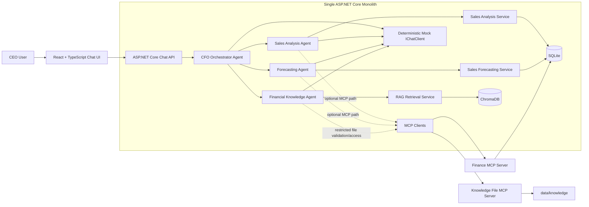
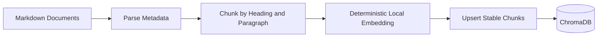
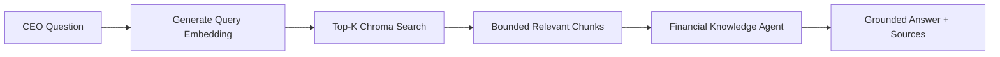

# CFO AI Agent — Codex Engineering Guide

## 1. Purpose of this file

This file is the primary engineering and domain guide for every Codex task in this repository.

Codex must read this file before making any code change. It defines the approved architecture, MVP scope, domain rules, agent responsibilities, data boundaries, testing expectations, and non-goals.

When implementation details are unclear, choose the smallest solution that satisfies this file and the current task. Do not add speculative infrastructure or abstractions.

---

## 2. Product summary

Build a small CFO AI assistant that a CEO can use through a web chat interface.

The application must answer sales and finance questions by coordinating a few specialist agents. It must use:

- .NET 10 and C# for the backend.
- ASP.NET Core Web API.
- Microsoft Agent Framework.
- A deterministic Mock LLM for this initial version.
- React with TypeScript for the frontend.
- SQLite for structured finance data.
- ChromaDB for RAG document retrieval.
- MCP integrations for controlled access to finance data and knowledge files.

This is a two-day interview MVP. Correctness, clarity, and a reproducible demonstration are more important than feature breadth.

---

## 3. Binding architectural decisions

These decisions are final for the initial version.

1. **Architecture style: simple monolith.**
   - The application backend is one ASP.NET Core project and one main deployable process.
   - Do not create application, domain, infrastructure, or feature class-library projects.
   - Organize the monolith with folders and focused classes only.

2. **Multi-agent implementation remains in-process.**
   - The CFO Orchestrator Agent and all specialist agents run inside `CfoAgent.Api`.
   - Agents are not microservices.
   - Agents do not communicate over HTTP with one another.

3. **Use a Mock LLM only.**
   - No OpenAI, Azure OpenAI, Ollama, Anthropic, Claude, or other real model call is permitted in this version.
   - The Mock LLM must be deterministic and offline.
   - Use the Microsoft `IChatClient` abstraction rather than inventing a large custom LLM abstraction.

4. **Financial calculations are deterministic.**
   - Revenue, profit, comparisons, rankings, dates, percentages, and forecasts must be calculated by C# and/or SQL.
   - An LLM must never calculate or invent financial values.
   - The Mock LLM may classify requests and format verified data into executive wording.

5. **RAG is for unstructured knowledge.**
   - ChromaDB stores chunks from financial Markdown documents.
   - Do not store individual sales transactions in ChromaDB.
   - Structured finance transactions remain in SQLite.

6. **MCP is an integration mechanism, not RAG and not a microservice architecture.**
   - One process-backed Finance MCP server exposes controlled read-only finance tools.
   - One independent process-backed Knowledge File MCP server exposes read-only access to approved files under `data/knowledge` only.
   - Both MCP servers use the official MCP C# SDK and stdio transport.
   - Both MCP integrations are disabled by default, initialized lazily on first use, and have controlled local fallback behavior.
   - ChromaDB remains responsible for semantic RAG retrieval and citations; the Knowledge File MCP server does not replace RAG.
   - The main business application remains the monolith.

7. **Do not overengineer.**
   - Build only the functionality required for the five MVP scenarios.
   - Prefer explicit routing and straightforward services.
   - Do not add autonomous planning, recursive agents, reflection loops, generic workflow engines, or plugin frameworks.

---

## 3.1 Current verified implementation baseline

The following baseline was verified after completion of `TASK-CFO-017`:

- The solution contains four .NET projects:
  - `src/CfoAgent.Api/CfoAgent.Api.csproj`
  - `tests/CfoAgent.Api.Tests/CfoAgent.Api.Tests.csproj`
  - `tools/CfoAgent.FinanceMcpServer/CfoAgent.FinanceMcpServer.csproj`
  - `tools/CfoAgent.KnowledgeFileMcpServer/CfoAgent.KnowledgeFileMcpServer.csproj`
- The Finance MCP integration is a real process-backed stdio connection.
- The Knowledge File MCP integration is a second independent process-backed stdio connection.
- Finance MCP exposes exactly five approved read-only finance tools.
- Knowledge File MCP exposes exactly:
  - `list_knowledge_files`
  - `read_knowledge_file`
- The existing in-process finance services and restricted file reader remain controlled fallback paths.
- Both MCP integrations are configuration-controlled, disabled by default, and started lazily.
- Caller cancellation is propagated and must never be converted into fallback.
- ChromaDB remains the semantic retrieval store for RAG and source citations.
- `99` backend/solution tests were passing at this checkpoint.
- Because of a known parallel MSBuild project-reference race in the local environment, solution-level validation must use serialized commands:

```bash
dotnet build CfoAgent.sln --no-restore --maxcpucount:1
dotnet test CfoAgent.sln --no-build --maxcpucount:1
```

The test count is a checkpoint, not a permanent fixed requirement. Later tasks may add more tests. Existing passing tests must remain green.

---

## 4. MVP success criteria

The MVP is complete when a reviewer can start the local application and successfully run these five scenarios from the React UI:

1. **Weekly sales summary**
   - Example: `Give me the sales summary of this week.`

2. **Week-over-week sales comparison**
   - Example: `Compare this week's sales with last week.`

3. **Top products for the current month**
   - Example: `Show me the top five products this month.`

4. **Five-year sales forecast**
   - Example: `Give me the sales forecast for the next five years.`

5. **Annual target and assumptions from RAG**
   - Example: `What is the annual sales target and what assumptions were used?`

The forecast scenario should demonstrate multi-agent collaboration by using both the Forecasting Agent and Financial Knowledge Agent when the prompt requests assumptions or supporting context.

Every answer must clearly identify:

- The participating agent or agents.
- The relevant data period.
- Structured financial values where applicable.
- Assumptions and warnings where applicable.
- RAG sources where document knowledge was used.
- That the application is running with a Mock LLM.

---

## 5. Explicit non-goals

Do not add any of the following unless a later user instruction explicitly changes scope:

- Authentication, authorization, user management, or roles.
- Microservices.
- Modular-monolith projects or separately compiled business modules.
- Event-driven architecture or message brokers.
- Kafka, RabbitMQ, or Azure Service Bus.
- CQRS, MediatR, or command buses.
- Generic repository or unit-of-work wrappers around EF Core.
- AutoMapper solely to avoid simple manual mappings.
- A generic plugin architecture.
- Additional agents beyond the four defined in this file.
- Autonomous agent loops, planning agents, critic agents, or reflection agents.
- Long-term or database-backed chat memory.
- Streaming chat responses, SignalR, WebSockets, or server-sent events.
- Authentication for MCP.
- Write-capable MCP tools.
- Arbitrary SQL MCP tools.
- Arbitrary shell execution.
- Unrestricted filesystem access.
- PDF parsing, OCR, or web search.
- Real LLM providers.
- Production cloud deployment.
- Full financial accounting, tax, cash-flow, balance-sheet, or ERP functionality.
- Advanced forecasting models or model-training pipelines.
- Production-grade semantic embeddings.
- Background job frameworks.
- Distributed tracing infrastructure or monitoring dashboards.
- Design systems, global frontend state libraries, or multiple frontend routes.

---

## 6. High-level architecture



### Architecture interpretation

- `CfoAgent.Api` is the business application and monolith.
- Specialist agents are focused C# classes in the same process.
- SQLite is authoritative for structured sales and budget data.
- ChromaDB is authoritative only for indexed document chunks used by RAG.
- MCP servers are external tool adapters required by the assignment. They are not independently owned business services.
- Local in-process services remain available as deterministic fallback when an MCP process is unavailable.

---

## 7. Target repository structure

```text
/
├── AGENT.md
├── CfoAgent.sln
├── Directory.Build.props
├── global.json
├── docker-compose.yml
├── README.md
├── docs/
├── scripts/
├── data/
│   ├── knowledge/
│   └── imports/
├── src/
│   ├── CfoAgent.Api/                 # The single backend monolith
│   │   ├── Agents/
│   │   │   ├── Configuration/
│   │   │   ├── Contracts/
│   │   │   ├── CfoOrchestratorAgent.cs
│   │   │   ├── SalesAnalysisAgent.cs
│   │   │   ├── ForecastingAgent.cs
│   │   │   └── FinancialKnowledgeAgent.cs
│   │   ├── AI/
│   │   │   └── Mock/
│   │   ├── Configuration/
│   │   ├── Controllers/
│   │   ├── Data/
│   │   │   ├── Migrations/
│   │   │   └── Seed/
│   │   ├── Features/
│   │   │   ├── Chat/
│   │   │   ├── Sales/
│   │   │   └── Forecasting/
│   │   ├── Mcp/
│   │   ├── Models/
│   │   ├── Rag/
│   │   │   ├── Chroma/
│   │   │   ├── Embeddings/
│   │   │   ├── Ingestion/
│   │   │   └── Retrieval/
│   │   ├── Services/
│   │   └── Program.cs
│   └── cfo-agent-ui/                    # React + TypeScript Vite app
├── tools/
│   ├── CfoAgent.FinanceMcpServer/       # Read-only finance MCP tool provider
│   └── CfoAgent.KnowledgeFileMcpServer/ # Restricted read-only knowledge-file MCP provider
└── tests/
    ├── CfoAgent.Api.Tests/
    └── CfoAgent.E2E/
```

### Structural rules

- Do not add additional backend class-library projects.
- Do not add a separate project for each agent.
- Do not create folders only to imitate Clean Architecture layers.
- Keep feature code close to the feature it supports.
- Shared code should be introduced only after genuine duplication appears.
- The two MCP server projects are external assignment integration tools and do not convert the application into a microservice architecture.
- Do not add another backend business project or another MCP server unless the user explicitly changes scope.

---

## 8. Technology choices

### Backend

- .NET 10.
- ASP.NET Core Web API.
- C# with nullable reference types enabled.
- Entity Framework Core with SQLite.
- Microsoft Agent Framework.
- `Microsoft.Extensions.AI.IChatClient` for the model abstraction.
- Official MCP C# SDK.
- Built-in dependency injection, configuration, logging, health checks, validation, and Problem Details.
- xUnit for backend tests.

### Frontend

- React.
- TypeScript with strict mode.
- Vite.
- A small typed API client using `fetch` unless an existing dependency justifies another choice.
- Vitest and React Testing Library.
- Playwright for the critical E2E scenarios.
- One lightweight chart library only if required by the forecast UI.

### Local infrastructure

- SQLite database file.
- ChromaDB in Docker Compose.
- Finance MCP server as a .NET 10 console process using stdio.
- Knowledge File MCP server as a separate .NET 10 console process using stdio, restricted to `data/knowledge`.
- Existing in-process services/readers retained only as controlled fallback paths.

### Dependency rules

- Use the latest stable package compatible with .NET 10 at execution time.
- Do not add a package when the .NET or browser platform already provides a simple solution.
- Do not add multiple packages that solve the same problem.
- Pin dependencies through project files and lock files where appropriate.

---

## 9. Core domain model

The MVP requires only three persistent finance entities.

### 9.1 Product

Minimum fields:

- `Id`
- `Code`
- `Name`
- `Category`
- `IsActive`

Rules:

- Product code is unique.
- Name and category are required.
- Products are reference data used by sales rows and ranking queries.

### 9.2 Sale

Minimum fields:

- `Id`
- `OrderNumber`
- `SaleDate`
- `ProductId`
- `Quantity`
- `UnitPrice`
- `DiscountAmount`
- `UnitCost`
- `Region`

Rules:

- `Quantity` must be greater than zero.
- Monetary values must be non-negative.
- `DiscountAmount` cannot make net revenue negative.
- Multiple sale rows may share an `OrderNumber`.
- Store enough precision for money and configure EF decimal precision explicitly.

Derived values:

```text
LineGrossRevenue = Quantity × UnitPrice
LineNetRevenue   = LineGrossRevenue - DiscountAmount
LineTotalCost    = Quantity × UnitCost
LineGrossProfit  = LineNetRevenue - LineTotalCost
```

### 9.3 BudgetTarget

Minimum fields:

- `Id`
- `Year`
- `Month` nullable for annual targets.
- `SalesTarget`
- `ProfitTarget` nullable if not required.
- `AssumptionReference` or short description.

Rules:

- Annual target: `Month` is null.
- Monthly target: `Month` is 1–12.
- Prevent duplicate target periods.

### Persistence rules

- Use `FinanceDbContext` directly inside focused application services.
- Do not create a generic repository.
- Entities must never be returned directly by HTTP endpoints.
- Use DTOs for service, agent, MCP, and API boundaries.

---

## 10. Business calendar and determinism

Relative questions such as “this week” and “this month” must be deterministic and testable.

- Inject `TimeProvider` into services that calculate dates.
- Do not call `DateTime.Now`, `DateTime.UtcNow`, or `DateOnly.FromDateTime(DateTime.Now)` directly in business logic.
- Define a configurable demo clock/date for local execution.
- Tests must use a fixed/fake `TimeProvider`.
- The MVP business week runs from Monday through Sunday.
- “Current week” includes the Monday containing the configured current date through the configured current date or Sunday, according to the service contract documented in code.
- The same boundary rule must be used consistently by local services, MCP tools, API tests, and UI assertions.
- Store dates consistently and document whether SQLite values are treated as UTC/date-only values.

Do not make test expectations depend on the real calendar date.

---

## 11. Finance calculations

### 11.1 Weekly sales summary

Return at minimum:

- Period start and end.
- Net revenue.
- Distinct order count.
- Units sold.
- Average order value.
- Gross profit.
- Gross margin percentage.
- Top product by net revenue.
- Data availability warnings.

Formula rules:

```text
AverageOrderValue = TotalNetRevenue / DistinctOrderCount
GrossMarginPercent = TotalGrossProfit / TotalNetRevenue × 100
```

- When the denominator is zero, return `0` and add an appropriate warning if useful.
- Round values only at the presentation boundary. Preserve decimal precision internally.

### 11.2 Week-over-week comparison

Return:

- Current-week summary.
- Previous-week summary.
- Absolute revenue change.
- Percentage revenue change.
- Direction: increased, decreased, or unchanged.

Zero-denominator behavior:

- Previous = 0 and current = 0: percentage change is 0.
- Previous = 0 and current > 0: do not return infinity. Return a warning and an explicitly represented unavailable/non-comparable percentage, or another documented safe contract.

### 11.3 Top products

- Use current calendar month.
- Rank by net revenue descending.
- Use deterministic secondary ordering, such as product name or code.
- Return at most five products for the MVP.
- Include quantity, revenue, and gross profit where available.

### 11.4 Budget target lookup

- Retrieve the matching annual or monthly budget target.
- Return the target period and source/assumption reference.
- If no target exists, return a controlled missing-data result.

### 11.5 Five-year forecast

Use a simple transparent deterministic method.

Recommended MVP method:

1. Aggregate historical net revenue by complete calendar year.
2. Require sufficient historical years; five seeded years should be available.
3. Fit a simple linear regression using sequential year values and annual revenue.
4. Forecast the next five years.
5. Clamp negative forecast values to zero.
6. Produce three scenarios:
   - Conservative.
   - Expected.
   - Optimistic.
7. Use a documented, configurable scenario percentage around the expected value, for example ±5% or ±10%.

Forecast output must contain:

- Method name.
- Historical period.
- Historical annual inputs.
- Five forecast rows.
- Conservative, expected, and optimistic values for every year.
- Assumptions.
- Warnings.
- Insufficient-data status when applicable.

The forecast is a demonstration model, not professional financial advice. State this limitation in UI and documentation.

---

## 12. Seed data requirements

The development seeder must be deterministic and idempotent.

It must create:

- At least five complete years of historical sales before the configured demo date.
- Multiple products.
- Multiple product categories.
- Multiple regions.
- Multiple order rows and distinct orders.
- Visible year-over-year growth.
- Visible seasonal variation.
- A clear difference between the current week and previous week.
- Data for the current month’s top-five product ranking.
- Annual and monthly budget targets.

Rules:

- Use a fixed seed or fully deterministic generation algorithm.
- Re-running the seeder must not duplicate records.
- The seeded values must remain stable so tests can assert exact results.
- Provide a non-destructive development seed/reset command.
- Do not silently reseed production environments.

---

## 13. Knowledge documents for RAG

Create concise Markdown documents under `data/knowledge`.

Required documents:

1. Annual sales report.
2. Current budget and annual target.
3. Forecast assumptions.
4. Market risks.
5. Product strategy.

Each document must contain metadata in front matter or a manifest:

- Document ID.
- Document name.
- Document type.
- Period/year.
- Section information.
- Source path.

The documents must contain enough distinct facts to test:

- Annual target retrieval.
- Forecast assumptions.
- Market-risk retrieval.
- Product-strategy retrieval.
- Insufficient-knowledge handling.

Do not place secrets, personal data, or real company information in demo documents.

---

## 14. Multi-agent design

Use exactly four agents.

### 14.1 CFO Orchestrator Agent

Purpose:

- Main entry point for CEO questions.
- Classify the prompt.
- Select one or at most two specialist agents.
- Combine structured specialist results.
- Ask the Mock LLM to format the final executive answer.

Supported intent values:

- `SalesSummary`
- `SalesComparison`
- `TopProducts`
- `Forecast`
- `Knowledge`
- `Mixed`
- `Unsupported`

Rules:

- Routing must be explicit and easy to inspect.
- Set a maximum of two specialist-agent invocations per user request.
- Do not recursively call the orchestrator.
- Do not permit agents to call arbitrary agents.
- Do not create a planner, critic, reviewer, or reflection loop.
- Unsupported questions must return a safe response explaining the MVP scope.

### 14.2 Sales Analysis Agent

Handles:

- Weekly sales summaries.
- Week-over-week comparisons.
- Current-month top products.
- Budget-target structured lookup if required by a mixed question.

Rules:

- Call `SalesAnalysisService` or approved Finance MCP tools.
- Receive typed structured results.
- Never calculate through an LLM prompt.
- Use the Mock LLM only to convert verified results into concise executive wording.

### 14.3 Forecasting Agent

Handles:

- Five-year sales forecasts.
- Forecast method and historical input presentation.
- Conservative, expected, and optimistic scenarios.

Rules:

- Call `SalesForecastingService` or the approved historical-sales MCP tool.
- Forecast calculation remains deterministic C#.
- Include method, historical period, assumptions, and warnings.
- Never parse forecast values back from natural-language LLM output.

### 14.4 Financial Knowledge Agent

Handles:

- Annual targets described in documents.
- Budget assumptions.
- Forecast assumptions.
- Market risks.
- Product strategy.

Rules:

- Retrieve relevant chunks through `FinancialKnowledgeRetrievalService`.
- Answer only from retrieved content.
- Return source metadata for every supporting document.
- Deduplicate source citations.
- If retrieval is empty or too weak, state that the available knowledge is insufficient.
- Do not use model memory or invent company facts.
- The Knowledge File MCP integration may validate or read approved source documents, but the final semantic retrieval must continue through ChromaDB.
- Do not return raw unrestricted file contents directly as a substitute for RAG.

### Agent result contract

Use a small provider-independent contract that can represent:

- `Answer`
- `ResponseType`
- `AgentNames`
- `StructuredData`
- `Sources`
- `Assumptions`
- `Warnings`
- `DataPeriod`

Avoid a large inheritance hierarchy. A small record/class plus typed payload DTOs is sufficient.

---

## 15. Mock LLM design

### Required abstraction

Use `Microsoft.Extensions.AI.IChatClient` as the application model abstraction.

Implement:

```text
MockChatClient : IChatClient
```

Do not create a duplicate general-purpose `ILlmService` unless the current Agent Framework API makes a tiny adapter necessary.

### Required deterministic behaviors

The Mock LLM must support:

1. Intent classification for the seven approved intents.
2. Formatting a weekly sales executive summary from supplied structured JSON/data.
3. Formatting a week-over-week comparison from supplied structured data.
4. Formatting a top-products response from supplied structured data.
5. Formatting a forecast explanation from supplied structured data.
6. Formatting a RAG-grounded knowledge answer from supplied chunks.
7. Formatting a combined multi-agent response.
8. Returning a safe unsupported-scope response.

### Guardrails

- Same input and context must produce the same output.
- No random wording that makes tests unstable.
- Do not add any number not present in the supplied verified data.
- Do not make network requests.
- Include provider/model metadata identifying the provider as `Mock`.
- Support optional configured delay and failure simulation for tests.
- Unsupported AI provider configuration must fail during startup validation.

### Future provider path

The README may explain that future versions can register another `IChatClient` implementation for:

- Ollama during local integration testing.
- OpenAI or Azure OpenAI in production.
- Claude through an adapter if required.

Do not implement those providers in this MVP.

---

## 16. RAG design

### Purpose

RAG grounds document-based answers in approved financial knowledge files.

### Ingestion flow



### Retrieval flow



### Embedding approach

For this Mock LLM MVP:

- Use a deterministic local token-hashing embedding algorithm.
- Use a fixed vector dimension.
- Normalize vectors consistently.
- Equal text must always produce equal embeddings.
- This implementation tests RAG plumbing and basic demo retrieval only.
- Document clearly that it is not production semantic quality.

Use an existing Microsoft embedding abstraction if it fits cleanly. Otherwise define one small `IEmbeddingGenerator` interface.

### Chunking rules

- Chunk Markdown by meaningful headings and bounded paragraphs.
- Avoid tiny arbitrary chunks.
- Bound maximum chunk size.
- Generate stable IDs from normalized document path, section, and content hash.
- Re-ingestion must not create duplicates.

### Chroma metadata

Store at minimum:

- Document ID.
- Document name.
- Document type.
- Period.
- Section.
- Source path.
- Chunk ID.

### Retrieval rules

- Support query text, top-K, and optional document type/period filters.
- Use a small default top-K such as 4.
- Apply a reasonable upper limit such as 8.
- Bound total retrieved text before it is sent to the Mock LLM.
- Return controlled dependency failures when ChromaDB is unavailable.
- Never silently fabricate an answer when retrieval fails.

### Collection

Use one collection for the MVP, with a stable configured name such as:

```text
cfo-financial-knowledge
```

Do not introduce multiple vector stores or collections without a demonstrated need.

---

## 17. MCP design

MCP provides standardized access to tools and resources. MCP is not the RAG algorithm.

### 17.1 Finance MCP server

Create one .NET 10 MCP server under:

```text
tools/CfoAgent.FinanceMcpServer
```

Use the official MCP C# SDK and stdio transport for the MVP.

Expose exactly these read-only tools:

- `get_sales_summary`
- `compare_sales_periods`
- `get_top_products`
- `get_historical_sales`
- `get_budget_target`

Rules:

- Connect read-only to the same local SQLite database.
- Validate all dates and parameters.
- Limit date ranges and result sizes.
- Return typed JSON results.
- Return controlled errors.
- Do not expose insert, update, delete, shell, raw SQL, or arbitrary query tools.
- Keep business calculations consistent with the monolith’s service behavior.
- The tool server is an assignment integration adapter, not the new home of the domain model.

### 17.2 Knowledge File MCP server

Create one independent .NET 10 MCP server under:

```text
tools/CfoAgent.KnowledgeFileMcpServer
```

Use the official MCP C# SDK and stdio transport.

Expose exactly these read-only tools:

- `list_knowledge_files`
- `read_knowledge_file`

The process command is conceptually:

```text
dotnet run --project tools/CfoAgent.KnowledgeFileMcpServer --no-build -- --root <resolved-data/knowledge>
```

Rules:

- Restrict the resolved root to `data/knowledge`.
- Reject absolute user paths.
- Reject `..` traversal segments using either path separator style.
- Resolve every requested path to a full path and verify containment under the approved root.
- Reject or skip symbolic links and junctions that can escape the approved root.
- Do not expose write, delete, rename, move, execute, directory-creation, or arbitrary filesystem tools.
- Return normalized relative paths only.
- Return controlled errors for invalid or missing files.
- This server validates and reads approved source files; it does not perform semantic retrieval and does not replace ChromaDB.

### 17.3 Monolith MCP clients and access paths

The monolith contains focused MCP integration classes, including:

- `FinanceMcpClient`
- `KnowledgeFileMcpProcessClient`
- `KnowledgeFileMcpAccess`
- Restricted in-process `KnowledgeFileMcpClient` used only as fallback
- Focused interfaces only where required for testability and provider boundaries

Rules:

- Discover and validate the exact approved tool capabilities on first use.
- Reject missing and unexpected Knowledge File MCP tools.
- Use cancellation tokens and configured finite timeouts.
- Start MCP processes lazily; service registration or application startup must not launch them.
- Integrate Finance MCP into Sales and Forecasting agents behind configuration flags.
- The Financial Knowledge Agent may validate or access approved files through the Knowledge File MCP path, but semantic retrieval and citations must continue through ChromaDB.
- Keep deterministic local-service and restricted-reader fallback enabled when configured.
- Log stable fallback reasons without sensitive paths, exception messages, document contents, or stack traces.
- Never convert caller cancellation into fallback.
- Never convert user input directly into SQL or an unrestricted filesystem path.

### MCP failure behavior

When an MCP process is unavailable:

- Return a controlled integration error or use the documented local-service fallback.
- Do not crash the host.
- Do not retry indefinitely.
- Surface a warning when fallback was used.

When local fallback is enabled:

- A disabled MCP integration must bypass process startup and use the local implementation.
- Initialization failure may use the local implementation.
- A missing required capability may use the local implementation.
- A configured timeout may use the local implementation.
- Caller-request cancellation must propagate and must not be converted into fallback.

When local fallback is disabled:

- Integration failures must propagate through a controlled application error.
- The system must not silently produce incomplete or fabricated financial results.

---

## 18. Chat API contract

Expose one business endpoint:

```http
POST /api/chat
```

### Request

```json
{
  "conversationId": "optional-guid-or-string",
  "message": "Give me the sales summary of this week."
}
```

Rules:

- `message` is required.
- Reject empty or whitespace-only input.
- Apply a bounded maximum length.
- `conversationId` is optional for the first request.
- Generate and return a conversation ID when absent.
- Persist conversation state only in memory if Agent Framework requires it.
- Do not persist chat messages to SQLite.

### Response

```json
{
  "conversationId": "generated-or-existing-id",
  "answer": "Executive-friendly answer generated by the Mock LLM.",
  "responseType": "sales_summary",
  "agentNames": ["CfoOrchestratorAgent", "SalesAnalysisAgent"],
  "structuredData": {},
  "sources": [],
  "assumptions": [],
  "warnings": [],
  "dataPeriod": {
    "from": "2026-07-13",
    "to": "2026-07-15",
    "label": "Current week"
  },
  "model": {
    "provider": "Mock",
    "name": "DeterministicMock"
  }
}
```

Approved `responseType` values:

- `sales_summary`
- `sales_comparison`
- `top_products`
- `forecast`
- `knowledge`
- `mixed`
- `unsupported`

### Error behavior

Use ASP.NET Core Problem Details for:

- Invalid request.
- Unsupported configuration.
- Missing required data.
- Chroma dependency failure.
- MCP dependency failure when fallback is disabled.
- Cancellation or timeout.
- Unexpected server error.

Do not expose stack traces, SQL, raw prompts, sensitive paths, or internal entities.

---

## 19. Frontend requirements

Build one responsive React page only.

### Required UI elements

- Application title.
- Clearly visible `Mock LLM` badge.
- Five example-prompt buttons.
- Conversation message list.
- Prompt textbox.
- Send button.
- Keyboard submission.
- Loading state.
- Error state.
- Empty state.

### Structured response rendering

Render based on `responseType`:

- KPI cards for weekly summary.
- Current-vs-previous values and direction for comparison.
- Table for top products.
- Five-year forecast table.
- One simple forecast chart.
- Assumptions.
- Warnings.
- RAG sources.
- Participating agents.
- Data period.

### Frontend design rules

- Use TypeScript strict mode.
- Keep API types explicit.
- Keep conversation ID in component state only.
- Do not add Redux, Zustand, MobX, or another global state library.
- Do not add a router for the one-page MVP.
- Do not add a design system.
- Use simple CSS or a minimal existing styling approach.
- Ensure labels, focus behavior, keyboard submission, and meaningful error text are accessible.
- Do not hide the fact that the model is mocked.

---

## 20. Configuration

Use strongly typed options and validate configuration during startup.

Recommended sections:

```json
{
  "Application": {
    "Name": "CFO AI Agent",
    "DemoMode": true
  },
  "ConnectionStrings": {
    "FinanceDatabase": "Data Source=./data/cfo-agent.db"
  },
  "AI": {
    "Provider": "Mock",
    "Model": "DeterministicMock",
    "SimulatedDelayMilliseconds": 0,
    "SimulateFailure": false
  },
  "Finance": {
    "WeekStartsOn": "Monday",
    "DemoDate": "2026-07-15"
  },
  "Forecasting": {
    "Years": 5,
    "ScenarioPercentage": 0.05
  },
  "Chroma": {
    "BaseUrl": "http://localhost:8000",
    "CollectionName": "cfo-financial-knowledge",
    "TimeoutSeconds": 10,
    "TopK": 4,
    "MaximumTopK": 8
  },
  "Mcp": {
    "UseLocalFallback": true,
    "Finance": {
      "Enabled": false,
      "ServerProjectPath": "tools/CfoAgent.FinanceMcpServer/CfoAgent.FinanceMcpServer.csproj",
      "TimeoutSeconds": 10
    },
    "KnowledgeFiles": {
      "Enabled": false,
      "ServerProjectPath": "tools/CfoAgent.KnowledgeFileMcpServer/CfoAgent.KnowledgeFileMcpServer.csproj",
      "RootPath": "data/knowledge",
      "TimeoutSeconds": 10
    }
  },
  "Frontend": {
    "AllowedOrigin": "http://localhost:5173"
  }
}
```

Configuration names may be adjusted to match the actual code, but responsibilities must remain clear.

Rules:

- Only `Mock` is accepted as an AI provider in this MVP.
- Fail startup for unsupported provider values.
- Both MCP integrations must remain disabled by default.
- `UseLocalFallback` controls whether MCP failures may use deterministic local implementations.
- MCP project paths and knowledge-root paths must be resolved safely from the application content or repository root.
- Merely registering MCP services must not launch their processes.
- Do not commit secrets.
- Environment variables may override local settings.
- Development paths must be resolved safely from the content or repository root.

---

## 21. Health and operational endpoints

Required endpoints:

- `/health/live`
- `/health/ready`
- Development OpenAPI/Swagger endpoint.
- A small root endpoint identifying the application and Mock mode.

### Liveness

- Confirms the API process is running.
- Must not depend on external services.

### Readiness

Report controlled status for:

- SQLite.
- ChromaDB.
- Required MCP processes or connections when enabled, without eagerly launching disabled or unused integrations.

Rules:

- Dependency failure must not crash the application while evaluating readiness.
- Health responses must not reveal secrets or sensitive paths.
- Do not introduce a separate monitoring platform.

---

## 22. Error handling, safety, and logging

### Financial accuracy guardrails

- Never invent financial values.
- Prefer tool or service data over natural-language model output.
- If data is unavailable, say so.
- Forecasts must include assumptions and limitations.
- RAG answers must include sources.

### Prompt and tool safety

- Treat all user prompts as untrusted input.
- Do not allow prompts to override system guardrails.
- MCP tools must be allow-listed.
- Do not pass arbitrary user strings as SQL.
- Do not pass arbitrary user strings as filesystem paths.
- Restrict filesystem access to the configured knowledge root.
- Reject path traversal attempts.
- Reject absolute user-provided paths.
- Reject or skip symbolic links and junctions that can escape the configured knowledge root.
- Do not expose write or execute capabilities through MCP.

### Logging

Log structured metadata for:

- Request or correlation ID.
- Conversation ID where safe.
- Classified intent.
- Participating agents.
- Service, RAG, and MCP call names.
- Whether MCP or local fallback was used.
- Stable fallback reason.
- Duration and outcome.

Do not log:

- Full financial documents.
- Raw database rows.
- Secrets or credentials.
- Full prompts if they may contain sensitive data.
- Complete retrieved RAG context.
- Sensitive absolute file paths.
- MCP process arguments containing sensitive values.
- Exception messages or stack traces in normal fallback logs.

### Resilience

- Use cancellation tokens.
- Configure finite timeouts for Chroma and MCP.
- Do not retry indefinitely.
- Do not add a heavy resilience framework unless the current task explicitly needs it.
- Return controlled Problem Details for failures.
- Caller cancellation must always propagate.
- A timeout may trigger fallback only when configured.
- Application startup must not fail merely because a disabled or lazy MCP process is unavailable.

---

## 23. Coding standards

### General C# rules

- Target `net10.0`.
- Enable nullable reference types.
- Enable implicit usings.
- Use warnings as errors where practical without blocking legitimate generated code.
- Use file-scoped namespaces where consistent with the repository.
- Prefer records for immutable DTOs when useful.
- Prefer clear domain names over abbreviations.
- Use `async` APIs for I/O.
- Pass `CancellationToken` through API, agent, RAG, MCP, and database calls.
- Inject `TimeProvider` for time-dependent behavior.
- Keep methods focused and readable.
- Avoid deep inheritance.
- Avoid static global service locators.
- Use constructor injection.
- Validate public inputs.
- Do not swallow exceptions.

### Simplicity rules

- Prefer one straightforward service over multiple pass-through abstractions.
- Create an interface when it enables testing, provider replacement, or a real boundary.
- Do not add interfaces for every class automatically.
- Do not add generic base agents.
- Do not add generic result builders unless repetition proves necessary.
- Manual mapping is acceptable for small DTOs.
- Comments should explain non-obvious decisions, not restate the code.
- Do not replace the current focused MCP classes with a generic provider framework.
- Do not create another fallback abstraction hierarchy.

### EF Core rules

- Query through focused services.
- Use `AsNoTracking` for read-only queries.
- Project only required fields.
- Avoid unnecessary `Include` calls.
- Configure indexes for date, order number, product, and budget period where useful.
- Keep migrations committed.
- Use a temporary SQLite database for integration tests.

### Frontend rules

- Enable TypeScript strict mode.
- Keep components small but do not fragment trivial markup.
- Keep API calls in a small typed client.
- Handle loading, error, empty, and success states.
- Do not suppress TypeScript errors with `any` unless documented and unavoidable.
- Avoid unnecessary memoization.
- Do not add state-management libraries.

---

## 24. Testing strategy

Tests are part of implementation, not a final afterthought.

### 24.1 Backend unit tests

Cover:

- Date boundaries with a fixed `TimeProvider`.
- Revenue, orders, units, average order value, profit, and margin.
- Week-over-week calculations and zero denominators.
- Product ranking and deterministic ordering.
- Budget lookup.
- Forecast shape, ordering, assumptions, and insufficient data.
- Mock LLM deterministic classification and formatting.
- Agent routing and result composition.
- Chunking, stable IDs, and deterministic embeddings.
- MCP capability discovery, process connection, path containment, cancellation, timeout, and fallback logic.
- Agent-to-MCP wiring while preserving deterministic local behavior.

### 24.2 Backend integration tests

Use a temporary SQLite database.

Cover:

- Idempotent seed behavior.
- EF queries and projections.
- HTTP `/api/chat` contract.
- Problem Details responses.
- Chroma operations when Docker is available.
- Finance and Knowledge File MCP tool discovery and invocation.
- Disabled, unavailable, timeout, capability-deficient, and caller-cancellation behavior.

Chroma-dependent tests may be conditionally skipped only when Docker is unavailable, with an explicit reason. Required phase gates must run with Docker available.

### 24.3 MCP-focused tests

Cover:

- Finance MCP exposes exactly five approved tools.
- Knowledge File MCP exposes exactly:
  - `list_knowledge_files`
  - `read_knowledge_file`
- Disabled MCP does not start its process.
- MCP process startup is lazy.
- Missing or invalid server paths produce controlled outcomes.
- Missing or unexpected capabilities are rejected.
- Timeouts follow configured fallback behavior.
- Caller cancellation propagates without fallback.
- Absolute paths are rejected.
- Both `../` and `..\` traversal forms are rejected.
- Resolved paths remain under `data/knowledge`.
- Symbolic-link and junction escapes are rejected or skipped.
- No write, delete, rename, move, create-directory, shell, or execute tools are exposed.
- Local fallback preserves the same deterministic result contracts.
- Agents use MCP when enabled and local services when disabled or fallback is triggered.
- Forecast calculations remain deterministic C# even when historical data comes through MCP.
- ChromaDB remains responsible for final semantic retrieval and source citations.

### 24.4 Frontend tests

Use Vitest and React Testing Library.

Cover:

- Initial or empty state.
- Prompt submission.
- Loading state.
- Error state.
- Rendering each response type.
- Source and warning presentation.
- Mock-mode visibility.

### 24.5 E2E tests

Use Playwright for exactly the critical MVP paths:

1. Weekly summary.
2. Week comparison.
3. Top products.
4. Five-year forecast.
5. Annual target and assumptions.
6. Invalid prompt or error presentation.

E2E data and clock must be deterministic.

### Testing rules

- Do not call a real LLM.
- Do not depend on the public internet.
- Do not weaken or delete tests to make a phase pass.
- Fix implementation defects exposed by tests.
- Tests must be repeatable and independent.
- Capture Playwright traces or screenshots on failure only.
- The verified `99` tests after `TASK-CFO-017` are a minimum checkpoint, not a hard final count.
- Later tasks may increase the count, but must not reduce coverage or silently remove tests.
- Use serialized solution-level validation because of the known local parallel MSBuild race.

---

## 25. Phase gates

Do not proceed to the next major phase unless its gate passes.

- **Phase 1 gate:** deterministic finance data and calculation tests.
- **Phase 2 gate:** Mock LLM and specialist-agent tests fully offline.
- **Phase 3 gate:** RAG, source grounding, and orchestrator routing tests.
- **Phase 4 gate:** MCP discovery, invocation, security, and fallback tests. **Completed at the `TASK-CFO-017` checkpoint with two independent process-backed MCP connections and 99 passing tests.**
- **Phase 5 gate:** API, frontend, integration, and E2E scenarios.
- **Phase 6 gate:** clean setup, complete regression, documentation, and demo readiness.

Every phase-gate task must write its result document under `docs/` with exact commands and outcomes.

---

## 26. Definition of done for every Codex task

A task is complete only when:

1. Only the current task scope was implemented.
2. The project builds.
3. Relevant tests were added or updated.
4. All validation commands in the task were run.
5. Failures introduced by the task were fixed.
6. Existing tests were not weakened or silently removed.
7. Configuration and documentation were updated when behavior changed.
8. No secret or real LLM credential was added.
9. No out-of-scope architecture or package was introduced.
10. Completed MCP functionality was not recreated, replaced, or duplicated without an explicit requirement.
11. ChromaDB RAG was not replaced with raw file reading.
12. Codex reports:
    - Files changed.
    - Important design choices.
    - Validation commands and results.
    - Exact test counts.
    - Remaining limitations.
    - Whether the current phase gate is satisfied.

---

## 27. Codex execution rules

For every task:

1. Read:
   - `AGENT.md`
   - `IMPLEMENTATION-PLAN.md`
   - `CODEX-GLOBAL-INSTRUCTIONS.md`
   - `EXECUTION-ORDER.md`
   - The current task file.

2. Inspect the existing repository before editing.

3. Do not assume previous tasks were implemented perfectly.

4. Implement exactly one task at a time.

5. Do not start a later task early.

6. Preserve the single ASP.NET Core business monolith.

7. Preserve the two existing MCP server integrations.

8. Prefer the smallest maintainable change.

9. Verify current package APIs against official documentation when package APIs may have changed.

10. Run every validation command stated by the task.

11. For all remaining solution-level validation, use:

```bash
dotnet restore CfoAgent.sln
dotnet build CfoAgent.sln --no-restore --maxcpucount:1
dotnet test CfoAgent.sln --no-build --maxcpucount:1
```

12. Do not interpret the serialized build requirement as a reason to redesign the solution.

13. Do not recreate Finance MCP, Knowledge File MCP, fallback policies, or agent MCP wiring in later tasks.

14. Do not replace ChromaDB retrieval with direct filesystem responses.

15. Stop after reporting the required completion summary.

### Instruction precedence

When instructions conflict, use this order:

1. The user’s latest explicit instruction.
2. This `AGENT.md` file.
3. The current task file.
4. `IMPLEMENTATION-PLAN.md`.
5. `CODEX-GLOBAL-INSTRUCTIONS.md`.
6. Existing code conventions.

Do not silently resolve a material conflict by expanding scope. Record the conflict and choose the safer, smaller implementation consistent with the latest user decision.

---

## 28. Local development workflow

Expected high-level commands after the corresponding tasks exist:

```bash
# Start ChromaDB
docker compose up -d

# Restore and build backend
dotnet restore CfoAgent.sln
dotnet build CfoAgent.sln --no-restore --maxcpucount:1

# Initialize or seed deterministic finance data
dotnet run --project src/CfoAgent.Api -- --seed

# Ingest knowledge documents into ChromaDB
dotnet run --project src/CfoAgent.Api -- --ingest-rag

# Run backend and solution tests
dotnet test CfoAgent.sln --no-build --maxcpucount:1

# Run API
dotnet run --project src/CfoAgent.Api

# Install and run frontend
cd src/cfo-agent-ui
npm install
npm run dev
```

The MCP processes are launched lazily by the monolith when their corresponding configuration flags are enabled and an operation first requires them.

The expected project commands are conceptually:

```bash
dotnet run --project tools/CfoAgent.FinanceMcpServer --no-build
```

```bash
dotnet run --project tools/CfoAgent.KnowledgeFileMcpServer --no-build -- --root <resolved-data/knowledge>
```

Do not manually start the MCP servers unless a specific diagnostic or test task requires it.

Final scripts may combine these steps, but they must remain transparent and reproducible.

---

## 29. Production evolution discussion only

The implementation remains Mock-only and local. Documentation may describe this future path:

| MVP component                       | Possible production replacement                                                              |
| ----------------------------------- | -------------------------------------------------------------------------------------------- |
| Mock `IChatClient`                  | Ollama for local testing; OpenAI, Azure OpenAI, or Claude adapter for production             |
| Deterministic token-hash embeddings | A production embedding model                                                                 |
| ChromaDB                            | Azure AI Search, PostgreSQL with pgvector, Qdrant, or another evaluated managed vector store |
| SQLite                              | Azure SQL or PostgreSQL                                                                      |
| Local knowledge files               | Azure Blob Storage or an approved document platform                                          |
| Local MCP process execution         | Secured hosted MCP integrations or approved internal tool gateways                           |
| Local logs                          | OpenTelemetry and Application Insights                                                       |
| In-memory conversation state        | A controlled distributed or persistent session store if genuinely required                   |

Do not implement these production replacements in this MVP.

---

## 30. Key trade-offs to preserve

### Why a monolith?

- Faster implementation within two days.
- One main business deployment and simpler debugging.
- No distributed-system failure modes between agents.
- Suitable for the small team and assignment scope.
- The MCP servers are narrow external tool providers, not separate business domains.

### Why multiple agents inside the monolith?

- Satisfies the assignment’s multi-agent requirement.
- Separates sales analysis, forecasting, and document knowledge responsibilities.
- Keeps orchestration understandable and testable.

### Why Mock LLM first?

- No API key or subscription required.
- Fully deterministic tests.
- Allows complete UI, API, agent, RAG, and MCP plumbing validation.
- Preserves future provider replacement through `IChatClient`.

### Why deterministic C# finance tools?

- Financial values must be reliable and testable.
- LLMs are used for language and orchestration, not arithmetic authority.

### Why ChromaDB?

- Required by the assignment.
- Easy local vector-store demonstration.
- Suitable for validating RAG plumbing.

### Why two MCP connections only?

- Demonstrates multiple independent MCP integrations without adding unnecessary services.
- Finance MCP provides structured finance-data tools.
- Knowledge File MCP demonstrates restricted knowledge-resource access.
- Both remain narrow adapters and do not turn the application into microservices.

### Why keep local fallbacks?

- The interview demo remains resilient when a local MCP process cannot start.
- Deterministic local services preserve financial correctness.
- Fallback behavior is explicit, configuration-controlled, logged, and tested.
- Caller cancellation is never hidden by fallback.

---

## 31. Interview demonstration expectations

The final demo should take approximately 10–15 minutes and show:

1. The architecture diagram and monolith boundary.
2. The four in-process agents and explicit routing.
3. Mock LLM provider configuration.
4. Weekly sales summary.
5. Week-over-week comparison.
6. Top-five products.
7. Five-year forecast with assumptions.
8. RAG answer with source citations.
9. Finance MCP tool discovery or invocation.
10. Knowledge File MCP restricted tool discovery or invocation.
11. Controlled fallback behavior.
12. Tests and production evolution discussion.

Explain clearly:

- MCP is not RAG.
- Agents are not microservices.
- The main business application remains one ASP.NET Core monolith.
- The Finance MCP server is an external read-only tool provider required by the assignment.
- The Knowledge File MCP server is a second independent, restricted read-only tool provider.
- The Knowledge File MCP server does not replace ChromaDB.
- The LLM does not calculate finance values.
- ChromaDB stores document embeddings, while SQLite stores structured transactions.
- MCP processes are disabled by default and launched lazily.
- Local deterministic implementations remain controlled fallbacks.
- The Mock LLM can later be replaced by another `IChatClient` implementation.

---

## 32. Current checkpoint and remaining work

At the completion of `TASK-CFO-017`:

- Finance MCP integration is complete.
- Knowledge File MCP integration is complete.
- Both process-backed connections use the official MCP C# SDK.
- Both MCP integrations are disabled by default and lazy.
- MCP capability discovery, timeouts, cancellation, security, and fallback paths are implemented.
- Sales, Forecasting, and Financial Knowledge agents are wired to their approved MCP paths.
- ChromaDB remains responsible for semantic RAG retrieval and source citations.
- All `TASK-CFO-017` acceptance criteria are satisfied.
- The serialized solution build passes with zero warnings and zero errors.
- `99` tests pass at this checkpoint.
- No blocker remains before `TASK-CFO-018`.

For `TASK-CFO-018` and later tasks:

- Do not recreate any MCP integration.
- Do not create a third MCP server.
- Do not replace the current MCP fallback implementation.
- Do not replace ChromaDB with file reading.
- Preserve all existing MCP and agent tests.
- Use the serialized solution-level build and test commands.
- Continue with the current result contracts and configuration structure.
- Implement only the scope of the current task.

---

## 33. Final engineering principle

Build the smallest solution that clearly demonstrates:

- A working .NET multi-agent application.
- Correct separation of structured finance calculations and RAG knowledge.
- Safe, deterministic Mock LLM behavior.
- Two controlled, process-backed MCP integrations.
- Secure read-only finance and knowledge access.
- Explicit, tested local fallback behavior.
- A usable React TypeScript interface.
- Strong tests and clear Technical Lead trade-offs.

Do not optimize for theoretical future scale. Optimize for a correct, understandable, interview-ready MVP that can be completed within two days.

