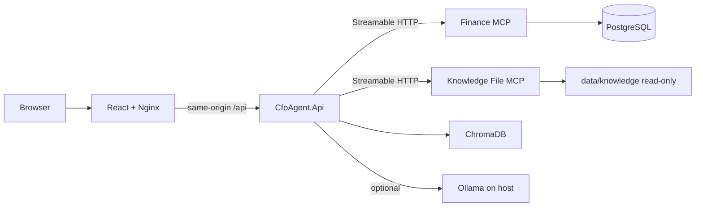

# CFO AI Agent Engineering Guide

## Product and boundaries

The CFO AI Agent is a local MVP for five CEO finance questions: weekly sales, week-over-week comparison, current-month top products, a five-year forecast, and annual-target assumptions.

`CfoAgent.Api` is the single ASP.NET Core business monolith. It contains the chat API, CFO Orchestrator, Sales Analysis, Forecasting, and Financial Knowledge agents, deterministic forecast calculation, RAG retrieval, configurable LLM-provider integration, and error handling. The agents stay in process and do not communicate over HTTP with one another.

Two approved hosted MCP services are external integration boundaries, not additional business applications:

- `CfoAgent.FinanceMcpServer` owns PostgreSQL persistence, EF Core migrations, deterministic seeding, finance tools, and budget lookup.
- `CfoAgent.KnowledgeFileMcpServer` exposes only read-only list/read operations under the mounted `data/knowledge` directory.

Both use the official `ModelContextProtocol` C# SDK over Streamable HTTP on the internal Docker network. No stdio process launch or project-path discovery remains active.

## Binding rules

- Finance data belongs only to Finance MCP PostgreSQL. `CfoAgent.Api` has no finance `DbContext`, migrations, seed command, connection string, direct finance query, or local finance fallback.
- Finance MCP loss, timeout, or missing capability is a controlled sanitized dependency failure, normally chat API HTTP 503. Caller cancellation is always propagated rather than translated to a fallback or 503.
- Knowledge File MCP has a secure local fallback only when explicitly enabled in Development. Containers disable it. ChromaDB remains the semantic retrieval and citation system in every mode.
- Financial summaries, comparisons, rankings, dates, percentages, and forecast values are deterministic C# and SQL results. An LLM never creates authoritative finance values.
- `IChatClient` is selected at the composition root from `AI:Provider`. Ollama is the only registered provider today: its adapter, options, SDK configuration, and health check stay under `AI/Ollama`. `AgentChatMiddleware` wraps that client through the Microsoft Agent Framework-compatible chat pipeline for timing, correlation-aware safe logging, configured prompt-risk checks, and sensitive-output redaction. It does not route business requests, select MCP tools, or map HTTP errors. Containers reach Ollama's Windows-host endpoint through `host.docker.internal`. No cloud-provider adapter is implemented.
- Preserve exactly four agents, the approved five Finance MCP tools, and the two Knowledge File MCP tools. The typed Finance MCP client selects only its fixed, configured-approved tool and supplies deterministic canonical arguments; `IChatClient` classifies requests and explains verified results but never selects MCP tools, endpoints, or authoritative finance arguments. Do not add auth, streaming, history, CQRS, MediatR, extra agents, write MCP operations, or microservices beyond the two approved hosted MCP services.

## Current deployment



Docker Compose publishes the frontend on `5173` and retains API port `5260` as a configurable diagnostic port. PostgreSQL, ChromaDB, Finance MCP, and Knowledge MCP have no host-published ports. `backend` is internal; the API and frontend also share `edge`. PostgreSQL and ChromaDB use named volumes. Finance migrations/seeding and RAG ingestion are one-shot services that run before the application becomes ready.

## Configuration and operations

- `AI:Provider` selects a registered provider and currently must be `Ollama`. `AI:Ollama:Model` defaults to `llama3.2:3b`; `AI:Ollama:BaseUrl` configures the local Ollama endpoint. Do not put provider-specific settings in agents, endpoints, or shared error handling.
- `Mcp:Finance:BaseUrl` and `Mcp:KnowledgeFiles:BaseUrl` are absolute HTTP URLs. In Compose they are `http://finance-mcp:8080` and `http://knowledge-mcp:8080`.
- `Mcp:Finance:AllowedToolNames` and `Mcp:KnowledgeFiles:AllowedToolNames` are the explicit MCP approval boundary. The shared adapter discovers tools with the official SDK, caches only approved metadata for its connection, validates each requested operation, and refreshes discovery after reconnect.
- `Mcp:KnowledgeFiles:UseLocalFallback` is Development-only and is `false` in containers.
- `Chroma:BaseUrl` is `http://chromadb:8000` in Compose.
- `AgentMiddleware:PromptInjectionCheckEnabled` and `AgentMiddleware:SuspiciousPromptPhrases` control the small deterministic prompt-risk check. Use `AgentMiddleware__...` environment-variable names outside JSON configuration. Middleware logs only correlation, provider, model, counts, duration, outcome, and redaction status; it never logs prompts, retrieved context, secrets, raw values, or full model output.
- Finance PostgreSQL credentials are supplied only to Finance MCP and the one-shot initializer; never add them to API configuration.

Use `/health/live` for process liveness and `/health/ready` for dependencies. Health checks are finite and do not reveal connection strings, file roots, prompts, SQL, or stack traces.

The MCP integration flow is: connect to the configured endpoint, SDK initialization, `tools/list`, allow-list filtering/cache, requested-operation validation, canonical-argument validation in the typed Finance facade, then `tools/call`. `IChatClient` is used only for bounded classification and verified-result prose. Finance typed facades retain deterministic arguments/result mapping; Knowledge raw file reads never replace ChromaDB retrieval. See `docs/MCP-INTEGRATION-REFACTOR-RESULTS.md` and `docs/CFO-AGENT-API-REFACTOR-RESULTS.md` for detailed behavior and validation evidence.

## Local workflow and validation

Start the complete deployment with `docker compose up --build -d`, then open `http://localhost:5173`. The five prompts and operational verification steps are listed in `USER-GUIDE.md`.

Run serialized .NET validation because this environment requires one MSBuild node:

```powershell
dotnet restore CfoAgent.sln
dotnet build CfoAgent.sln --no-restore --maxcpucount:1
dotnet test CfoAgent.sln --no-build --maxcpucount:1
dotnet test CfoAgent.sln --configuration Release --maxcpucount:1
```

Run frontend validation from `src/cfo-agent-ui` with `npm ci`, `npm test -- --run`, `npm run build`, and `npm run test:e2e:container` after Compose is healthy. The isolated backend resilience gate is `scripts/test-phase-8-containers.ps1`.

Historical pre-Phase-8 documents are retained under `docs/` for traceability and are explicitly marked where their SQLite/stdio design has been superseded.
