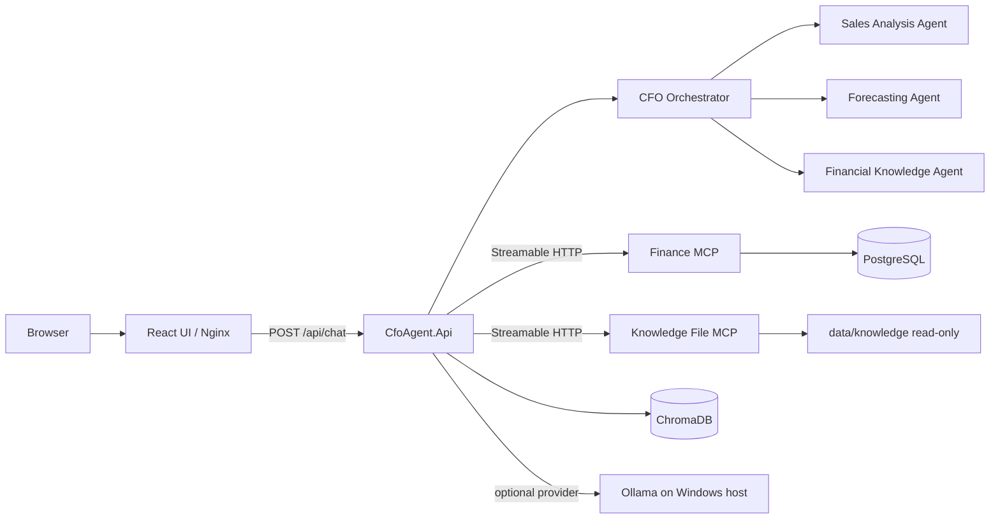
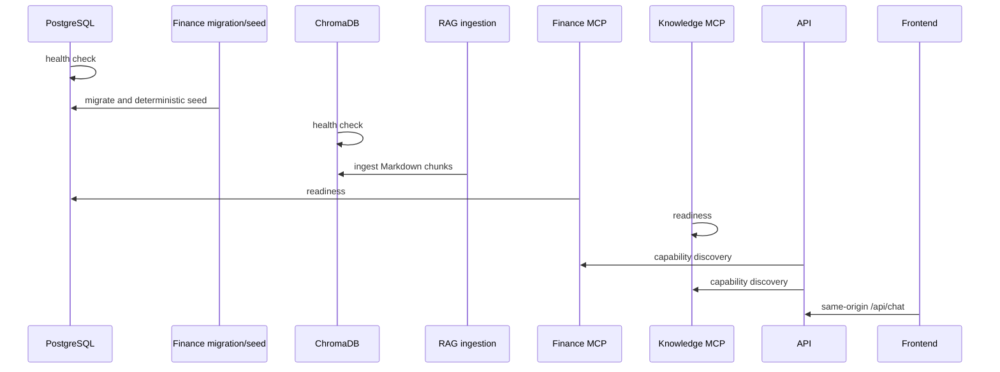

# Application Architecture

## Current architecture

The deployed application is a React single-page UI, an ASP.NET Core orchestration monolith, two network-hosted MCP services, PostgreSQL, and ChromaDB. The business monolith remains `CfoAgent.Api`; MCP services provide tightly controlled data integration rather than autonomous business workflows.

## Ownership

| Concern | Owner |
|---|---|
| Chat HTTP API, orchestration, four agents, deterministic forecast regression/scenarios | `CfoAgent.Api` |
| Finance entities, `FinanceDbContext`, migrations, seed data, SQL aggregation, budget lookup | Finance MCP |
| PostgreSQL connection settings and volume | Finance MCP / Compose initializer |
| Semantic Markdown retrieval, deterministic embeddings, citations | API + ChromaDB |
| Restricted file list/read | Knowledge File MCP |
| Static UI and same-origin API proxy | React + Nginx frontend container |

The API has no PostgreSQL connection string, finance EF Core persistence, finance migrations, seeding, direct finance query, or Finance fallback. Finance dependency faults produce sanitized Problem Details 503 responses; cancellation is not converted to a dependency fault.

## MCP transport and security

Both MCP services use the official C# SDK Streamable HTTP endpoint at `/mcp` over the internal Docker `backend` network. `McpToolAdapter` creates the SDK client lazily, lets it initialize, calls `tools/list`, filters the result using configured `AllowedToolNames`, and caches only approved tool metadata for the live connection. On a transport or tool failure it disposes the client and cache; the next request reconnects and rediscovers tools.

The API never exposes arbitrary endpoints or all server tools. For Finance operations, the current approved candidate set is supplied to the configured `IChatClient`, which can choose one tool only within that bounded set. `CfoAgentFramework` verifies the returned function name and requires arguments to exactly match deterministic C# canonical values before `McpToolAdapter` invokes `tools/call`. The CFO Orchestrator still routes business intents to specialist agents; it does not select MCP tools. Knowledge list/read use the same adapter but raw file access remains outside LLM answer selection so ChromaDB stays responsible for semantic retrieval and citations.

Finance MCP exposes only `get_sales_summary`, `compare_sales_periods`, `get_top_products`, `get_historical_sales`, and `get_budget_target`. Knowledge File MCP exposes only `list_knowledge_files` and `read_knowledge_file`. The knowledge root is a read-only bind mount, traversal and absolute paths are rejected, and the Knowledge container has a read-only root filesystem.

Knowledge local fallback is permitted only when explicitly configured in Development. The Compose deployment and container tests disable it. ChromaDB remains responsible for semantic retrieval and citations; raw file access never replaces it.

## Deployment and startup

`docker compose up --build -d` starts the complete local deployment. Frontend port `5173` is user-facing; API port `5260` is retained as configurable diagnostics. MCP, PostgreSQL, and ChromaDB ports remain internal. PostgreSQL and ChromaDB use named volumes; the application never removes them during normal operations.

## AI, calculations, and RAG

`MockChatClient` is the offline default `IChatClient`; optional Ollama remains configuration-selected and is contacted by containers through `host.docker.internal`. Both providers may return a bounded approved MCP function call when one is supplied for the current operation, but neither calculates finance values or controls canonical finance arguments. Finance MCP returns deterministic historical totals; `SalesForecastingService` performs forecast arithmetic in C#. ChromaDB stores deterministic token-hash embeddings and Markdown citation metadata only, never finance transactions.

## Health and tests

`/health/live` checks process liveness. `/health/ready` checks configured dependencies, including remote MCP capability/readiness and ChromaDB; it does not expose internals. Docker health checks gate startup for PostgreSQL, both MCP services, ChromaDB, API, and frontend.

Offline backend tests are deterministic. Opt-in live Ollama tests stay skipped by default. The Phase 8 container gate validates real MCP capability discovery, PostgreSQL seed data, no fallback on Finance loss, Knowledge security, cancellation, Chroma citations, internal-only ports, and recovery. Playwright verifies all five MVP workflows through the frontend container.
