# CFO AI Agent Application Architecture

## 1. Purpose of this document

The CFO AI Agent answers a small set of finance questions for a demonstration business. It can summarize sales, compare sales periods, rank products, produce a five-year sales forecast, and answer questions from indexed finance documents.

This document is for developers, testers, operators, and readers who want to understand how the application works without first learning every framework it uses. Technical terms are explained when they first appear, and a glossary is included at the end.

The main focus is `CfoAgent.Api`. This is the ASP.NET Core application that receives a question, understands the requested business capability, coordinates specialist agents, calls external services, and returns the response.

The document also explains the services that `CfoAgent.Api` depends on:

- Finance MCP for structured finance data;
- Knowledge File MCP for restricted raw-file access;
- ChromaDB for semantic document search;
- PostgreSQL for Finance MCP persistence;
- Ollama language-model provider;
- the React frontend and Docker network where they affect API requests.

Detailed frontend design and the internal business design of external services are outside the main focus. They are described only enough to explain their relationship with the API.

Source of truth: this document describes the implementation in `src/CfoAgent.Api`, `tools`, `docker-compose.yml`, configuration, and tests. It describes current behavior, not a future design proposal. Historical SQLite and child-process or `stdio` MCP designs are no longer active.

## 2. Simple system overview

The browser displays a React chat interface. When a user asks:

> Compare this week's sales with last week and explain the result.

the following happens:

1. The frontend sends the text to `POST /api/chat`.
2. `CfoAgent.Api` checks that the request contains a message and that it is not too long.
3. `CfoOrchestratorAgent` asks Ollama to return one allowed intent name. For this prompt, the intent is `SalesComparison`.
4. The orchestrator selects `SalesAnalysisAgent` using an explicit C# switch.
5. The sales agent calls the typed Finance MCP client.
6. The Finance client selects the fixed `compare_sales_periods` tool and creates the current-week and previous-week date arguments in C#.
7. The generic MCP adapter connects to Finance MCP, discovers and approves tools, then calls the selected tool.
8. Finance MCP reads PostgreSQL and calculates the comparison deterministically. Deterministic means the same inputs produce the same calculated values without asking an LLM to do the mathematics.
9. The sales agent gives the verified comparison to Ollama and asks it only to explain the data in concise language.
10. The API returns both the prose answer and the authoritative structured comparison.

The LLM does not choose the database, MCP server, MCP tool, or financial calculations in this flow. For a sales summary, it can propose a bounded start/end date range; C# validates the ISO dates, their ordering, and that the end date is not in the future before Finance MCP is called.

## 3. Main building blocks

| Building block | What it does | Relationship to `CfoAgent.Api` |
|---|---|---|
| React frontend | Collects questions and displays answers, structured values, warnings, and citations | Sends `POST /api/chat`; Nginx proxies `/api/` to the API in Docker |
| `CfoAgent.Api` | Validates requests, classifies intent, routes work, calls integrations, calculates forecasts, composes results, and translates errors | Main business and orchestration application |
| Finance MCP | Offers five read-only finance tools over MCP | API calls it through `FinanceMcpClient` and `McpToolAdapter` |
| Knowledge File MCP | Offers two restricted read-only file tools | API registers clients and checks readiness; current knowledge chat does not call it |
| RAG initializer | One-shot `CfoAgent.Api --ingest-rag` process that reads Markdown and loads ChromaDB | Runs before the API container starts; it is not a chat request |
| ChromaDB | Stores and searches indexed finance-document chunks | `FinancialKnowledgeAgent` reaches it through `IFinancialKnowledgeSearch` |
| PostgreSQL | Stores products, sales, and budget targets | Owned and accessed only by Finance MCP |
| Ollama | Local language model running on Windows | The only runtime `IChatClient`; API containers reach it through `host.docker.internal` |
| pgAdmin | Optional browser administration tool for PostgreSQL | Operational tool only; not part of an application request |

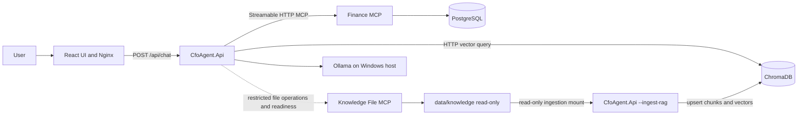

The dotted Knowledge MCP line is intentional. It represents an available operational integration, not the current semantic knowledge-answer path. Knowledge chat uses ChromaDB. The separate `rag-init` line is also intentional: the API project reads source Markdown only while it is building the ChromaDB index; the normal API container does not mount or read those files for a chat answer.

## 4. CfoAgent.Api responsibilities

`CfoAgent.Api` is responsible for the complete application-level request flow.

### Receive and validate prompts

`ChatEndpoints.MapChatEndpoints` maps `POST /api/chat`. `HandleAsync` rejects a missing, blank, or longer-than-4,000-character message. It preserves a supplied conversation ID or creates one. Source: `src/CfoAgent.Api/Features/Chat/ChatEndpoints.cs`.

### Classify the request

`CfoOrchestratorAgent.ClassifyAsync` asks `IChatClient` for one bounded intent. If the returned text is malformed, the orchestrator uses explicit keyword rules. Source: `src/CfoAgent.Api/Agents/CfoOrchestratorAgent.cs`.

### Route to specialist agents

`CfoOrchestratorAgent.HandleAsync` uses a C# switch over `CfoIntent`. It calls Sales, Forecasting, Financial Knowledge, or a tested Forecast-plus-Knowledge mixed path.

### Decide which external capability is needed

The selected specialist determines the dependency:

- Sales and Forecasting use Finance MCP.
- Financial Knowledge uses ChromaDB vector search.
- Knowledge File MCP is not consulted by the current chat agents.

### Call MCP tools

`FinanceMcpClient` chooses a fixed tool for each typed finance operation and builds canonical arguments. `McpToolAdapter` owns the MCP SDK connection, discovery, allow-list filtering, cache, and call. Source: `src/CfoAgent.Api/Mcp`.

### Call vector search

`FinancialKnowledgeAgent` calls `IFinancialKnowledgeSearch`. Its implementation, `ChromaFinancialKnowledgeSearch`, embeds the question and searches ChromaDB. Source: `src/CfoAgent.Api/Rag`.

### Compose the final answer

Each specialist creates an `AgentResult`. `AgentResultComposer` returns a single result unchanged or combines Forecast and Knowledge results once. `ChatResponse.FromAgentResult` maps the result to the public JSON contract.

### Return errors safely

`ApiExceptionHandler` converts dependency failures to Problem Details responses without returning stack traces, connection strings, internal paths, prompts, or SQL.

### Handle cancellation

`ChatEndpoints.HandleAsync` passes `HttpContext.RequestAborted` through the orchestrator, specialists, MCP calls, vector search, and LLM calls. Caller cancellation is rethrown and is not converted to a fallback or dependency 503.

## 5. Internal architecture of CfoAgent.Api

The API follows an Orchestrator-Worker pattern with practical Ports and Adapters boundaries.

- An orchestrator is a coordinator. It decides which focused worker should handle a request.
- A port is a small interface used by application code to describe an external capability.
- An adapter is the implementation that talks to a particular external technology.

The project remains one ASP.NET Core monolith. The agents are in the same process and call each other through normal C# method calls.

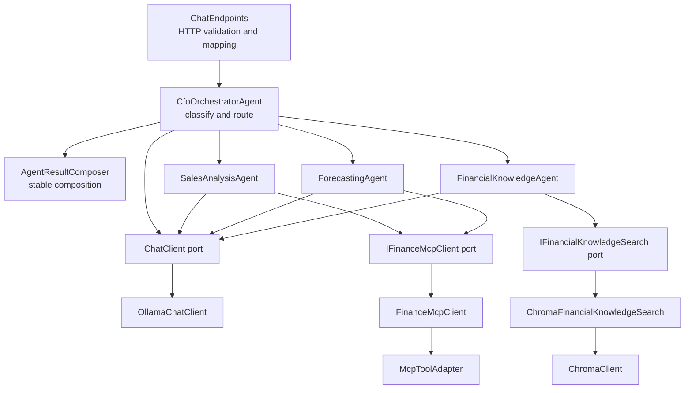

### HTTP endpoint

`ChatEndpoints` owns HTTP concerns only: request validation, conversation ID handling, cancellation source, and response mapping. It contains no agent-routing, MCP, ChromaDB, PostgreSQL, or Ollama-specific logic.

On success, the public response contains the prose answer, a stable response type, the agent names, authoritative structured data when available, citations for knowledge answers, assumptions, warnings, the data period, and the selected provider/model. The endpoint maps these values; it does not calculate them.

### CFO orchestrator

`CfoOrchestratorAgent` is the one coordinator. It classifies, selects workers, propagates cancellation, handles the supported mixed case, and delegates final merging to `AgentResultComposer`.

### Specialist agents

- `SalesAnalysisAgent` handles summary, comparison, and top-products capabilities.
- `ForecastingAgent` handles historical inputs and deterministic forecasts.
- `FinancialKnowledgeAgent` handles ChromaDB-backed document questions and citations.

### LLM abstraction

Application code depends on `Microsoft.Extensions.AI.IChatClient`. At startup, the composition root reads `AI:Provider`, creates a provider-neutral `AiProviderDescriptor`, and registers the matching runtime client. Ollama is the only registered provider today, implemented by `OllamaChatClient`. Tests inject test-local `IChatClient` doubles, and agents do not contain provider transport code.

### MCP adapter and typed client

`IMcpToolAdapter` hides the MCP SDK from agents. `McpToolAdapter` uses the SDK. `IFinanceMcpClient` gives Sales and Forecasting strongly typed business operations instead of raw JSON or arbitrary tool calls.

### Vector-search adapter

`IFinancialKnowledgeSearch` hides ChromaDB details. `ChromaFinancialKnowledgeSearch` implements retrieval and uses `ChromaClient` for Chroma API v2 HTTP requests.

### Response composer

`AgentResultComposer` is a concrete class because there is no need for interchangeable composition strategies. It performs deterministic merging and never calls an LLM.

### Configuration and dependency injection

`Program.cs` binds options and registers dependencies. Dependency injection means constructors receive the services they need instead of creating infrastructure clients themselves.

### Error handling

`RequestCorrelationMiddleware` assigns a safe correlation ID and logs request timing. `ApiExceptionHandler` translates known exceptions into sanitized HTTP responses.

## 6. End-to-end request flow

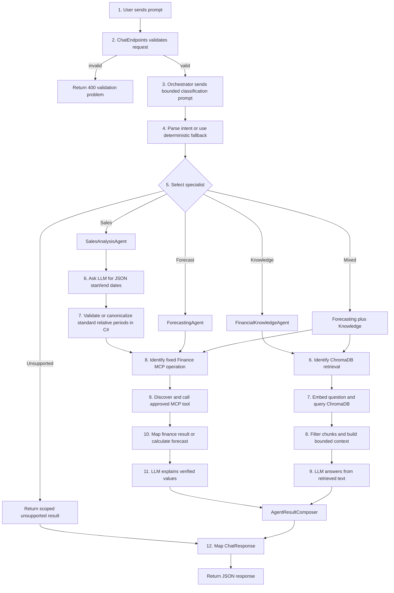

The LLM is used twice for most requests: once for bounded intent classification and once by the selected specialist to phrase verified information. Sales summaries add one bounded date-range interpretation call that returns only JSON. C# canonicalizes standard relative phrases such as "this week" and "last week" and validates other ranges before querying Finance MCP. There is no extra final LLM composition call.

## 7. How the system decides what to do

The four decisions below are deliberately separate. Keeping them separate prevents a language model from making infrastructure or financial decisions.

| Decision | Current decision maker | Example | What the LLM does not decide |
|---|---|---|---|
| Intent | `CfoOrchestratorAgent` with a bounded `IChatClient` answer and keyword fallback | `Forecast` | Which database or tool to call |
| Specialist agent | Explicit C# switch in the orchestrator | `ForecastingAgent` | Whether to invent a new agent or workflow |
| MCP server | The selected agent's injected port | Finance MCP for Sales/Forecasting | Which endpoint to contact |
| MCP tool and arguments | Typed client method plus the MCP allow-list | `get_historical_sales` with five deterministic years | Tool name, limits, or financial values. Sales-summary dates are an exception: the LLM proposes them, then C# validates and canonicalizes them. |

### 7.1 How intent is identified

Intent identification is hybrid.

First, `CfoOrchestratorAgent.ClassifyAsync` sends a prompt through the configured `IChatClient`. The prompt allows only:

- `SalesSummary`
- `SalesComparison`
- `TopProducts`
- `Forecast`
- `Knowledge`
- `Mixed`
- `Unsupported`

The response must exactly match one enum name and must be no longer than 64 characters.

If that response is not valid, `ClassifyDeterministically` applies keyword rules. For example, `COMPARE` or `VERSUS` means Sales Comparison; `TOP` plus `PRODUCT` means Top Products; and `FORECAST` plus `TARGET`, `ASSUMPTION`, or `RISK` means Mixed.

This fallback handles malformed model output. It does not handle an unavailable LLM: provider exceptions propagate.

### 7.2 How the specialist agent is selected

Selection is an explicit switch in `CfoOrchestratorAgent.HandleAsync`.

| Intent | Selected work |
|---|---|
| Sales Summary | `SalesAnalysisAgent.GetWeeklySummaryAsync` |
| Sales Comparison | `SalesAnalysisAgent.GetWeekOverWeekComparisonAsync` |
| Top Products | `SalesAnalysisAgent.GetCurrentMonthTopProductsAsync` |
| Forecast | `ForecastingAgent.GetForecastAsync` |
| Knowledge | `FinancialKnowledgeAgent.AnswerAsync` |
| Mixed | Forecasting and Financial Knowledge, awaited with `Task.WhenAll` |
| Unsupported | No specialist; return a fixed supported-scope message |

There is no agent registry, plugin discovery, planner, or dynamic workflow engine.

### 7.3 How the MCP server is selected

MCP server selection is based on specialist responsibility and dependency injection.

- Sales and Forecasting call `IFinanceMcpClient`. This leads to the keyed Finance `McpToolAdapter` and Finance MCP URL.
- Explicit file-list/read operations use `IKnowledgeFileMcpClient`, implemented by `KnowledgeFileMcpAccess`. When Knowledge MCP is enabled, it uses `KnowledgeFileMcpHttpClient`, the keyed Knowledge `McpToolAdapter`, and the Knowledge MCP URL. Only an explicitly enabled Development fallback can use the in-process restricted reader instead.
- The language model does not choose an MCP server.
- Tool discovery does not choose the server; it occurs after the correct keyed adapter has already been selected.

Current chat agents do not call `IKnowledgeFileMcpClient`. A Knowledge intent selects ChromaDB through `IFinancialKnowledgeSearch`.

### 7.4 How the MCP tool is selected

The implementation is a hybrid of dynamic discovery and fixed business mappings.

What is dynamic:

- The official SDK client performs initialization.
- `McpToolAdapter` calls `tools/list` through `ListToolsAsync`.
- Discovered tools are filtered against configured allow-lists and cached.

What is fixed in application logic:

| Typed method | Hard-coded MCP tool |
|---|---|
| `GetSalesSummaryAsync(SalesPeriod)` | `get_sales_summary` |
| `GetCurrentWeekSummaryAsync` | `get_sales_summary` |
| `GetWeekOverWeekComparisonAsync` | `compare_sales_periods` |
| `GetCurrentMonthTopProductsAsync` | `get_top_products` |
| `GetHistoricalYearlyTotalsAsync` | `get_historical_sales` |
| `GetBudgetTargetAsync` | `get_budget_target` |
| `KnowledgeFileMcpHttpClient.ListFilesAsync` | `list_knowledge_files` |
| `KnowledgeFileMcpHttpClient.ReadFileAsync` | `read_knowledge_file` |

Discovered tools are not passed to the LLM in the current agent flow. The LLM does not choose the final tool. The only Finance-argument exception is Sales Summary: it proposes `startDate` and `endDate` as JSON. `SalesAnalysisAgent` canonicalizes standard relative phrases such as "this week" and validates other ranges for ISO format, date ordering, and the non-future boundary before `FinanceMcpClient` sends canonical arguments to `get_sales_summary`.

The generic adapter can call another discovered and approved tool by name without adding an adapter method, but that alone does not make the tool available to a chat scenario. A business route or typed operation would still have to request it.

### 7.5 How the system decides whether to call ChromaDB

The orchestrator calls ChromaDB only indirectly:

1. The prompt is classified as `Knowledge` or `Mixed`.
2. The orchestrator selects `FinancialKnowledgeAgent`.
3. That agent always calls `IFinancialKnowledgeSearch.RetrieveAsync` before calling the LLM.
4. `ChromaFinancialKnowledgeSearch` performs the vector query.

Sales Summary, Sales Comparison, Top Products, and Forecast do not call ChromaDB. Unsupported requests do not call it either.

The prompt "What does gross margin mean?" is not guaranteed to reach Knowledge with the current bounded classifier. It lacks the deterministic `TARGET`, `ASSUMPTION`, or `RISK` keywords, and an Ollama response outside the allowed intent names falls back to `Unsupported`. The tested Knowledge example is "What is the annual sales target and what assumptions were used?"

## 8. Detailed sequence diagrams

### 8.1 Finance request: sales summary

Example: "Give me the sales summary since yesterday."

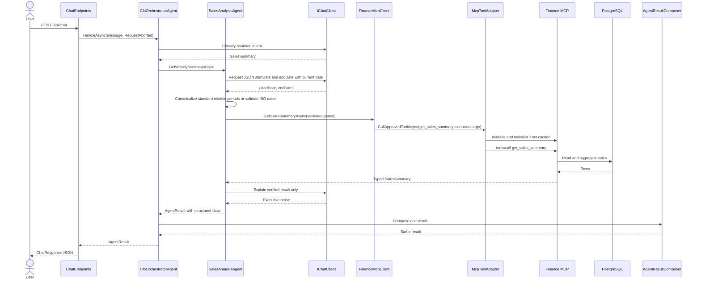

The LLM interprets the user's time wording only. It does not calculate financial values, select the MCP server/tool, or bypass the C# validation.

### 8.2 Finance request: top products

Example: "Show me this month's top products."

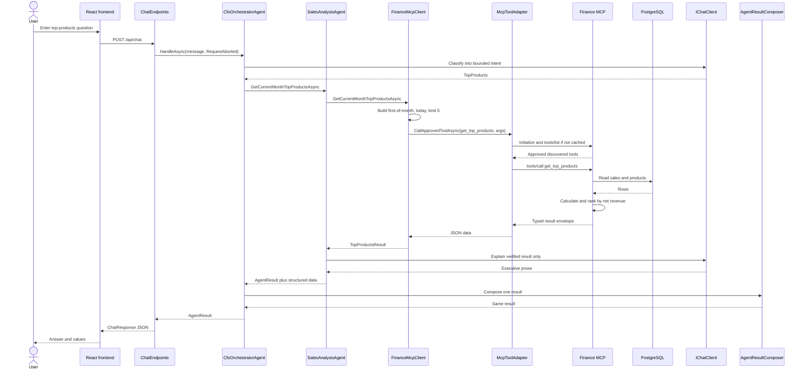

### 8.3 Knowledge request

Tested example: "What is the annual sales target and what assumptions were used?"

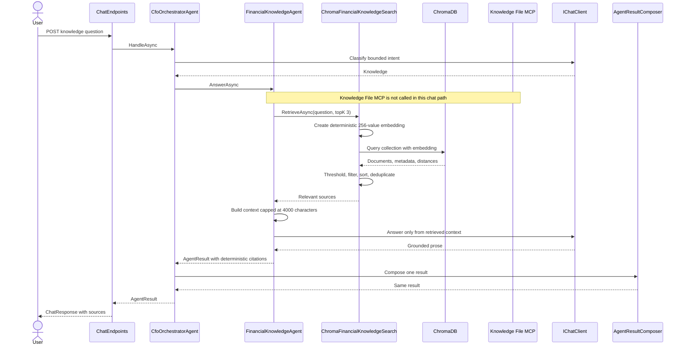

### 8.4 Mixed request

The current Mixed route is specifically Forecast plus Knowledge. A tested example is:

> Give me the sales forecast with assumptions and risks.

The suggested phrase "Compare this week's sales with last week and explain possible reasons" contains `COMPARE` but no current Knowledge keyword. It routes only to Sales Comparison, so it is not shown as Mixed.

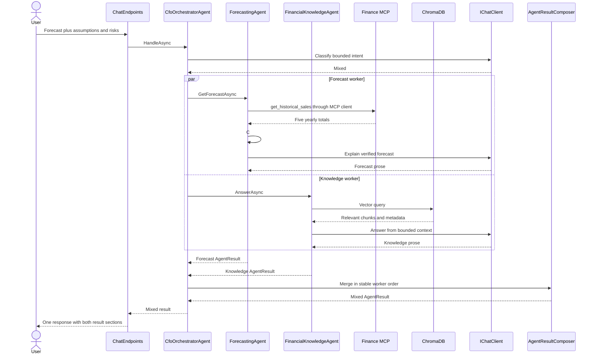

### 8.5 Finance MCP failure

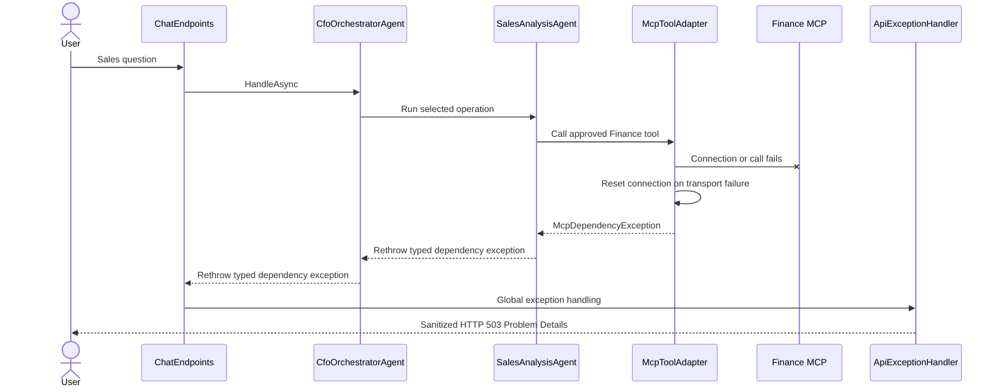

## 9. MCP integration

MCP means Model Context Protocol. It is a standard way for an application to discover and call capabilities exposed by another process or service.

An MCP server is the service exposing capabilities. An MCP tool is one callable capability, such as `get_sales_summary` or `read_knowledge_file`.

### Actual connection flow

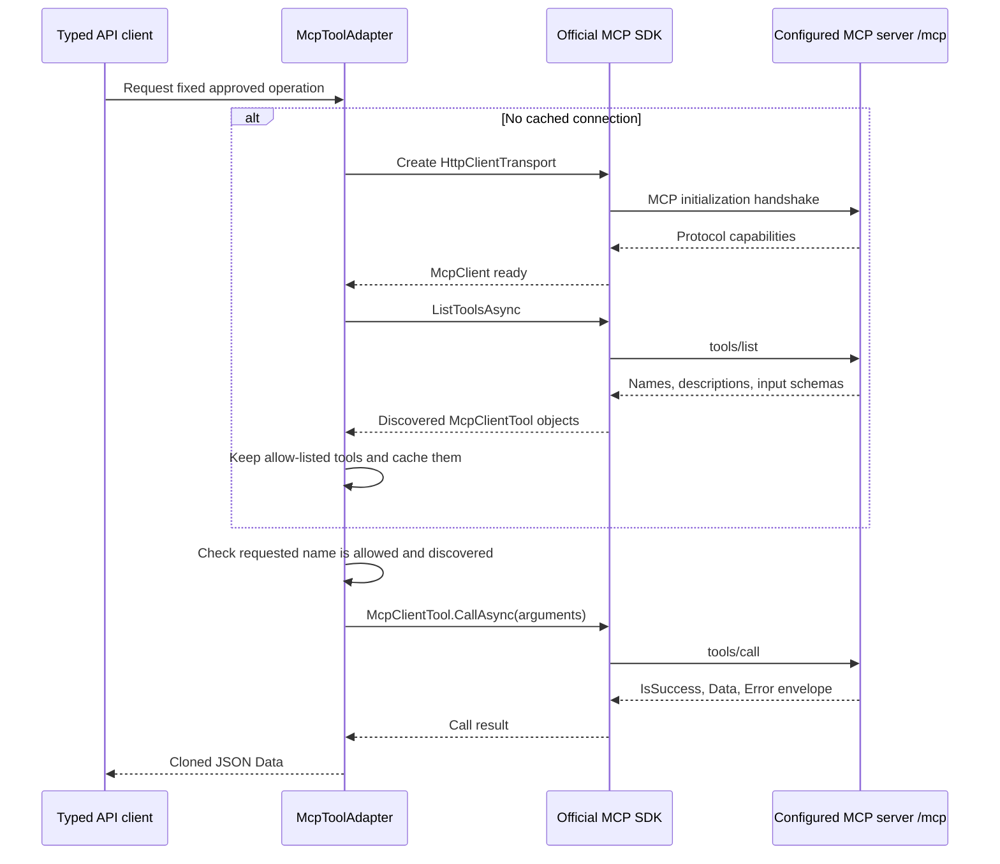

### Initialization handshake

`McpToolAdapter.GetOrCreateClientUnderLockAsync` creates an `HttpClientTransport` and calls `McpClient.CreateAsync`. The official SDK performs initialization. The API does not build handshake JSON itself.

### Transport

Both services use Streamable HTTP at `/mcp`. Streamable HTTP is the MCP network transport suitable for normal HTTP service-to-service communication. The servers configure stateless HTTP transport, meaning they do not require application session state between calls.

### Tool discovery and descriptions

`McpToolAdapter.GetOrDiscoverToolsAsync` calls `ListToolsAsync`, the SDK form of `tools/list`. Discovered `McpClientTool` objects include names and SDK-provided definitions such as descriptions and input schemas.

The adapter uses names for approval and invocation. Current agents do not convert or pass discovered definitions to the LLM.

### Allow-lists

Configuration contains five approved Finance names and two approved Knowledge names. A server can expose another tool, but the adapter ignores it unless its exact name is configured.

### Input and result schemas

The MCP server SDK creates input schemas from `[McpServerTool]` methods and their parameter types/descriptions. The API does not implement a separate JSON Schema engine.

Finance and Knowledge tools return an envelope containing `IsSuccess`, `Data`, and `Error`. `McpToolAdapter` accepts only a successful envelope with non-null data. Typed API clients deserialize `Data` into application contracts.

### Connection reuse and caching

Each keyed adapter is registered as a singleton. It lazily creates one SDK client and caches approved discovered tools for that live connection. A semaphore prevents concurrent duplicate initialization.

There is no background polling. Discovery happens on first use or readiness and again after a reset/reconnect.

### Missing and additional tools

- If a required tool is missing, the adapter throws `McpDependencyException` with `CapabilityMismatch`.
- If a tool is discovered but not allow-listed, it is not exposed by `GetApprovedToolNamesAsync` and cannot be called.
- If a new tool is both discovered and allow-listed, the generic adapter can call it by name. Current chat routing still needs application logic to request it.
- If a server schema rejects arguments, the server/SDK returns an error and the adapter translates it to a controlled invalid-response dependency failure.

### Error and refresh behavior

Transport errors and adapter timeouts reset and dispose the SDK client and cache. A server result with `IsError=true` also resets. The next operation reconnects and rediscovers.

Not every capability mismatch or application-level invalid envelope immediately clears the cache. This is a current implementation limitation, described later.

## 10. Finance MCP server

Finance MCP provides read-only access to structured finance information. It is hosted independently by `CfoAgent.FinanceMcpServer.Program` using ASP.NET Core, the official MCP server SDK, stateless HTTP transport, assembly tool discovery, and `/mcp`.

### Finance tool catalog

| Tool | Purpose | Inputs | Result | Example question |
|---|---|---|---|---|
| `get_sales_summary` | Summarize one period up to 366 days | `startDate`, `endDate` as `YYYY-MM-DD` | Revenue, cost, profit, margin, quantity, orders, AOV, top product, warnings | "Give me this week's sales summary." |
| `compare_sales_periods` | Compare two periods | Current and previous start/end dates | Two summaries, change, percentage, direction, warnings | "Compare this week with last week." |
| `get_top_products` | Rank products by net revenue | Start date, end date, limit 1-20 | Period and ranked products | "Show this month's top five products." |
| `get_historical_sales` | Return complete yearly totals | Start year and end year, at most five years | Ordered yearly net revenue totals | "Forecast sales for five years." |
| `get_budget_target` | Read an annual or monthly target | Year and optional month | Availability, sales/profit targets, reference, warnings | No current chat agent invokes this tool |

### PostgreSQL ownership

Finance MCP is the only application service with `FinanceDbContext`, EF Core migrations, and the Npgsql PostgreSQL provider. `CfoAgent.Api.csproj` contains no EF Core or Npgsql dependency and no PostgreSQL connection string.

This boundary keeps database credentials and schema details out of the orchestration application. The API asks for a business result through MCP instead of querying tables.

### Queries and deterministic calculations

`FinanceMcpTools` performs read-only EF Core queries with `AsNoTracking`. It calculates revenue, cost, gross profit, gross margin, average order value, comparison changes, rankings, historical totals, and budget lookup in C# over bounded query results.

The LLM is never involved in those calculations.

### Migrations and seeding

The migration `20260718162809_InitialPostgreSqlFinanceSchema` creates `Products`, `Sales`, and `BudgetTargets`, including indexes, relationships, decimal precision, and check constraints.

The host accepts:

- `--migrate`: apply migrations;
- `--seed`: apply migrations and run `DevelopmentFinanceSeeder`.

Compose runs `finance-db-init --seed` once before Finance MCP starts. Seeding is deterministic relative to `Finance:DemoDate` and returns without inserting duplicates if products already exist.

### Health and network access

`FinanceDatabaseReadinessHealthCheck` verifies database connectivity, no pending migrations, and readable access to all three tables. Finance MCP exposes `/health/live` and `/health/ready` internally. Its port is not published to the host by the main Compose file.

## 11. Knowledge File MCP server

Knowledge File MCP provides restricted raw access to files under one configured directory. It is not a semantic search engine and does not replace ChromaDB.

| Tool | Purpose | Input | Result |
|---|---|---|---|
| `list_knowledge_files` | List files recursively | None | Sorted relative paths |
| `read_knowledge_file` | Read one allowed file | Relative path | File text or typed missing-file failure |

### Knowledge directory and read-only behavior

Compose mounts `./data/knowledge` at `/knowledge` with `read_only: true`. The container root filesystem is also read-only, with only `/tmp` provided as temporary writable storage.

The server exposes no method for writing, deleting, renaming, moving, executing, or creating directories.

### Path security

`KnowledgeFileMcpTools`:

- rejects blank and absolute paths;
- rejects `..` traversal segments using slash or backslash;
- resolves a full path and verifies it remains below the configured root;
- rejects symbolic links and junctions;
- skips reparse points during listing.

### Local fallback policy

`KnowledgeFileMcpAccess` can use the in-process `KnowledgeFileMcpClient` only when both conditions are true:

1. `Mcp:KnowledgeFiles:UseLocalFallback=true`;
2. the API environment is Development.

Container configuration sets fallback to false. Finance MCP has no local database fallback.

### Health and current use

`KnowledgeRootReadinessHealthCheck` verifies that the root exists, is not a reparse point, and can be enumerated. API readiness discovers both tools when Knowledge MCP is enabled.

Current chat agents do not list or read files through Knowledge MCP. The integration is currently exercised by readiness, explicit client operations, and integration tests.

## 12. ChromaDB and vector search

### Beginner-friendly explanation

A vector is a list of numbers. An embedding is a vector created from text so that text with overlapping or related content can be compared numerically.

A vector database stores those number lists and searches for nearby vectors. Semantic search means searching by meaning or content similarity rather than requiring an exact phrase match. This project's embedding is a simple token-hash baseline, so it is strongest when text shares actual words. It is less semantically capable than a trained embedding model.

RAG means Retrieval-Augmented Generation. The application retrieves relevant document text first and then gives that text to the LLM as controlled context.

### Actual ingestion flow

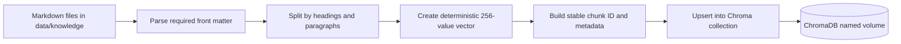

The one-shot Compose service `rag-init` runs `CfoAgent.Api --ingest-rag` after ChromaDB is healthy.

### Actual query flow

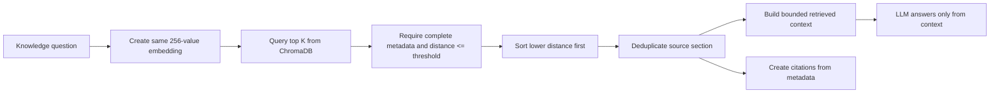

### Embedding implementation

`DeterministicTokenHashEmbeddingGenerator` is the only registered embedding provider.

| Property | Actual implementation |
|---|---|
| Provider | Local C# implementation, not Ollama or a cloud model |
| Dimension | 256 numbers |
| Tokenization | Lowercase sequences of letters and digits |
| Hash | 32-bit FNV-1a over each token's UTF-8 bytes |
| Bucket | Hash modulo 256 |
| Value | Add +1 or -1 based on one hash bit |
| Normalization | Divide non-empty vector by its Euclidean length |
| Determinism | Same text always produces the same vector |

Example document chunk:

> Gross margin equals revenue minus cost of goods sold.

Example question:

> How do I calculate gross margin?

Both texts contain the exact tokens `gross` and `margin`. Those tokens affect the same vector buckets, so the vectors have some overlap and can be closer than unrelated text. The implementation does not actually understand that `calculate` and `equals` are related concepts. Hash collisions and vocabulary differences can therefore produce weaker matches than a trained embedding model.

### Similarity and distance

The API asks ChromaDB for documents, metadata, and distances. `ChromaFinancialKnowledgeSearch` treats smaller distance as better and keeps results at or below `Rag:MaximumRetrievalDistance`, which defaults to 1.25.

The collection creation code does not specify the exact Chroma distance metric. This document therefore does not claim cosine, Euclidean, or another metric.

### No relevant result

If the collection does not exist, retrieval returns "No financial knowledge has been ingested." If no result survives validation and the distance threshold, it returns "No sufficiently relevant financial knowledge was found."

`FinancialKnowledgeAgent` then returns a fixed insufficient-knowledge answer and does not call the LLM.

## 13. How data is saved into ChromaDB

### Source files

Source documents are top-level `*.md` files in `data/knowledge`. They currently cover the annual sales report, current budget and target, forecast assumptions, market risks, and product strategy.

In Docker, only the one-shot `rag-init` container mounts this directory for ingestion. The normal API container answers knowledge questions from ChromaDB and does not need direct source-file access. Knowledge File MCP has its own separate read-only mount for its two explicit file tools.

### Required front matter

Each document must provide:

- `document_id`
- `document_name`
- `document_type`
- `period`
- `section`
- `source_path`

### Chunking

`RagDocumentIngestionService.BuildChunks` treats Markdown headings as section boundaries. Within each section it uses deterministic character-based sliding windows up to `Rag:MaxChunkCharacters`, default 1,200. The next window starts after `chunk size - overlap size` characters. `Rag:ChunkOverlapPercentage` defaults to 15, and its overlap size is rounded away from zero. This keeps a small amount of boundary context in consecutive chunks without skipping source text. Re-ingestion deletes prior ChromaDB records for the same `source_path` before writing the current chunk set, so a chunk-size or overlap change does not leave old chunk IDs alongside the new ones.

### Collection creation

`ChromaClient.GetOrCreateCollectionAsync` calls Chroma API v2 using:

- tenant `Chroma:Tenant`;
- database `Chroma:Database`;
- collection `Chroma:CollectionName`, default `cfo-financial-knowledge`.

### Stored record

Each chunk stores:

| Field | Value |
|---|---|
| Chroma ID | `chunk-` plus SHA-256 of source path, section, and content |
| Document | Section heading and chunk text |
| Embedding | 256 normalized floats |
| Metadata | document ID/name/type, period, section, source path, chunk index |

### Duplicate and re-ingestion behavior

The service uses Chroma `upsert`. Re-ingesting an unchanged chunk calculates the same ID and updates the same record rather than creating an exact duplicate.

If a document changes, changed chunks receive new IDs. The ingestion code does not delete old IDs that are no longer produced, so stale chunks can remain in the collection. This is a proven current limitation.

### Error handling

Ingestion catches non-cancellation errors per document and records the source path and message in `RagIngestionResult`. The `--ingest-rag` command prints failures and exits by throwing if any document failed. Compose requires `rag-init` to complete successfully before starting the API.

## 14. LLM provider

`OllamaChatClient` wraps `OllamaApiClient` from OllamaSharp. This is provider-specific infrastructure, not an application-level dependency.

- Ollama runs on the Windows host, outside Docker.
- The API container reaches it at `http://host.docker.internal:11434` by default.
- `AI:Provider` selects the configured provider and currently must be `Ollama`.
- `AI:Ollama:Model` selects the model, normally `llama3.2:3b`.
- The wrapper enforces configured model ID, temperature, context length, output-token limit, and timeout.
- Caller cancellation remains cancellation.
- Timeout, unavailable endpoint, malformed response, and empty response become typed provider failures.

Information sent to the selected LLM is bounded by operation:

- classification: the user's message inside the allowed-intent prompt;
- Sales Summary date interpretation: the user's message and the `TimeProvider` current date; the response must be JSON with `startDate` and `endDate`;
- Sales result presentation: verified serialized summary/comparison/product data;
- Forecast: completed deterministic forecast data and assumptions;
- Knowledge: bounded retrieved Chroma text and source headers.

Current agents do not send MCP tool definitions to either provider. They do not accept model-selected tool calls.

## 15. Error handling and resilience

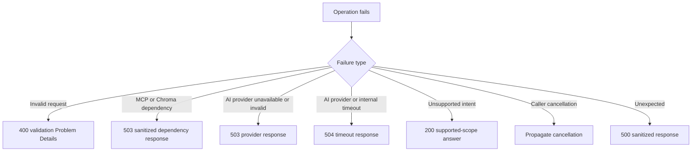

| Situation | Current behavior |
|---|---|
| Missing/blank/oversized prompt | HTTP 400 validation Problem Details |
| Unsupported request | HTTP 200 with an `unsupported` response and a scoped message |
| Finance/Knowledge MCP unavailable | `McpDependencyException`, normally sanitized HTTP 503 |
| Required MCP tool missing | `CapabilityMismatch`, mapped to sanitized HTTP 503 during a request/readiness unhealthy |
| Invalid MCP arguments | Server/SDK rejection becomes controlled invalid-response dependency failure |
| ChromaDB unavailable | `ChromaDependencyException` through `VectorSearchDependencyException`, HTTP 503 |
| No relevant knowledge | Successful Knowledge result with a fixed insufficient-knowledge answer, not 503 |
| AI provider unavailable or invalid | Sanitized provider HTTP 503 |
| Invalid Sales Summary date-range JSON | C# prevents the Finance MCP call; the current `InvalidOperationException` mapping returns a sanitized HTTP 503 |
| AI provider timeout | HTTP 504 |
| Caller cancellation | Propagated; not converted to fallback or 503 |

MCP adapter operations use a linked configured timeout. On timeout or transport failure, the adapter disposes the connection and clears its tool cache so the next request reconnects.

Logs record operational fields as applicable, such as dependency, tool name, provider, model, duration, outcome, and failure category. HTTP errors contain only a safe title, status/type, and trace ID. The response does not include internal exception text or stack traces.

## 16. Configuration

Docker Compose reads root `.env` values and maps them to .NET options. Direct `dotnet run` uses `appsettings*.json`, environment variables with `__`, or user secrets.

The local and container defaults are intentionally different. Local `appsettings.json` enables Finance MCP at `http://localhost:5081` and disables Knowledge MCP. Compose enables both MCP services at Docker DNS addresses and disables the Knowledge local fallback. Both modes use Ollama.

| Setting | Purpose | Example | Used by | Required behavior |
|---|---|---|---|---|
| `AI:Provider` / `AI_PROVIDER` | Selected registered provider | `Ollama` | Composition root, response metadata | Required; currently `Ollama` only |
| `AI:Ollama:Model` / `OLLAMA_MODEL` | Ollama model name | `llama3.2:3b` | Ollama adapter and dynamic chat metadata | Nonblank |
| `AI:Ollama:BaseUrl` / `OLLAMA_BASE_URL` | Ollama endpoint | `http://host.docker.internal:11434` | Ollama HTTP client | Absolute HTTP URL |
| `AI:Ollama:TimeoutSeconds` / `OLLAMA_TIMEOUT_SECONDS` | LLM operation timeout | `120` | Ollama adapter/client | 1 through 600 |
| `AI:Ollama:Temperature` / `OLLAMA_TEMPERATURE` | Ollama sampling variability | `0` | Ollama request | 0 through 2 |
| `AI:Ollama:ContextLength` / `OLLAMA_CONTEXT_LENGTH` | Ollama context size | `4096` | Ollama request | 1,024 through 32,768 |
| `AI:Ollama:MaxOutputTokens` / `OLLAMA_MAX_OUTPUT_TOKENS` | Maximum completion size | `512` | Ollama request | 1 through 1,024 and below context length |
| `Mcp:Finance:Enabled` | Enable required Finance MCP | `true` | Finance adapter/readiness | Finance readiness is unhealthy when false |
| `Mcp:Finance:BaseUrl` / `FINANCE_MCP_BASE_URL` | Finance MCP service address | `http://finance-mcp:8080` | Finance keyed adapter | Absolute HTTP URL when enabled |
| `Mcp:Finance:TimeoutSeconds` | Finance MCP timeout | `10` | Finance keyed adapter | Positive |
| `Mcp:Finance:AllowedToolNames` | Finance security allow-list | Five committed tool names | MCP adapter | Unique, nonblank, non-empty when enabled |
| `Mcp:KnowledgeFiles:Enabled` | Enable Knowledge MCP | `true` in Compose | Knowledge adapter/readiness | Controls remote client use |
| `Mcp:KnowledgeFiles:BaseUrl` / `KNOWLEDGE_MCP_BASE_URL` | Knowledge MCP address | `http://knowledge-mcp:8080` | Knowledge keyed adapter | Absolute HTTP URL when enabled |
| `Mcp:KnowledgeFiles:RootPath` | Local fallback/root setting | `/knowledge` | Local client and server mapping | Required for local fallback |
| `Mcp:KnowledgeFiles:UseLocalFallback` | Permit local restricted-file fallback | `false` | `KnowledgeFileMcpAccess` | Allowed only in Development |
| `Mcp:KnowledgeFiles:TimeoutSeconds` | Knowledge operation timeout | `10` | Remote/local knowledge clients | Positive |
| `Chroma:BaseUrl` / `CHROMA_BASE_URL` | ChromaDB service address | `http://chromadb:8000` | Chroma clients/health | Absolute URL |
| `Chroma:CollectionName` | Vector collection | `cfo-financial-knowledge` | Ingestion and search | Nonblank |
| `Chroma:Tenant` / `Chroma:Database` | Chroma API v2 scope | `default_tenant`, `default_database` | Chroma client | Nonblank |
| `Chroma:TimeoutSeconds` | Chroma HTTP timeout | `10` | Chroma clients | Positive |
| `Rag:KnowledgeFilesRoot` | Markdown source directory | `/knowledge` in Compose | RAG ingestion | Nonblank |
| `Rag:MaxChunkCharacters` | Maximum chunk target | `1200` | Ingestion | At least 256 |
| `Rag:ChunkOverlapPercentage` / `RAG_CHUNK_OVERLAP_PERCENTAGE` | Percentage of each chunk repeated at the start of the next chunk | `15` | RAG ingestion | At least 0 and below 100; calculated overlap must be smaller than the chunk size |
| `Rag:MaxKnowledgeContextCharacters` | Maximum LLM context built from retrieval | `4000` | Knowledge agent | At least 256 |
| `Rag:MaximumRetrievalDistance` | Largest accepted Chroma distance | `1.25` | Vector-search adapter | Nonnegative |

PostgreSQL credentials and `ConnectionStrings:FinanceDatabase` are supplied only to Finance MCP and `finance-db-init`. They are deliberately absent from API configuration.

## 17. Deployment architecture

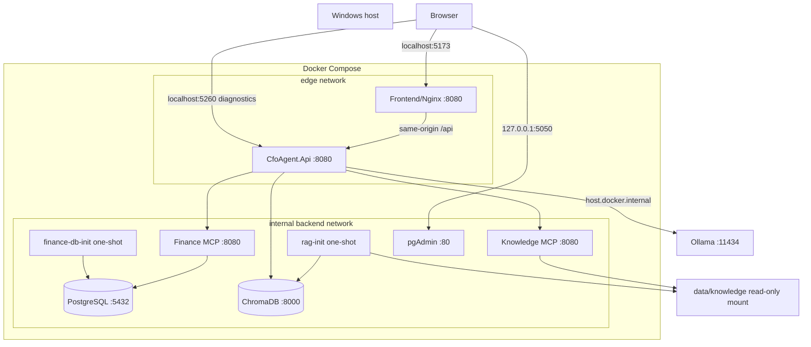

### Networks and ports

- `backend` is an internal Docker network. PostgreSQL, both MCP services, and ChromaDB are not published to the host.
- `edge` connects frontend and API.
- Frontend is published on configurable port 5173 by default.
- API diagnostic access is published on configurable port 5260.
- pgAdmin is published only on host loopback port 5050 by default.
- Ollama remains on Windows and is reached through `host.docker.internal`.

### Startup order

1. PostgreSQL starts and becomes healthy.
2. `finance-db-init` applies migration and deterministic seed, then exits successfully.
3. Finance MCP starts and verifies PostgreSQL/schema readiness.
4. ChromaDB starts and becomes healthy.
5. `rag-init` ingests Markdown and exits successfully.
6. Knowledge MCP verifies its read-only root.
7. API waits for Finance MCP, Knowledge MCP, ChromaDB, and RAG ingestion.
8. Frontend waits for API readiness.

PostgreSQL, ChromaDB, and pgAdmin use named volumes. Knowledge files use a read-only bind mount.

## 18. Example scenarios

| Example | Detected intent | Selected agent | External data | Tool or search | Composition |
|---|---|---|---|---|---|
| "Give me this week's sales summary." | Sales Summary | Sales Analysis | LLM date interpretation, then Finance MCP -> PostgreSQL | validated `startDate`/`endDate`, then `get_sales_summary` | Single result returned unchanged |
| "Compare this week's sales with last week." | Sales Comparison | Sales Analysis | Finance MCP -> PostgreSQL | `compare_sales_periods` | Single result returned unchanged |
| "Show me the top five products this month." | Top Products | Sales Analysis | Finance MCP -> PostgreSQL | `get_top_products` | Single result returned unchanged |
| "Give me the sales forecast for the next five years." | Forecast | Forecasting | Finance MCP historical totals | `get_historical_sales`, then C# regression | Single result with forecasts and assumptions |
| "What is the annual sales target and what assumptions were used?" | Knowledge | Financial Knowledge | ChromaDB | Top-3 vector search, distance threshold | Single grounded result with citations |
| "Give me the sales forecast with assumptions and risks." | Mixed | Forecasting plus Financial Knowledge | Finance MCP and ChromaDB | `get_historical_sales` plus vector search | Composer joins two answers and structured results |

The annual-target example does not call Finance MCP `get_budget_target` in the current chat flow. It reads indexed Markdown through ChromaDB.

## 19. Architecture patterns used

### Orchestrator-Worker

Fully implemented for the bounded MVP. One `CfoOrchestratorAgent` classifies and routes; three focused specialist agents perform the work. Mixed routing is limited to one explicit Forecast-plus-Knowledge combination.

### Ports and Adapters

Implemented pragmatically around external boundaries:

- `IChatClient` separates agents from provider details and provides a test seam.
- `IFinanceMcpClient` separates agents from MCP JSON/transport.
- `IMcpToolAdapter` separates typed clients from the MCP SDK.
- `IFinancialKnowledgeSearch` separates the knowledge agent from ChromaDB.

This is not a physically separated multi-project Clean Architecture implementation. Application and infrastructure classes live in one API project, but constructor dependencies point through meaningful interfaces at external boundaries.

### LLM registration

`Program.cs` selects the registered `IChatClient` from `AI:Provider` at the composition root and exposes only `AiProviderDescriptor` outside that boundary. Ollama is the one supported selection today. Unit tests replace `IChatClient` or the descriptor with test-project doubles; agents and endpoints have no provider switch or fallback provider.

### Dependency Injection

Fully implemented using ASP.NET Core DI in `Program.cs`. Agents receive ports and collaborators through constructors and do not construct infrastructure clients.

### Adapter pattern

Implemented for MCP and ChromaDB:

- `McpToolAdapter` translates application requests to MCP SDK operations.
- `FinanceMcpClient` translates MCP JSON into stable finance contracts.
- `ChromaFinancialKnowledgeSearch` translates a business query into Chroma search and retrieval results.

### Patterns not used

The API does not use a generic repository, unit of work, CQRS, MediatR, event bus, workflow engine, plugin registry, or microservice-per-agent design. Finance MCP uses EF Core directly because it owns that persistence boundary.

## 20. Known limitations

These limitations are visible in the current code:

- Intent categories are static. The orchestrator supports seven fixed enum values.
- Deterministic fallback classification uses narrow keywords and cannot understand every natural-language finance question.
- Mixed handling supports only Forecast plus Knowledge. It is not a general multi-agent planner.
- MCP tools are dynamically discovered but selected by fixed typed mappings. Newly discovered tools do not automatically become chat capabilities.
- Discovered MCP tools are not passed to the LLM, and the LLM does not select tools.
- Tool discovery is cached per connection with no background refresh. Refresh happens after selected failures/reconnect, and not every capability mismatch or invalid envelope clears the cache immediately.
- `get_budget_target` exists but is not used by the current chat agents.
- Knowledge File MCP is not part of the current knowledge-answer path; ChromaDB is.
- The token-hash embedding is deterministic and test-friendly but is not a trained semantic model. It depends heavily on shared tokens and can suffer hash collisions.
- The exact Chroma distance metric is not configured by repository code.
- Re-ingestion replaces records for Markdown documents that are currently present, keyed by their front-matter `source_path`. Removing a source Markdown file does not automatically purge its existing ChromaDB records.
- Internal MCP and PostgreSQL services are unauthenticated. Docker network isolation is the current protection.
- Ollama is a local host dependency and must have the configured model installed.
- Knowledge local fallback is Development-only and explicitly disabled in containers.
- Chat history is not persisted. The conversation ID is returned but no conversation store exists.
- The ChromaDB and pgAdmin Compose images use `latest`, so exact image versions depend on pull time.

## 21. Glossary

| Term | Simple definition |
|---|---|
| Agent | A class with a focused role in processing a user request |
| Orchestrator | The coordinator that decides which specialist agents should run |
| Specialist agent | A worker focused on Sales, Forecasting, or Financial Knowledge |
| LLM | Large Language Model; software that classifies or writes natural-language text |
| Prompt | Text instructions and context sent to an LLM |
| MCP | Model Context Protocol; a standard for discovering and calling external tools |
| MCP server | A service that exposes tools through MCP |
| MCP tool | One named callable operation exposed by an MCP server |
| Vector | A list of numbers used for mathematical comparison |
| Embedding | A vector representation of text |
| Semantic search | Finding text by content similarity rather than only exact keywords |
| ChromaDB | The vector database used to store and search knowledge chunks |
| RAG | Retrieval-Augmented Generation; retrieve source text before asking an LLM to answer |
| Dependency injection | Supplying a class's dependencies through configuration/constructors instead of constructing them inside the class |
| Adapter | Code that translates between the application's interface and an external technology |
| Health check | A small probe reporting whether a process or required dependency is ready |
| 503 response | HTTP Service Unavailable; a controlled response indicating a required service cannot currently complete the request |
