# Application Architecture

## 1. Document purpose

This document describes the architecture implemented in the CFO AI Agent repository at the completed Phase 7 checkpoint. It is intended for technical reviewers, engineers maintaining the MVP, and interviewers who need to distinguish current behavior from optional configuration and future plans.

The source of truth is the current repository implementation, especially `src/CfoAgent.Api`, `src/cfo-agent-ui`, `tools`, `tests`, `data/knowledge`, `docker-compose.yml`, and `src/CfoAgent.Api/appsettings.json`. The latest recorded full regression in `docs/FINAL-VALIDATION.md` reports 118 backend tests, 10 frontend unit tests, and 7 Playwright tests passing on 2026-07-16.

The architecture checkpoint represented here has:

- one React and TypeScript browser application;
- one ASP.NET Core .NET 10 business monolith;
- four in-process agents;
- one configuration-selected `IChatClient`: deterministic Mock by default or optional local Ollama;
- SQLite for structured finance data;
- ChromaDB for Retrieval-Augmented Generation (RAG);
- two optional, independently process-backed MCP integrations; and
- no cloud LLM provider, authentication, persistent chat history, streaming HTTP response, queue, or background-job framework.

## 2. Executive architecture summary

The browser runs the React application from `src/cfo-agent-ui`. It sends one non-streaming HTTP request to `POST /api/chat` on `CfoAgent.Api`. The API validates the request, creates or reuses the caller-provided conversation ID, and invokes `CfoOrchestratorAgent`.

The monolith contains four agents:

1. `CfoOrchestratorAgent`
2. `SalesAnalysisAgent`
3. `ForecastingAgent`
4. `FinancialKnowledgeAgent`

These agents are ordinary in-process C# classes. They are not microservices and do not communicate over HTTP. Microsoft Agent Framework wraps the single selected `IChatClient` through `CfoAgentFramework`; sessions are created for individual calls and are not persisted.

`MockChatClient` is deterministic and offline, and remains the default provider. `OllamaChatClient` is an optional local `IChatClient` adapter selected through `AI:Provider=Ollama`, with `AI:Model=llama3.2:3b` supplied through configuration. Neither provider calculates authoritative revenue, profit, rankings, dates, percentages, budgets, or forecasts. Those values come from EF Core queries and deterministic C# in `SalesAnalysisService`, `SalesForecastingService`, or the equivalent read-only Finance MCP tools.

SQLite stores `Product`, `Sale`, and `BudgetTarget` records. ChromaDB stores chunk text, 256-dimensional deterministic embeddings, and citation metadata derived from Markdown under `data/knowledge`. MCP is not RAG: the Finance MCP server exposes read-only structured finance tools, while the Knowledge File MCP server exposes restricted file list/read tools. ChromaDB remains the semantic retrieval system.

Both MCP integrations are disabled by default and start lazily. The Finance and Knowledge File MCP servers are local integration/tool providers, not separately owned business services. Their presence does not change the monolith boundary.

## 3. System context diagram

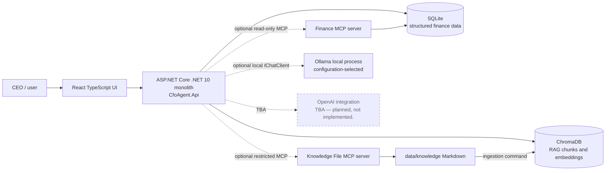

## 4. Container/deployment diagram

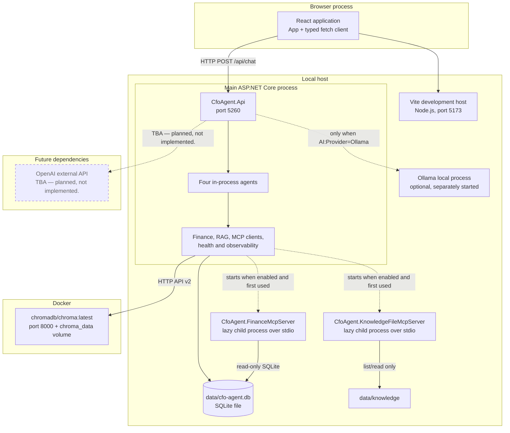

The React code runs in the browser and is served by Vite during local development. `CfoAgent.Api` is the main business process. ChromaDB is the only Docker service. When explicitly enabled, the two MCP clients launch local .NET child processes using stdio. Ollama is an optional separately started local dependency; startup does not contact, start, or download it. OpenAI remains future-only and is not implemented.

## 5. Backend monolith internal architecture

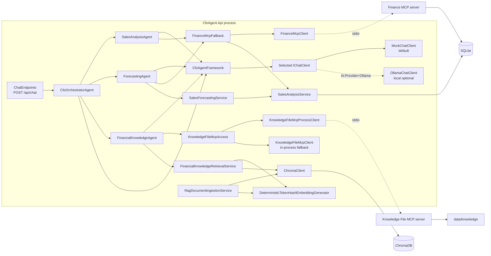

Dependency direction is explicit: the HTTP boundary calls the orchestrator; the orchestrator calls specialists; specialists call focused services or optional MCP facades; services call data dependencies. Agents do not own databases, run servers, or call each other recursively. All business decisions, routing, result composition, local calculations, and fallback policies remain in `CfoAgent.Api`, so the system remains a monolith.

## 6. Frontend architecture and request flow

The frontend is a single React page with local component state:

- `src/cfo-agent-ui/src/main.tsx` mounts `App` inside React `StrictMode`.
- `src/cfo-agent-ui/src/App.tsx` owns `conversationId`, `messages`, `prompt`, `error`, and `isLoading` with `useState`.
- `src/cfo-agent-ui/src/features/chat/chatApi.ts` contains `postChat` and `ChatApiError`. It uses browser `fetch`.
- `src/cfo-agent-ui/src/features/chat/types.ts` defines `ChatResponse`, response types, sources, data periods, messages, and the five example prompts.
- `src/cfo-agent-ui/src/features/chat/ChatResponseContent.tsx` renders the response according to `responseType`.

There is no router, global state library, persistent browser store, or server-side chat-history store. The first successful response supplies a conversation ID, which `App` retains in memory and includes in later requests. Refreshing the page loses that ID and displayed messages.

The UI trims prompts, ignores empty input or a second submission while loading, supports Enter to submit and Shift+Enter for a new line, shows a loading status, restores the failed prompt, and presents a sanitized error message. It renders:

- KPI cards for `sales_summary`;
- current/previous/change panels for `sales_comparison`;
- a product table for `top_products`;
- a table and CSS bar chart for `forecast`;
- text plus supporting information for `knowledge`, `mixed`, and `unsupported`;
- assumptions, warnings, sources, agents, and data-period labels when present.

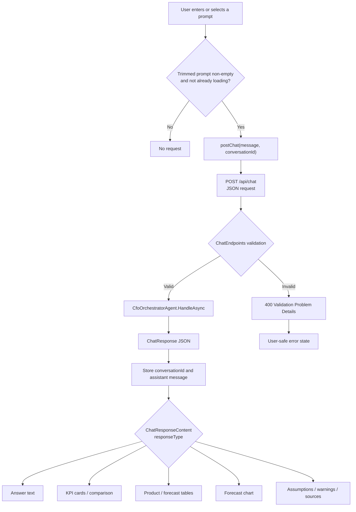

The API base URL defaults to `http://localhost:5260` and can be overridden with the frontend build/runtime environment value `VITE_API_BASE_URL`.

## 7. End-to-end prompt-processing sequence

In the sequence below, `Classifier` and `Formatter` are two logical uses of the same singleton `MockChatClient` through Microsoft Agent Framework. They are shown separately to make the role change clear.

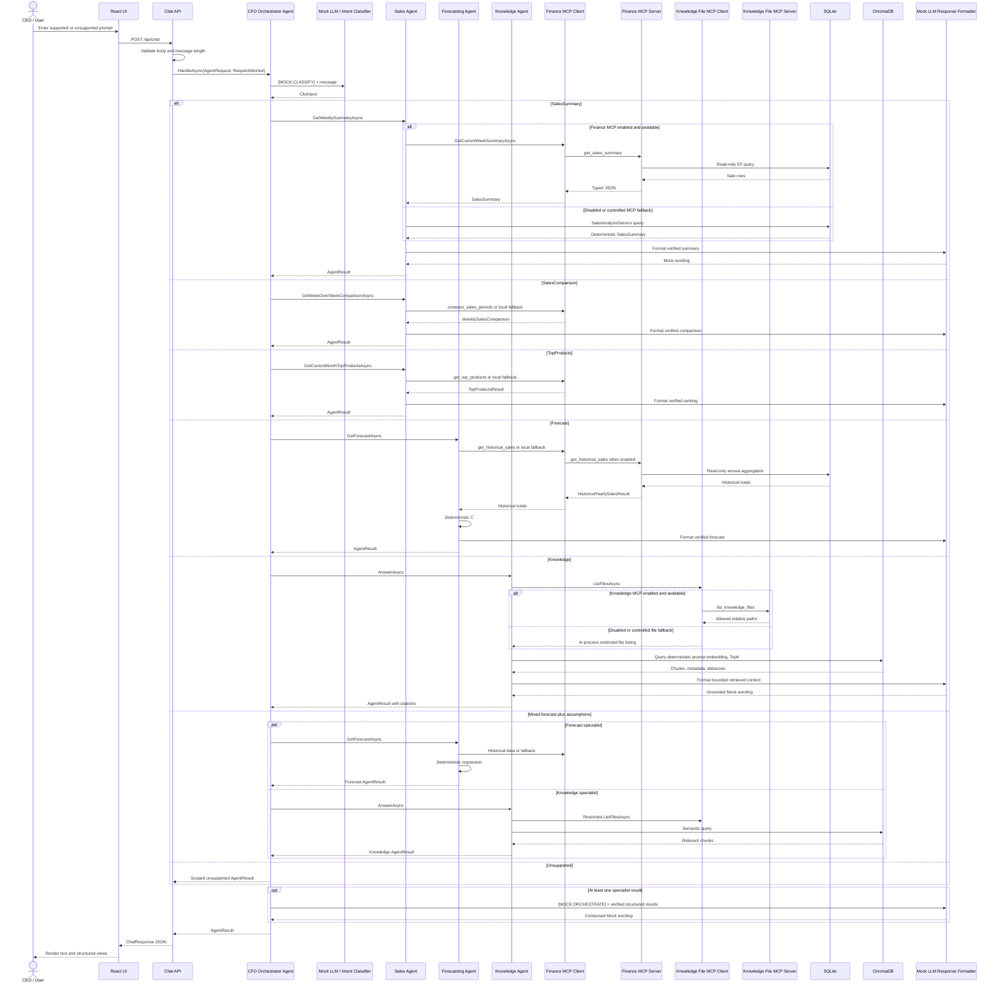

Not every participant is called for every request. Simple requests call one specialist. Only `Mixed` runs two specialists, and those two calls are concurrent.

## 8. Intent classification and agent routing

`CfoIntent` contains:

- `SalesSummary`
- `SalesComparison`
- `TopProducts`
- `Forecast`
- `Knowledge`
- `Mixed`
- `Unsupported`

`CfoOrchestratorAgent.ClassifyAsync` creates a `CfoOrchestratorAgent` framework session and sends `[MOCK:CLASSIFY]` plus the user message. `MockChatClient.ClassifyIntent` uppercases the message and applies deterministic keyword rules in this exact order:

1. `FORECAST` plus any of `TARGET`, `ASSUMPTION`, or `RISK` -> `Mixed`.
2. `FORECAST` -> `Forecast`.
3. `COMPARE` or `VERSUS` -> `SalesComparison`.
4. `TOP` plus `PRODUCT` -> `TopProducts`.
5. Any of `TARGET`, `ASSUMPTION`, or `RISK` -> `Knowledge`.
6. `SALES` or `WEEK` -> `SalesSummary`.
7. Otherwise -> `Unsupported`.

This is LLM-shaped because it runs through `IChatClient` and Agent Framework, but its current implementation is deterministic keyword classification, not a network LLM decision.

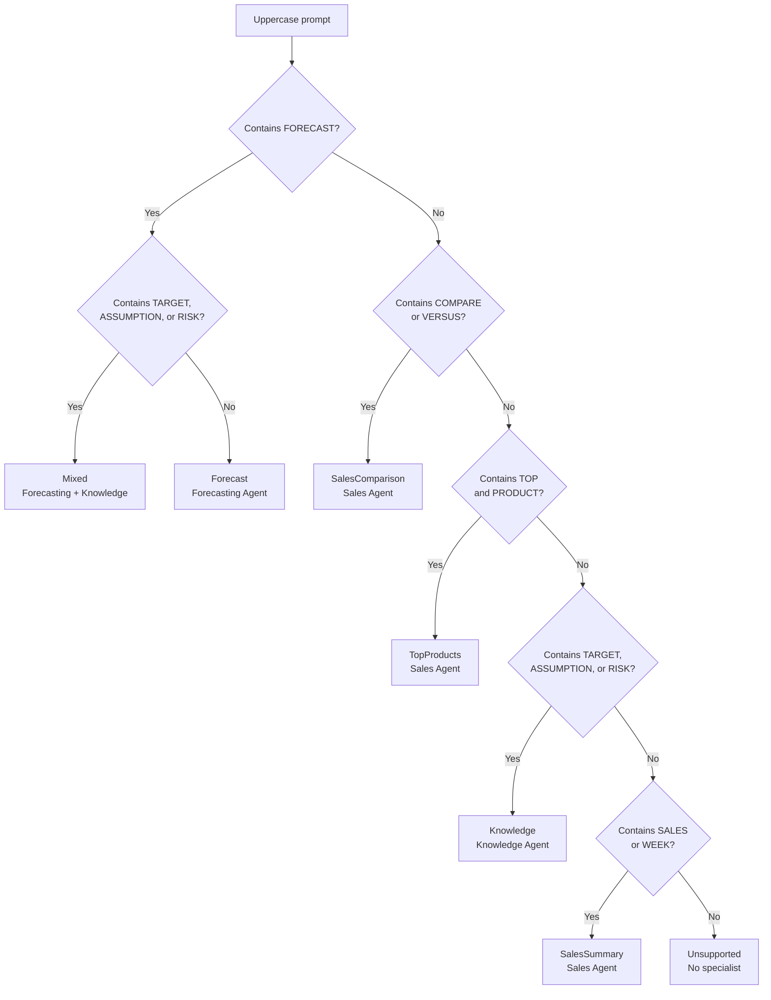

The maximum number of specialist invocations is the private constant `MaximumSpecialistInvocations = 2`. Simple intents invoke one specialist; `Mixed` invokes `ForecastingAgent` and `FinancialKnowledgeAgent` with `Task.WhenAll`.

The orchestrator does not choose or call MCP directly:

| Specialist | Optional MCP path | Operations currently used |
|---|---|---|
| `SalesAnalysisAgent` | `FinanceMcpFallback` -> `FinanceMcpClient` | current-week summary, week comparison, current-month top products |
| `ForecastingAgent` | `FinanceMcpFallback` -> `FinanceMcpClient` | historical yearly totals |
| `FinancialKnowledgeAgent` | `IKnowledgeFileMcpClient` -> `KnowledgeFileMcpAccess` | file listing before ChromaDB retrieval |
| `CfoOrchestratorAgent` | None | Chooses specialists and composes results |

## 9. Agent responsibilities

### CFO Orchestrator Agent

- **Class:** `CfoOrchestratorAgent`
- **Input:** `AgentRequest` containing `Message`, optional `ConversationId`, and optional `StructuredData`.
- **Responsibility:** classify the request, invoke zero, one, or two specialists, then compose verified specialist outputs.
- **Dependencies:** all three specialists and `CfoAgentFramework`.
- **LLM usage:** classification and final wording through the deterministic `MockChatClient`.
- **Output:** `AgentResult`; the API later adds `CfoOrchestratorAgent` to `agentNames`.
- **MCP usage:** none directly.
- **Limits:** at most two specialists; no loops, plans, recursion, memory, or dynamic tool selection.

### Sales Analysis Agent

- **Class:** `SalesAnalysisAgent`
- **Inputs:** `AgentRequest` and caller `CancellationToken`.
- **Responsibility:** weekly summary, week-over-week comparison, and current-month top products.
- **Dependencies:** `SalesAnalysisService`, `CfoAgentFramework`, optional `IFinanceMcpClient`, and `FinanceMcpFallback`.
- **MCP usage:** `GetCurrentWeekSummaryAsync`, `GetWeekOverWeekComparisonAsync`, and `GetCurrentMonthTopProductsAsync`.
- **LLM usage:** formats only serialized, verified service/MCP results.
- **Output:** `AgentResult` with a finance DTO, warnings, and a data period.
- **Limits:** no budget route and no arbitrary date/query input from the user.

### Forecasting Agent

- **Class:** `ForecastingAgent`
- **Inputs:** `AgentRequest` and caller `CancellationToken`.
- **Responsibility:** obtain complete historical yearly totals and produce the deterministic five-year forecast.
- **Dependencies:** `SalesForecastingService`, `CfoAgentFramework`, optional `IFinanceMcpClient`, and `FinanceMcpFallback`.
- **MCP usage:** `GetHistoricalYearlyTotalsAsync` only.
- **LLM usage:** formats the completed `SalesForecastResult`; it never computes forecast values.
- **Output:** `AgentResult` with forecast rows, assumptions, warnings, and historical period.
- **Limits:** ordinary least-squares linear trend only; minimum three historical years.

### Financial Knowledge Agent

- **Class:** `FinancialKnowledgeAgent`
- **Inputs:** `AgentRequest`, default `topK = 3`, optional document type/period filters, and caller `CancellationToken`.
- **Responsibility:** validate/list the permitted knowledge source boundary, query ChromaDB, bound retrieved context, and return citations.
- **Dependencies:** `FinancialKnowledgeRetrievalService`, `CfoAgentFramework`, `RagOptions`, and optional `IKnowledgeFileMcpClient`.
- **MCP usage:** currently calls `ListFilesAsync` only. `ReadFileAsync` is implemented and tested but not currently invoked by this agent.
- **LLM usage:** formats only retrieved context after distance/filter checks.
- **Output:** `AgentResult` with retrieval details and deduplicated `AgentSource` citations.
- **Limits:** no raw file content is used as a replacement for semantic retrieval; weak/empty retrieval returns an insufficient-knowledge result.

## 10. Finance MCP architecture

The Finance server project is `tools/CfoAgent.FinanceMcpServer/CfoAgent.FinanceMcpServer.csproj`. Both client and server use the official `ModelContextProtocol` package version `1.4.1` and stdio transport.

When `Mcp:Finance:Enabled` is `true` and a specialist first requests an operation, `FinanceMcpClient.GetClientAsync`:

1. serializes initialization with `SemaphoreSlim`;
2. resolves `Mcp:Finance:ServerProjectPath` relative to `IHostEnvironment.ContentRootPath`;
3. verifies `CfoAgent.FinanceMcpServer.csproj` exists;
4. starts `dotnet run --project <resolved-project> --no-build --configuration <Debug|Release>`;
5. creates an MCP client over stdio; and
6. discovers tools and verifies all five required names are present.

Finance discovery rejects missing required tools but does not reject additional tools. The implemented server itself advertises exactly five. The server finds `data/cfo-agent.db`, creates a SQLite connection with `Mode=ReadOnly`, and performs `AsNoTracking` EF Core queries. Date ranges are limited to 366 inclusive days, top products to 1-20, historical ranges to at most five inclusive years between 2000 and 2100, and budget years/months are validated.

The default timeout is 10 seconds per initialization, discovery, or tool call. A linked cancellation token combines the caller token with `CancelAfter`. Caller cancellation is rethrown and is never converted to fallback. A client-side timeout can use local fallback when `Mcp:UseLocalFallback` is `true`. `DisposeAsync` disposes the SDK client, which owns the stdio transport/process, and clears the client under the same gate.

| MCP tool | Called by | Purpose | Input | Output | Fallback |
|---|---|---|---|---|---|
| `get_sales_summary` | `SalesAnalysisAgent` via `FinanceMcpClient.GetCurrentWeekSummaryAsync` | Calculate current Monday through demo date summary | `startDate`, `endDate` as `YYYY-MM-DD` | `McpSalesSummary` mapped to `SalesSummary` | `SalesAnalysisService.GetCurrentWeekSummaryAsync` |
| `compare_sales_periods` | `SalesAnalysisAgent` via `FinanceMcpClient.GetWeekOverWeekComparisonAsync` | Compare current partial week with previous full week | Four inclusive date strings | `McpPeriodComparison` mapped to `WeeklySalesComparison` | `SalesAnalysisService.GetWeekOverWeekComparisonAsync` |
| `get_top_products` | `SalesAnalysisAgent` via `FinanceMcpClient.GetCurrentMonthTopProductsAsync` | Rank products by net revenue | month start, demo date, `limit = 5` | `McpTopProducts` mapped to `TopProductsResult` | `SalesAnalysisService.GetCurrentMonthTopProductsAsync` |
| `get_historical_sales` | `ForecastingAgent` via `FinanceMcpClient.GetHistoricalYearlyTotalsAsync` | Get the five complete years before the demo year | `startYear`, `endYear` | `McpHistoricalSales` mapped to `HistoricalYearlySalesResult` | `SalesForecastingService.GetHistoricalYearlyTotalsAsync` |
| `get_budget_target` | No current agent; process/API tests call `FinanceMcpClient.GetBudgetTargetAsync` | Read annual or monthly target | `year`, optional `month` | `McpBudgetTarget` mapped to `BudgetTargetResult` | Local equivalent exists as `SalesAnalysisService.GetBudgetTargetAsync`, but no current agent route invokes it |

Server methods are respectively `FinanceMcpTools.GetSalesSummaryAsync`, `CompareSalesPeriodsAsync`, `GetTopProductsAsync`, `GetHistoricalSalesAsync`, and `GetBudgetTargetAsync`.

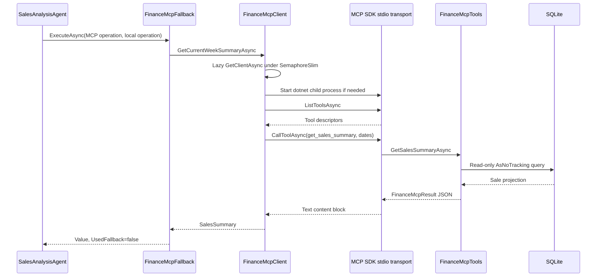

## 11. Knowledge File MCP architecture

The server project is `tools/CfoAgent.KnowledgeFileMcpServer/CfoAgent.KnowledgeFileMcpServer.csproj`. It uses `ModelContextProtocol` `1.4.1` with stdio. The configured default root is `data/knowledge`.

On first enabled use, `KnowledgeFileMcpProcessClient` resolves the root and server project, then starts:

`dotnet run --project <resolved-project> --no-build --configuration <Debug|Release> -- --root <resolved-knowledge-root>`

It requires exactly two tools and rejects both missing and unexpected capabilities:

- `list_knowledge_files`
- `read_knowledge_file`

Security is enforced in the client, local fallback, and server:

- blank and rooted/absolute input is rejected;
- both slash forms are split and any `..` segment is rejected;
- the full resolved path must start under the normalized root prefix;
- the root itself cannot be a reparse point;
- enumeration skips reparse points;
- each read path is checked segment-by-segment for symbolic links/junctions;
- only list and read methods exist; there are no write, delete, rename, move, execute, or directory-creation tools.

Initialization and calls use the configured 10-second timeout and caller cancellation. Initialization is lazy and guarded by `SemaphoreSlim`. Disposal follows the same SDK-client/process disposal pattern as Finance MCP.

`KnowledgeFileMcpAccess` is the facade registered as `IKnowledgeFileMcpClient`. `KnowledgeFileMcpFallback` chooses the process client when enabled and the in-process restricted `KnowledgeFileMcpClient` when disabled or when an allowed fallback is triggered. Caller cancellation propagates.

Current runtime usage is narrower than the available API: `FinancialKnowledgeAgent` calls `ListFilesAsync` before retrieval. It does not call `ReadFileAsync` to answer a question. Raw file listing/access validates the source boundary; `FinancialKnowledgeRetrievalService` still performs the actual semantic query and citation selection in ChromaDB.

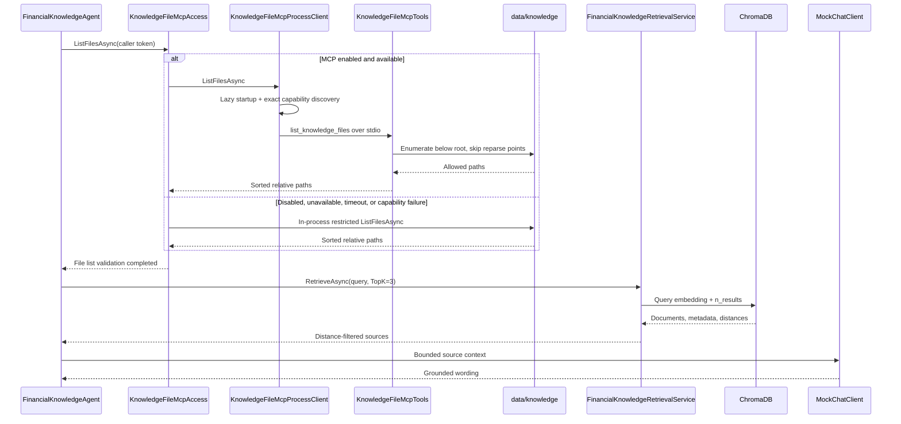

The Knowledge File MCP server does not generate embeddings, perform similarity search, rank chunks, or replace ChromaDB.

## 12. RAG architecture

### 12.1 Document ingestion

The command `dotnet run --project src/CfoAgent.Api -- --ingest-rag` resolves `Rag:KnowledgeFilesRoot` (`../../data/knowledge` from the API content root), gets or creates the configured ChromaDB collection, and processes top-level `*.md` files in ordinal path order.

Each Markdown document must begin with YAML-like front matter containing:

- `document_id`
- `document_name`
- `document_type`
- `period`
- `section`
- `source_path`

`RagDocumentIngestionService` uses Markdown headings to change the current section, groups paragraphs, and splits an oversized paragraph at a sentence boundary or space. `Rag:MaxChunkCharacters` is 1,200. The accumulator is bounded to that value before the section heading is prepended, so the final stored string can be slightly longer than 1,200 characters by the section heading and separator length.

No chunk overlap is currently implemented.

Each chunk receives:

- a stable ID: lowercase SHA-256 of `source_path + newline + section + newline + content`, prefixed with `chunk-`;
- chunk text including the section heading;
- a deterministic normalized embedding from `DeterministicTokenHashEmbeddingGenerator`;
- embedding dimension 256;
- metadata fields listed in section 13.

Files and chunks are processed sequentially. Records for a document are sent to ChromaDB with `upsert`, so rerunning unchanged ingestion uses the same IDs and is idempotent for those records. Per-file non-cancellation failures are collected in `RagIngestionResult`; the CLI prints failures and throws if any document failed.

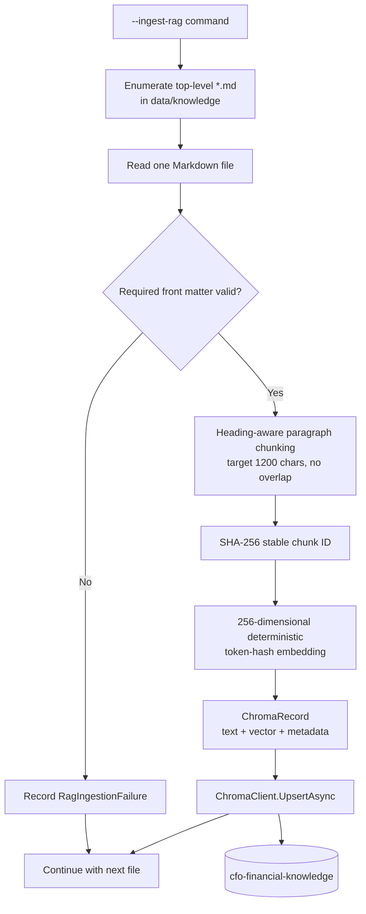

### 12.2 Query retrieval

`FinancialKnowledgeAgent.AnswerAsync` defaults to `topK = 3`. `FinancialKnowledgeRetrievalService` permits values from 1 through 10; 10 is the maximum. It:

1. gets the configured collection;
2. returns an insufficient result if the collection is missing;
3. generates a deterministic 256-dimensional query embedding;
4. asks ChromaDB for `n_results = TopK`, including documents, metadata, and distances;
5. rejects incomplete matches;
6. applies `Distance <= Rag:MaximumRetrievalDistance`, configured as `1.25`;
7. applies optional `DocumentType` and `Period` filters in application code;
8. sorts lower distance first, then source path, section, and chunk ID;
9. groups by document ID, section, and source path and keeps the first result; and
10. returns insufficient knowledge if no source survives.

Answers to the requested retrieval questions:

- **Is a distance check performed?** Yes. Results must have distance less than or equal to `1.25`.
- **Is a similarity threshold configured?** The implementation uses a maximum distance threshold, `Rag:MaximumRetrievalDistance = 1.25`, rather than a separately named similarity score.
- **What TopK value is used?** The agent default is 3.
- **What maximum TopK is allowed?** 10.
- **How are the best chunks selected?** ChromaDB ranks the requested TopK; the application applies completeness, distance, metadata filters, deterministic ordering, and source-section deduplication.
- **What happens when results are weak or empty?** The result contains no sources and a warning. The Knowledge Agent returns an explicit insufficient-knowledge answer rather than asking the Mock LLM to fabricate content.

The Knowledge Agent builds context in source order with headers containing document name, section, period, and source path. `Rag:MaxKnowledgeContextCharacters = 4000` bounds the combined context before it is sent to `MockChatClient`.

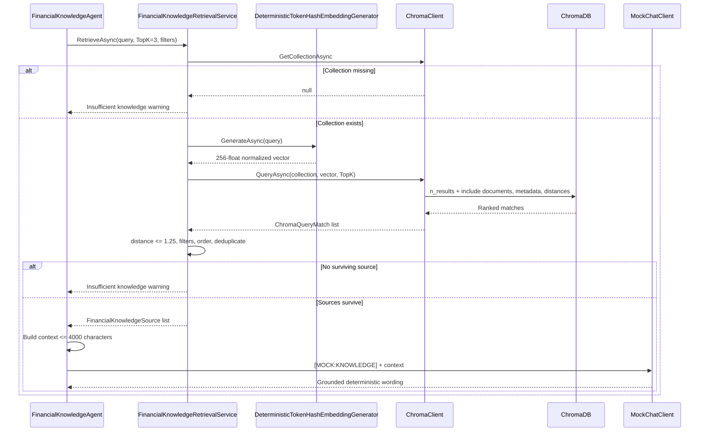

## 13. ChromaDB data model

The configured collection is `cfo-financial-knowledge` in tenant `default_tenant` and database `default_database`. ChromaDB runs at `http://localhost:8000` with a 10-second HTTP timeout.

Each record contains:

| Field | Stored value |
|---|---|
| ID | `chunk-` plus lowercase SHA-256 of source path, section, and chunk content |
| Document | Section-prefixed chunk text |
| Embedding | 256 finite normalized `float` values |
| `document_id` | Front-matter stable document identifier |
| `document_name` | Human-readable document name |
| `document_type` | Type used by optional retrieval filtering |
| `period` | Document period string |
| `section` | Current Markdown heading |
| `source_path` | Citation path declared in front matter |
| `chunk_index` | Zero-based index within the parsed document |

Representative non-sensitive record:

```json
{
  "id": "chunk-<sha256>",
  "document": "Annual Target\n\nThe FY2026 sales target is ...",
  "embedding": ["256 normalized float values"],
  "metadata": {
    "document_id": "current-budget-target-2026",
    "document_name": "Current Budget And Annual Target",
    "document_type": "budget_target",
    "period": "2026",
    "section": "Annual Target",
    "source_path": "data/knowledge/current-budget-and-target.md",
    "chunk_index": "0"
  }
}
```

The source path is taken from document front matter, not recalculated from the host absolute file path. Upsert updates records with matching IDs. If content changes, its hash changes and a new record is inserted.

Deletion synchronization is not implemented. `TBA — not currently implemented or not confirmed in the repository.` Specifically, ingestion does not delete old chunks when a source file is removed or when changed content produces a new ID. A clean local rebuild uses `docker compose down -v`, recreates the volume, and re-runs ingestion.

## 14. Deterministic finance and forecasting flow

Authoritative financial values are never delegated to `IChatClient`. Both the local services and Finance MCP tools calculate from SQLite:

- **Current-week summary:** Monday through configured demo date, inclusive. Net revenue is quantity times unit price minus discount. Cost is quantity times unit cost. Gross profit is net revenue minus cost. Gross margin is gross profit divided by net revenue times 100, or zero with a warning when revenue is zero. Orders are distinct `OrderNumber` values. Average order value is revenue divided by order count.
- **Week-over-week comparison:** current partial week versus the preceding full Monday-Sunday week. It calculates absolute and percentage revenue change and increased/decreased/unchanged direction. If previous revenue is zero and current is nonzero, percentage is null with a warning; if both are zero, the local service returns zero.
- **Top products:** first day of the current demo month through demo date, grouped by product, ordered by net revenue descending and product code ascending, limited to five.
- **Budget lookup:** annual or monthly `BudgetTarget`, with a controlled missing result. The local service and MCP tool exist, but no current agent routes a user prompt to this operation.
- **Historical aggregation:** local service excludes the current year and groups all prior records by year; the Finance MCP client requests exactly the prior five years.

`SalesForecastingService` has hard-coded implementation constants rather than a configuration section:

- minimum historical years: 3;
- forecast years: 5;
- scenario adjustment: 10 percent;
- method: ordinary least-squares linear regression.

It assigns sequential `x` values `0..n-1` to ordered annual net revenue totals, computes intercept and slope, forecasts at `n..n+4`, clamps expected values below zero to zero, and returns conservative `expected * 0.90`, expected, and optimistic `expected * 1.10`. Forecast years begin with the configured current/demo year. Insufficient history produces no forecast rows and a warning.

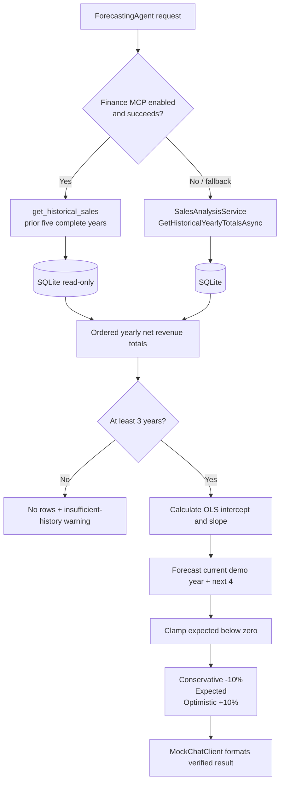

## 15. Asynchronous processing model

Actual asynchronous boundaries include:

- browser `fetch` from `postChat`;
- ASP.NET Core `ChatEndpoints.HandleAsync`;
- Agent Framework session creation and `RunAsync`;
- EF Core `ToListAsync`, `SingleOrDefaultAsync`, `CanConnectAsync`, migrations, and seeding;
- ChromaDB HTTP requests and JSON reads;
- Markdown file reads;
- MCP process initialization, tool discovery, stdio tool calls, and SDK disposal;
- health checks; and
- the optional Mock delay.

The caller token originates as `HttpContext.RequestAborted` and is passed through the orchestrator, specialists, EF Core, ChromaDB, MCP, file operations, and Mock client. ChromaDB uses `HttpClient.Timeout = 10 seconds`. Each MCP client creates a linked token and applies its own configured 10-second timeout.

Simple intent processing is sequential: classify, specialist data operation, specialist Mock formatting, orchestrator Mock composition, response. `Mixed` is the only confirmed concurrent business path: forecasting and knowledge tasks are started together and awaited with `Task.WhenAll`. RAG ingestion processes files and chunks sequentially. Week comparison builds current and prior summaries sequentially.

There are no background jobs, message queues, event bus, hosted business workers, or fire-and-forget application tasks. `TBA — not currently implemented or not confirmed in the repository.` The long-running MCP child processes are on-demand tool transports managed by the MCP clients, not background job processors. `MockChatClient` implements the `IChatClient` streaming method, but `POST /api/chat` does not use streaming.

## 16. Fallback and failure handling

Finance and Knowledge File fallback classes use the same explicit policy:

- disabled integration -> local path with reason `disabled`;
- enabled and successful -> MCP value, no fallback;
- timeout and `Mcp:UseLocalFallback = true` -> local path with reason `timeout`;
- unavailable process, invalid path, missing capability, or other MCP exception with fallback enabled -> local path with reason `unavailable`;
- caller cancellation -> rethrow, never fallback;
- failure with `UseLocalFallback = false` -> propagate.

`McpFallbackResult<T>` includes `Value`, `UsedFallback`, and `FallbackReason`; agents currently use `Value`, while fallback visibility is preserved in structured logs and direct fallback tests.

ChromaDB has no alternate semantic store. An unreachable ChromaDB throws `ChromaDependencyException`, which is wrapped by the Knowledge Agent/orchestrator and returned by the chat endpoint as a sanitized 503. A missing collection or no sufficiently relevant result is not a dependency failure; it produces an explicit insufficient-knowledge response.

`AI:SimulateFailure = true` makes `MockChatClient` throw `InvalidOperationException`. A positive `AI:SimulatedDelayMilliseconds` uses cancellable `Task.Delay`. Development defaults are false and zero.

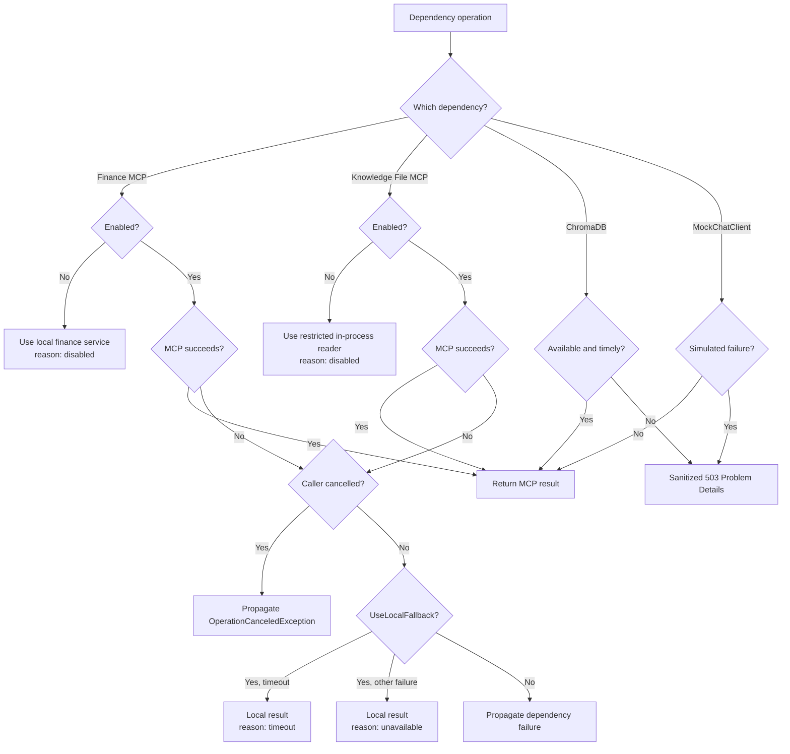

Validation failures return 400 Validation Problem Details. Centralized `ApiExceptionHandler` maps dependency failures to sanitized 500/503/504 Problem Details with a `traceId` and no stack trace. `ChatEndpoints` catches orchestrator `InvalidOperationException` and returns a specific sanitized 503. Caller-aborted requests are rethrown so ASP.NET Core can terminate the request rather than disguising cancellation as fallback.

## 17. API architecture

The chat API is a minimal endpoint:

- **Path:** `POST /api/chat`
- **Request:** `ChatRequest(string? ConversationId, string? Message)`
- **Success:** HTTP 200 `ChatResponse`
- **Validation failure:** HTTP 400 Validation Problem Details
- **Controlled operation failure:** HTTP 503 Problem Details
- **Rate limit:** 30 requests per one-minute fixed window, queue limit 0

Validation rules:

- a request body is required;
- `message` is required and cannot be blank;
- maximum message length is 4,000 characters.

If `conversationId` is null or whitespace, the API creates a 32-character GUID in `N` format. Otherwise it trims and echoes the provided value. It does not load any history for that ID. There is no validation length bound on `conversationId` in the current endpoint and no persistent conversation store.

`ChatResponse` contains:

- `conversationId`
- `answer`
- `agentNames`
- `responseType`
- `structuredData`
- `sources`
- `assumptions`
- `warnings`
- `dataPeriod`
- `model` with provider and name

Response type strings are `sales_summary`, `sales_comparison`, `top_products`, `forecast`, `knowledge`, `mixed`, and `unsupported`. `ChatResponse.FromAgentResult` prepends `CfoOrchestratorAgent` and removes duplicate agent names.

The five sample requests are attached to the OpenAPI operation in development. OpenAPI is exposed at `/openapi/v1.json`. Operational endpoints are `/`, `/health/live`, and `/health/ready`.

No internal EF entity is returned. `StructuredData` is serialized from result DTOs. Chat history persistence, authentication, authorization, and response streaming are not implemented.

## 18. Configuration architecture

The following values are from `src/CfoAgent.Api/appsettings.json`, `appsettings.Development.json`, option classes, and `Program.cs`.

| Section / key | Current default | Purpose and status | Required / validation |
|---|---|---|---|
| `Application:Name` | `CFO AI Agent` | Root endpoint identity | Required, nonblank |
| `Application:DemoMode` | `true` | Identifies demo mode | Implemented |
| `AI:Provider` | `Mock` | Only accepted provider | Must equal `Mock` |
| `AI:Model` | `DeterministicMock` | Response model metadata | Required, nonblank |
| `AI:SimulatedDelayMilliseconds` | `0` in Development | Cancellable Mock delay | Must be nonnegative |
| `AI:SimulateFailure` | `false` in Development | Test/demo failure switch | Implemented |
| `Finance:DemoDate` | `2026-07-15` | Fixed UTC-backed `DemoTimeProvider` date | Required, nondefault |
| `Forecasting:*` | No section | Forecast values are private constants: 3 minimum years, 5 output years, 10% scenarios | `TBA — not currently implemented or not confirmed in the repository.` |
| `Database:ConnectionString` | `Data Source=../../data/cfo-agent.db` | EF Core SQLite connection used by monolith | Required, nonblank |
| `ConnectionStrings:*` | No section | The app does not use ASP.NET Core `ConnectionStrings`; it uses `Database:ConnectionString` | `TBA — not currently implemented or not confirmed in the repository.` |
| `Chroma:BaseUrl` | `http://localhost:8000` | ChromaDB API base URL | Required absolute URI |
| `Chroma:CollectionName` | `cfo-financial-knowledge` | RAG collection | Required, nonblank |
| `Chroma:Tenant` | `default_tenant` | Chroma v2 tenant | Required, nonblank |
| `Chroma:Database` | `default_database` | Chroma v2 database | Required, nonblank |
| `Chroma:TimeoutSeconds` | `10` | Chroma client and health-check timeout | Must be positive |
| `Rag:KnowledgeFilesRoot` | `../../data/knowledge` | Ingestion source directory from API content root | Required, nonblank |
| `Rag:MaxChunkCharacters` | `1200` | Chunk accumulator target | Must be at least 256 |
| `Rag:MaxKnowledgeContextCharacters` | `4000` | Bound sent to Mock client | Must be at least 256 |
| `Rag:MaximumRetrievalDistance` | `1.25` | Maximum accepted Chroma distance | Must be nonnegative |
| `Mcp:UseLocalFallback` | `true` | Allows local fallback after enabled MCP failures | Implemented |
| `Mcp:Finance:Enabled` | `false` | Controls Finance MCP use and lazy startup | Optional; disabled by default |
| `Mcp:Finance:ServerProjectPath` | `tools/CfoAgent.FinanceMcpServer` | Finance server project path | Required when enabled |
| `Mcp:Finance:TimeoutSeconds` | `10` | Finance initialization/discovery/call timeout | Must be positive |
| `Mcp:KnowledgeFiles:Enabled` | `false` | Controls Knowledge File MCP use and lazy startup | Optional; disabled by default |
| `Mcp:KnowledgeFiles:RootPath` | `data/knowledge` | Restricted list/read root | Required, nonblank |
| `Mcp:KnowledgeFiles:TimeoutSeconds` | `10` | File MCP and in-process read timeout | Must be positive |
| `Frontend:AllowedOrigin` | `http://localhost:5173` | CORS `LocalFrontend` origin | Required absolute URI |
| `VITE_API_BASE_URL` | `http://localhost:5260` fallback in `chatApi.ts` | Frontend API location | Optional frontend environment override |
| `Logging:LogLevel:Default` | `Information` | Application logging threshold | Implemented |
| `Logging:LogLevel:Microsoft.AspNetCore` | `Warning` | Framework log threshold | Implemented |
| `AllowedHosts` | `*` | ASP.NET Core host filtering setting | Implemented local default |

Environment variables can override nested .NET keys with double underscores, as used by `scripts/start-phase-5-e2e-api.ps1`, for example `Mcp__Finance__Enabled`.

## 19. Security and safety architecture

Implemented controls include:

- User prompts are data for a fixed classifier; they are not SQL, file paths, shell commands, or executable instructions.
- The API rejects blank and over-4,000-character prompts.
- A built-in fixed-window limiter allows 30 chat requests per minute with no queue.
- CORS allows the single configured local frontend origin.
- Finance queries use EF Core projections; no arbitrary SQL tool or endpoint exists.
- Finance MCP opens SQLite in read-only mode and exposes exactly the five server tools.
- Knowledge File MCP exposes exactly list/read operations and is rooted under `data/knowledge`.
- Absolute paths, `..` traversal, root escape, and symbolic-link/junction paths are rejected or skipped.
- There are no MCP write, delete, rename, move, execute, shell, or directory-creation methods.
- MCP capability discovery occurs before calls.
- Structured logs record lengths, route/type, operation names, fallback reason, failure type, status, and duration, not raw prompts, rows, SQL, file contents, retrieved context, secrets, or sensitive process values.
- `RequestCorrelationMiddleware` accepts only 1-64 ASCII alphanumeric, hyphen, or underscore characters from `X-Correlation-ID`; otherwise it generates a trace-based/GUID value.
- Problem Details omit exception messages and stack traces and include only a sanitized title/type/status and trace ID.
- The Mock LLM receives verified serialized finance DTOs or bounded retrieved context. Shared agent instructions say never to invent finance values.
- SQLite check constraints enforce positive quantities, nonnegative money, valid discounts, valid target periods, and nonnegative targets.

There is no authentication, authorization, user isolation, MCP authentication, secret store, or TLS configuration in the repository. Those are confirmed MVP limitations, not hidden controls.

## 20. Testing architecture

The solution contains one xUnit project, `tests/CfoAgent.Api.Tests`, plus frontend Vitest and Playwright suites.

Backend coverage includes:

- EF Core migrations and temporary SQLite databases;
- deterministic/idempotent seeding;
- fixed-date weekly, comparison, top-product, budget, and forecast calculations;
- Mock intent classification, payload preservation, delay cancellation, and simulated failure;
- Agent Framework contracts, specialist agents, orchestrator routing, mixed composition, and unsupported results;
- deterministic embedding shape/normalization;
- ingestion chunking, stable IDs, metadata, idempotent upsert, and failure reporting;
- Chroma HTTP client parsing and Docker-backed ingestion/retrieval;
- insufficient RAG knowledge and citation metadata;
- Finance and Knowledge File MCP process discovery/invocation;
- MCP restrictions, timeout, cancellation, disposal, and fallback;
- agent-to-MCP wiring and deterministic forecast preservation;
- health checks, API contracts, request validation, Problem Details, correlation, and failure responses.

`ChromaFactAttribute` allows a clear skip when Docker/ChromaDB is unavailable, but the final phase gate ran with Docker available. MCP process tests launch the built local stdio servers. Finance tests use temporary SQLite databases and `FixedTimeProvider`; production/demo runtime uses `DemoTimeProvider` fixed at `2026-07-15`.

Frontend architecture tests:

- Vitest + React Testing Library: initial state, Mock badge, prompt submission, loading/error behavior, conversation ID reuse, forecast visualization, and all response types.
- Playwright: five MVP browser scenarios, empty prompt prevention, and dependency-failure UI. It runs Chromium with one worker, non-parallel tests, traces retained on failure, and screenshots only on failure.

Latest confirmed counts from `docs/FINAL-VALIDATION.md`:

- backend: 118 passed, 0 failed, 0 skipped;
- frontend unit: 10 passed across 2 files;
- Playwright: 7 passed in Chromium.

Solution-level builds/tests use `--maxcpucount:1` because the local environment has a documented parallel MSBuild project-reference race. The current solution has four .NET projects: API, backend tests, Finance MCP server, and Knowledge File MCP server.

## 21. Local runtime and startup order

Prerequisites are .NET SDK 10.0.302 (or compatible patch selected by `global.json`), Node.js 22+, npm, Docker Desktop, and free ports 5173, 5260, and 8000.

From the repository root:

```powershell
docker compose up -d
dotnet restore CfoAgent.sln
dotnet run --project src/CfoAgent.Api -- --seed
dotnet run --project src/CfoAgent.Api -- --ingest-rag
dotnet run --project src/CfoAgent.Api
```

Then, in a second terminal:

```powershell
Set-Location src/cfo-agent-ui
npm ci
npm run dev
```

The seed and ingestion commands run in the Development profile, await completion, and exit. The normal API remains running at `http://localhost:5260`; Vite serves the UI at `http://localhost:5173`; ChromaDB listens at `http://localhost:8000`.

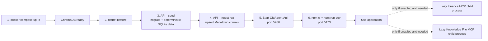

With default configuration, both MCP flags are false, so no MCP process starts and local fallback paths are used. The E2E startup script enables both with environment variables to test the process-backed routes. MCP servers should not be started manually for normal use.

## 22. Future LLM integration — TBA

No OpenAI, Azure OpenAI, Anthropic, or other cloud-provider package, adapter, endpoint, credential, configuration selector, or network call exists in the current application. The only optional real local provider is Ollama, selected through the existing `IChatClient` boundary.

### 22.1 Ollama local LLM

`OllamaChatClient` wraps `OllamaSharp.OllamaApiClient` and is selected only when `AI:Provider=Ollama`. `AI:Model` supplies `llama3.2:3b` through configuration; the committed default remains `Mock` with `DeterministicMock`.

Ollama requests use configured finite timeout, temperature, context, and output limits. Caller cancellation propagates. Startup is network-free, liveness ignores Ollama, and readiness probes the lightweight tags endpoint only when Ollama is selected. Unavailable, timeout, and malformed responses produce controlled sanitized errors; Ollama does not automatically fall back to Mock.

The adapter has no MCP tools. It does not calculate finance data, generate embeddings, query ChromaDB, or change MCP fallback policy. Finance calculations remain deterministic C#/SQL and semantic retrieval remains ChromaDB with the existing deterministic embedding generator.

### 22.2 OpenAI production LLM — TBA

`TBA — planned, not implemented.`

An intended production design could register an OpenAI or Azure OpenAI `IChatClient` adapter, source credentials from managed secrets rather than repository files, validate model/provider configuration, and add bounded retries, timeouts, token/cost telemetry, structured output/tool calling validation, prompt-injection controls, evaluation datasets, and safety reviews.

`TBA — proposed production model: GPT-5.4 mini, subject to availability, compatibility, evaluation, and final production approval.`

No production model is guaranteed or hard-coded by this document.

### 22.3 Future provider-selection diagram

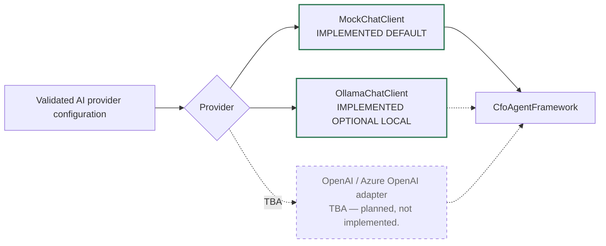

Current startup validation accepts `AI:Provider=Mock` or `AI:Provider=Ollama` and rejects other values.

## 23. Architecture decisions and trade-offs

- **Why a monolith:** the two-day MVP benefits from one business process, one DI container, direct in-process calls, simple debugging, and no distributed coordination between agents.
- **Why four in-process agents:** orchestration, sales, forecasting, and unstructured knowledge have distinct responsibilities while sharing one process and contracts.
- **Why two external MCP tool servers:** Finance MCP demonstrates controlled structured-data tools; Knowledge File MCP demonstrates a second independently connected, restricted filesystem tool provider. Neither owns business workflow.
- **Why Mock by default with optional Ollama:** Mock keeps normal tests deterministic and offline. Ollama exercises the same `IChatClient` boundary for local validation without changing finance authority, RAG, MCP, or the default startup path.
- **Why deterministic calculations:** authoritative finance values must be auditable and repeatable; language-model output is not an arithmetic source of truth.
- **Why ChromaDB:** it demonstrates local vector retrieval, chunk metadata, distance filtering, and citations for unstructured planning documents.
- **Why SQLite:** it is local, file-based, EF Core compatible, and sufficient for deterministic demo transactions and targets.
- **Why local fallback:** the demo remains functional if an optional child process cannot start, without changing result contracts or financial formulas.
- **Why no event-driven architecture:** requests are short, synchronous user interactions with no background workflow, queue, or eventual-consistency need.
- **Why no microservices:** there is one small business domain and one main deployable application. The MCP servers are tool adapters mandated by the integration design, not separately owned domains.

Trade-offs include local-only dependencies, duplicated query formulas in the Finance MCP server and monolith service, deterministic rather than semantic-grade embeddings, simple keyword intent rules, and a demonstration forecast rather than a production statistical model.

## 24. Known limitations

- Mock LLM is the default provider; Ollama is an optional local provider selected through configuration.
- Intent classification is keyword-based and supports only the documented CFO scope.
- Deterministic token-hash embeddings are a plumbing baseline, not production semantic embeddings.
- ChromaDB is local Docker infrastructure using the unpinned `chromadb/chroma:latest` image.
- SQLite is a local file and has no multi-instance production strategy.
- Forecast settings are hard-coded constants, not configuration.
- Forecasting is simple linear regression with fixed +/-10 percent scenarios.
- Knowledge retrieval defaults to only three candidates and applies optional metadata filters after ChromaDB returns TopK.
- RAG ingestion has no chunk overlap and no stale-record deletion.
- The Knowledge Agent lists permitted files but does not currently invoke `read_knowledge_file`.
- The Finance budget tool is implemented/tested but not routed from a current agent.
- There is no authentication, authorization, tenancy, persistent conversation history, or durable session.
- The API is non-streaming; the Mock streaming method is unused by the HTTP endpoint.
- There are no background jobs, queues, event bus, retry policy, distributed tracing exporter, metrics backend, or dashboard.
- MCP processes are local child processes and have no authentication.
- The React UI is one route with component-local state.
- Solution-level validation requires serialized MSBuild in the documented local environment.
- OpenAI and other cloud providers, plus production deployment, are `TBA — planned, not implemented.` Ollama is the implemented optional local provider.

## 25. Production evolution

Possible production evolution, without changing current implementation, includes:

- replace `MockChatClient` with an evaluated real-provider `IChatClient` while preserving verified input/result contracts;
- replace deterministic embeddings with a governed embedding service and retrieval-quality evaluation;
- move ChromaDB to an evaluated managed vector/search system such as Azure AI Search or PostgreSQL/pgvector;
- move SQLite to Azure SQL or PostgreSQL with migration, backup, and access controls;
- host MCP tools behind authenticated, authorized, audited internal gateways instead of local child processes;
- add OpenTelemetry traces/metrics, structured log aggregation, dashboards, and alerts;
- add identity, authorization, tenant boundaries, rate limits at the edge, and explicit retention policy;
- use managed secrets and workload identity for external credentials;
- deploy API, UI, database, vector store, and tool gateways with health, scaling, and disaster-recovery design; and
- add production evaluation for routing, grounding, tool use, hallucination resistance, cost, latency, and safety.

These are architecture options, not repository claims. `TBA — not currently implemented or not confirmed in the repository.`

## 26. Glossary

| Term | Definition in this application |
|---|---|
| Agent | An in-process C# class with a focused responsibility and a Microsoft Agent Framework wrapper around `IChatClient`. |
| Orchestrator | `CfoOrchestratorAgent`, which classifies prompts, selects specialists, and composes results. |
| LLM | Large Language Model. The default provider is deterministic Mock; an optional local Ollama provider is available through configuration. |
| Mock LLM | `MockChatClient`, a deterministic offline `IChatClient` that classifies keywords and formats verified context. |
| RAG | Retrieval-Augmented Generation: retrieve relevant document chunks first, then provide bounded sources to the response formatter. |
| Embedding | A numeric vector representing token features. The current implementation generates a normalized 256-float token-hash vector. |
| Vector store | A database that stores embeddings and can rank nearby vectors. |
| ChromaDB | The local Docker vector store used for knowledge chunk upsert, TopK query, distances, and citation metadata. |
| MCP | Model Context Protocol, used here to connect the monolith to two local read-only tool processes over stdio. |
| MCP server | A process that advertises allow-listed tools and executes validated calls. |
| Tool | A named MCP operation such as `get_sales_summary` or `list_knowledge_files`. |
| TopK | The maximum number of nearest ChromaDB candidates requested before application filtering; default 3, maximum 10. |
| Similarity/distance | ChromaDB returns distance values; lower is treated as better and values above 1.25 are rejected. |
| Fallback | A controlled switch from an optional MCP operation to an existing local deterministic implementation. |
| Deterministic calculation | A C#/SQL operation whose result is repeatable for the same data, configuration, and fixed time, without model-generated arithmetic. |
