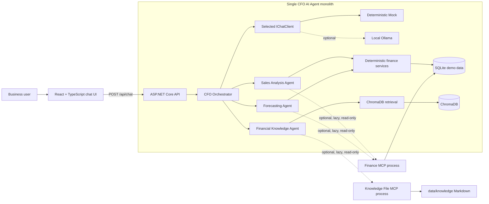

# CFO AI Agent

A locally runnable CFO assistant MVP for five finance and planning questions. It combines deterministic C#/SQL calculations, source-grounded financial knowledge retrieval, a React chat interface, and optional read-only MCP tool access. The deterministic Mock LLM is the default provider; a local Ollama provider is available only through explicit configuration. No model credentials are required.

## Scope

The MVP supports these demonstrable scenarios:

1. Current-week sales summary.
2. Week-over-week sales comparison.
3. Current-month top products.
4. Five-year sales forecast.
5. Annual sales target and the assumptions behind it.

Finance values and forecasts are calculated by deterministic C# and SQL code. The selected chat provider classifies supported prompts and writes explanations from verified results; it is never used as a calculation authority. Knowledge answers are retrieved from ChromaDB and retain their document citations.

## Architecture



This is a simple ASP.NET Core monolith: the API owns the business workflow, agents, calculations, data access, fallback decisions, and HTTP surface. The two MCP processes are narrowly scoped local tool providers, not independently deployed business services or microservices. They are disabled by default, start only when first needed, expose only allow-listed read operations, and fall back to existing local implementations when unavailable.

## Prerequisites

- .NET SDK `10.0.302` or a compatible patch selected by [global.json](global.json).
- Node.js 22 or later with npm.
- Docker Desktop running locally for ChromaDB.
- Optional Ollama validation: a locally running Ollama instance with `llama3.2:3b` installed manually. It is not required for normal startup or offline tests.
- PowerShell on Windows for the supplied scripts, or equivalent shell commands on another platform.

No OpenAI, Azure, Anthropic, or other cloud LLM API key is required.

## Start Locally

From the repository root, use these commands in order. The seed and ingestion commands are repeatable.

```powershell
docker compose up -d
dotnet restore CfoAgent.sln
dotnet run --project src/CfoAgent.Api -- --seed
dotnet run --project src/CfoAgent.Api -- --ingest-rag
dotnet run --project src/CfoAgent.Api
```

In a second terminal, start the React UI:

```powershell
Set-Location src/cfo-agent-ui
npm ci
npm run dev
```

Open `http://localhost:5173`. The API runs on `http://localhost:5260` under the local launch profile. `POST /api/chat` is the only chat endpoint; it accepts `{ "message": "..." }`. Health probes are available at `/health/live` and `/health/ready`.

The default configuration keeps both MCP integrations disabled. The application continues with its local deterministic finance services and direct RAG/document path. The browser test startup script, [start-phase-5-e2e-api.ps1](scripts/start-phase-5-e2e-api.ps1), shows the controlled local configuration used to exercise both optional MCP processes.

## Chat Providers

`AI:Provider=Mock` and `AI:Model=DeterministicMock` remain the committed default. Mock is deterministic and fully offline.

To use local Ollama, copy the values from [appsettings.Ollama.example.json](src/CfoAgent.Api/appsettings.Ollama.example.json) into local configuration or set environment variables before starting the API:

```powershell
$env:AI__Provider = "Ollama"
$env:AI__Model = "llama3.2:3b"
$env:AI__BaseUrl = "http://localhost:11434"
$env:AI__TimeoutSeconds = "120"
dotnet run --project src/CfoAgent.Api
```

`AI:Temperature`, `AI:ContextLength`, and `AI:MaxOutputTokens` are also validated configuration values. Startup does not contact Ollama, download a model, or preload `llama3.2:3b`. The provider is selected through the existing `IChatClient` registration; there is no automatic fallback from Ollama to Mock. To return to the default behavior, clear the `AI__*` overrides or set `AI__Provider=Mock` and `AI__Model=DeterministicMock`.

`/health/live` never depends on Ollama. When Ollama is selected, `/health/ready` uses a finite, lightweight tags probe and verifies that the configured model is present. Ollama completion calls use the configured finite timeout and propagate caller cancellation. Local CPU latency varies with hardware, model load state, and concurrent work; the application intentionally makes no benchmark claim.

## Demo Prompts

Run these in the UI:

1. `Give me the sales summary of this week.`
2. `Compare this week's sales with last week.`
3. `Show me the top five products this month.`
4. `Give me the sales forecast for the next five years.`
5. `What is the annual sales target and what assumptions were used?`

The sales responses show KPIs or product data, the forecast shows a deterministic forecast table and chart, and the target response includes knowledge citations. A complete 10-15 minute walkthrough is in [docs/DEMO-SCRIPT.md](docs/DEMO-SCRIPT.md).

## Test And Validation

Run the serialized solution commands because the local environment requires one MSBuild node for reliable project-reference builds:

```powershell
dotnet restore CfoAgent.sln
dotnet build CfoAgent.sln --no-restore --maxcpucount:1
dotnet test CfoAgent.sln --no-build --maxcpucount:1
dotnet test CfoAgent.sln --configuration Release --maxcpucount:1
```

Run the UI checks from `src/cfo-agent-ui`:

```powershell
npm ci
npm run build
npm test -- --run
npm run test:e2e
```

For a clean-state release validation, follow the exact recorded commands and results in [docs/FINAL-VALIDATION.md](docs/FINAL-VALIDATION.md). `docker compose down -v` removes only the local ChromaDB volume; rerun seed and ingestion afterward.

Normal backend tests never call Ollama. The optional live category is explicitly enabled and never downloads a model:

```powershell
./scripts/test-live-ollama.ps1
```

The script sets `CFO_AGENT_RUN_OLLAMA_TESTS=true` for its child process and runs only `Category=LiveOllama`. If the local endpoint, `llama3.2:3b`, or indexed Chroma knowledge collection is unavailable, the affected live test reports an actionable skip.

## MCP And Fallbacks

- Finance MCP allows five read-only finance tools. Sales and Forecasting agents use it only when explicitly enabled and available; otherwise they use the existing local finance services.
- Knowledge File MCP allows only listing and reading files rooted under `data/knowledge`. It cannot write, execute, traverse directories, or access outside that root. It does not replace ChromaDB semantic retrieval or citations.
- Both clients validate capabilities, use timeouts, propagate caller cancellation, dispose processes safely, and log stable fallback reasons without configuration values or document contents.

See [docs/PHASE-4-RESULTS.md](docs/PHASE-4-RESULTS.md) and [docs/SECURITY-NOTES.md](docs/SECURITY-NOTES.md) for the MCP validation and security controls.

## Intentional MVP Limits

- Mock is the default offline provider; local Ollama is optional and configuration-controlled. No cloud provider, streaming, or autonomous behavior is implemented.
- No authentication, authorization, persistent chat history, or multi-user tenancy.
- SQLite and a local ChromaDB container are development/demo dependencies.
- Forecasting uses a transparent deterministic trend approach, not a production statistical model.
- The application handles only the five defined CFO intents.

Ollama does not receive MCP tools and does not replace ChromaDB or the deterministic embedding generator. Sales, forecasting, SQL, MCP, RAG retrieval, and source citations remain governed by the existing deterministic services and retrieval code. Production alternatives for embeddings, vector storage, relational data, and operations are deliberately documented rather than implemented in [docs/FUTURE-IMPROVEMENTS.md](docs/FUTURE-IMPROVEMENTS.md).

## Reviewer Notes

- [Demo script](docs/DEMO-SCRIPT.md)
- [Architecture trade-offs](docs/TRADE-OFFS.md)
- [Future improvements, not implemented](docs/FUTURE-IMPROVEMENTS.md)
- [Final validation record](docs/FINAL-VALIDATION.md)
- [Security notes](docs/SECURITY-NOTES.md)
- [Phase 7 Ollama results](docs/PHASE-7-RESULTS.md)
