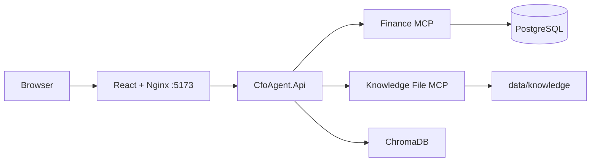

# CFO AI Agent

A local CFO assistant for five finance and planning questions. The React UI is served by Nginx, `CfoAgent.Api` orchestrates four in-process agents, Finance MCP owns PostgreSQL finance data, Knowledge File MCP provides restricted read-only file access, and ChromaDB provides semantic RAG citations.



Financial values are deterministic C# and SQL results. `MockChatClient` is the default offline provider. Optional Ollama uses the existing `IChatClient` configuration and is never an authority for finance calculations.

## Start the complete application

Prerequisites: Docker Desktop, .NET SDK selected by `global.json`, and Node.js 22 or later for local frontend validation. Ollama is optional and runs on the Windows host.

Docker Compose reads deployment settings from the root `.env` file. It is intentionally ignored by Git. Fresh clones should create it from the tracked template before starting:

```powershell
Copy-Item .env.example .env
```

Set `AI_PROVIDER=Mock` for the offline default, or set `AI_PROVIDER=Ollama` and `AI_MODEL=llama3.2:3b` after installing Ollama on the Windows host. The `.env` file also holds local PostgreSQL credentials, ports, MCP endpoints, and Chroma/RAG settings.

```powershell
docker compose up --build -d
```

Open `http://localhost:5173`. The API diagnostic port is `http://localhost:5260`, and pgAdmin is available locally at `http://localhost:5050`; normal browser calls use the Nginx same-origin `/api` proxy. The frontend, API, Finance MCP, Knowledge MCP, PostgreSQL, pgAdmin, ChromaDB, migration/seed job, and RAG ingestion job start in dependency order. Named PostgreSQL, pgAdmin, and ChromaDB volumes are preserved.

Use `docker compose ps`, `docker compose logs --no-color`, and `docker compose down` for operations. Do not use `down -v` unless intentionally deleting local PostgreSQL and ChromaDB data.

## Demo prompts

1. `Give me the sales summary of this week.`
2. `Compare this week's sales with last week.`
3. `Show me the top five products this month.`
4. `Give me the sales forecast for the next five years.`
5. `What is the annual sales target and what assumptions were used?`

## Providers

Default Docker configuration is `AI_PROVIDER=Mock` and `AI_MODEL=DeterministicMock` in `.env`. To use the optional host Ollama provider, set `AI_PROVIDER=Ollama` and `AI_MODEL=llama3.2:3b` in `.env`, then recreate the API with `docker compose up -d --force-recreate api`. Compose reaches it at `http://host.docker.internal:11434`. Startup never downloads or starts Ollama, and there is no automatic Ollama-to-Mock fallback.

## Service boundaries

- Finance MCP is the only PostgreSQL owner. The API has no database connection string or Finance fallback; its dependency failure is a sanitized HTTP 503.
- Knowledge File MCP permits only list/read beneath `data/knowledge`; it is mounted read-only in containers. Its Development-only fallback is disabled in Compose.
- ChromaDB remains the semantic source retrieval and citation store. It does not contain finance transactions.
- Frontend `5173`, API diagnostic `5260`, and pgAdmin `5050` are published on the local machine. PostgreSQL, ChromaDB, and MCP services remain internal; pgAdmin reaches PostgreSQL through the internal Docker network.

## Validation

```powershell
dotnet restore CfoAgent.sln
dotnet build CfoAgent.sln --no-restore --maxcpucount:1
dotnet test CfoAgent.sln --no-build --maxcpucount:1
dotnet test CfoAgent.sln --configuration Release --maxcpucount:1

Set-Location src/cfo-agent-ui
npm ci
npm test -- --run
npm run build
npm run test:e2e:container
```

`test:e2e:container` is deterministic when the Docker API uses the default Mock provider. If the deployment is intentionally configured for Ollama, use the manual workflows instead or recreate the API with `AI_PROVIDER=Mock` before running this timing-sensitive regression suite.

Run `scripts/test-phase-8-containers.ps1` from the repository root for the isolated real-container resilience gate. See [Phase 8 results](docs/PHASE-8-RESULTS.md), [architecture](APPLICATION_ARCHITECTURE.md), [demo script](docs/DEMO-SCRIPT.md), and [security notes](docs/SECURITY-NOTES.md).

For a full first-run, verification, MCP, frontend-development, and troubleshooting walkthrough, see [USER-GUIDE.md](USER-GUIDE.md).
