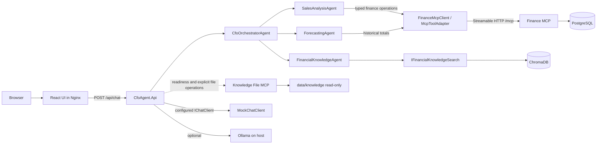

# Application Architecture Discovery

## Purpose and scope

This document records the architecture observed in the repository source as of 2026-07-20. It is a discovery artifact for a later rewrite of `APPLICATION_ARCHITECTURE.md`; it does not prescribe a new design. The primary subject is `CfoAgent.Api`. The Finance MCP server, Knowledge File MCP server, PostgreSQL, ChromaDB, Ollama, Mock provider, Docker deployment, frontend proxy, and tests are included only where they establish the API's actual behavior.

Evidence is cited as repository path, class, and method (or top-level registration/configuration block). Configuration names use .NET section syntax such as `Mcp:Finance:BaseUrl`; Docker environment names use their literal Compose names.

## 1. System overview

The deployed system consists of one browser UI, one ASP.NET Core business/orchestration application, two independently hosted MCP integration services, PostgreSQL, and ChromaDB. Ollama is optional and runs on the host; the deterministic Mock provider is the committed default.

Important boundary: Knowledge File MCP is not called by `FinancialKnowledgeAgent` during a chat request. The knowledge worker uses `IFinancialKnowledgeSearch`, implemented by `ChromaFinancialKnowledgeSearch`. Knowledge MCP is available through its own application port and is checked by readiness when enabled.

## 2. Main projects and services

| Project or service | Observed responsibility | Source evidence |
|---|---|---|
| `src/CfoAgent.Api` | HTTP API, intent classification, orchestration, three specialist workers, response composition, LLM provider selection, Finance MCP clients, Knowledge MCP clients, Chroma ingestion/search, deterministic forecasting, health and error translation | `src/CfoAgent.Api/Program.cs`; `CfoAgent.Api.csproj` targets `net10.0` and references `ModelContextProtocol` 1.4.1, `Microsoft.Extensions.AI.Abstractions` 10.8.0, and `OllamaSharp` 5.4.27 |
| `tools/CfoAgent.FinanceMcpServer` | Stateless Streamable HTTP MCP host, five read-only finance tools, PostgreSQL EF Core model, migration, deterministic seed, database readiness | `Program.Main`; `FinanceMcpTools`; project references `ModelContextProtocol.AspNetCore` 1.4.1 and `Npgsql.EntityFrameworkCore.PostgreSQL` 10.0.3 |
| `tools/CfoAgent.KnowledgeFileMcpServer` | Stateless Streamable HTTP MCP host with two restricted read-only filesystem tools | `Program.Main`; `KnowledgeFileMcpTools`; project references `ModelContextProtocol.AspNetCore` 1.4.1 |
| `tests/CfoAgent.Api.Tests` | Unit, HTTP integration, MCP host/client, PostgreSQL Testcontainers, Chroma, provider, and opt-in container/live tests | `tests/CfoAgent.Api.Tests/CfoAgent.Api.Tests.csproj` and test files listed under `tests/CfoAgent.Api.Tests` |
| `src/cfo-agent-ui` | Sends chat requests and displays the public response; Nginx proxies `/api/` to the API container | `src/cfo-agent-ui/src/features/chat/chatApi.ts`; `types.ts`; `nginx.conf` |
| PostgreSQL | Stores products, sales, and budget targets; accessed only by Finance MCP | `FinanceDbContext`; `docker-compose.yml` service `postgres` |
| ChromaDB | Stores knowledge text chunks, 256-dimensional deterministic embeddings, and source metadata | `ChromaClient`; `RagDocumentIngestionService`; Compose service `chromadb` |
| pgAdmin | Optional local database administration UI; it does not participate in application requests | `docker-compose.yml` service `pgadmin` |

`CfoAgent.sln` contains four .NET projects: the API, its tests, Finance MCP, and Knowledge File MCP. The API project has no project reference to either MCP server and no EF Core or Npgsql package.

## 3. CfoAgent.Api responsibilities

`CfoAgent.Api` owns:

- HTTP input validation, CORS, rate limiting, correlation IDs, OpenAPI, Problem Details, and `/health` endpoints (`Program.cs`, `ChatEndpoints`, `RequestCorrelationMiddleware`, `ApiExceptionHandler`).
- Selection of Mock or Ollama as the singleton `IChatClient` (`Program.cs`, `AiOptions`).
- Bounded intent classification and deterministic fallback classification (`CfoOrchestratorAgent.ClassifyAsync`, `TryParseIntent`, `ClassifyDeterministically`).
- Business-level routing to one or more in-process specialist agents (`CfoOrchestratorAgent.HandleAsync`).
- Mapping typed Finance MCP results into API finance contracts (`FinanceMcpClient`).
- Deterministic five-year forecast calculation (`SalesForecastingService.Forecast`).
- RAG ingestion and query orchestration, deterministic embeddings, citation mapping, and bounded context construction (`RagDocumentIngestionService`, `ChromaFinancialKnowledgeSearch`, `FinancialKnowledgeAgent`).
- Stable public chat response composition (`AgentResultComposer`, `ChatResponse.FromAgentResult`).

It does not own PostgreSQL, finance migrations, seed data, SQL finance aggregation, MCP server hosting, or filesystem tool execution.

## 4. HTTP entry point and public contracts

### Entry point

`ChatEndpoints.MapChatEndpoints` maps `POST /api/chat`. `HandleAsync`:

1. Validates that the body and `message` exist and that the message is at most 4,000 characters.
2. Preserves a supplied trimmed conversation ID or generates a 32-character GUID value.
3. Calls `CfoOrchestratorAgent.HandleAsync(new AgentRequest(message), HttpContext.RequestAborted)`.
4. Creates `ChatModel` from `AI:Provider` and `AI:Model`.
5. Maps the `AgentResult` through `ChatResponse.FromAgentResult`.

The endpoint contains no worker selection, MCP, ChromaDB, PostgreSQL, or provider-specific logic. It applies the named fixed-window rate limit `chat` configured in `Program.cs` as 30 requests per minute with no queue.

### Request and response DTOs

| Contract | Fields | Evidence |
|---|---|---|
| `ChatRequest` | nullable `ConversationId`, nullable `Message` | `src/CfoAgent.Api/Features/Chat/ChatContracts.cs` |
| `AgentRequest` | non-null `Message` after endpoint validation | `Agents/Contracts/AgentRequest.cs` |
| `AgentResult` | answer, enum response type, agent names, structured data, sources, assumptions, warnings, optional period | `Agents/Contracts/AgentResult.cs` |
| `ChatResponse` | conversation ID, answer, string response type, JSON structured data, sources, assumptions, warnings, period, provider/model | `ChatContracts.cs`, `ChatResponse.FromAgentResult` |

`ChatResponse.FromAgentResult` always prepends `CfoOrchestratorAgent`, de-duplicates agent names, serializes the runtime structured-data object to `JsonElement`, and maps enum values to snake-case public response types. The frontend mirrors this contract in `src/cfo-agent-ui/src/features/chat/types.ts`.

## 5. CFO orchestrator, intent classification, and worker routing

### Orchestrator responsibility

There is one orchestrator: `CfoOrchestratorAgent`. Its primary methods are:

- `ClassifyAsync`: sends a bounded classification prompt through `IChatClient` and accepts only an exact `CfoIntent` enum name no longer than 64 characters.
- `HandleAsync`: classifies, routes via an explicit switch, invokes workers, composes their results, logs duration/outcome, and preserves typed dependency failures and cancellation.
- `GetMixedResultsAsync`: runs Forecasting and Financial Knowledge work and awaits both with `Task.WhenAll`.

The switch is business routing, not MCP tool selection.

### Classification behavior

`AgentPromptTemplates.ForClassification` asks for exactly one of `SalesSummary`, `SalesComparison`, `TopProducts`, `Forecast`, `Knowledge`, `Mixed`, or `Unsupported`. `AgentDefinitions.CfoOrchestrator.SystemInstructions` applies the shared guardrail that the model must not calculate, invent values, or invoke tools.

If the model returns a valid exact enum name, that result is used. If it returns blank, more than 64 characters, or another string, `ClassifyDeterministically` uses explicit keyword rules:

- forecast plus target/assumption/risk -> `Mixed`
- forecast -> `Forecast`
- compare/versus -> `SalesComparison`
- top plus product -> `TopProducts`
- target/assumption/risk -> `Knowledge`
- sales/week -> `SalesSummary`
- otherwise -> `Unsupported`

An `IChatClient` exception is not converted to deterministic classification; it propagates as a provider/request failure. Evidence: `CfoOrchestratorAgent.ClassifyAsync` awaits the provider before parsing.

### Routing matrix

| Intent | Worker method | External data path | Final type |
|---|---|---|---|
| `SalesSummary` | `SalesAnalysisAgent.GetWeeklySummaryAsync` | Finance MCP `get_sales_summary` | `sales_summary` |
| `SalesComparison` | `SalesAnalysisAgent.GetWeekOverWeekComparisonAsync` | Finance MCP `compare_sales_periods` | `sales_comparison` |
| `TopProducts` | `SalesAnalysisAgent.GetCurrentMonthTopProductsAsync` | Finance MCP `get_top_products` | `top_products` |
| `Forecast` | `ForecastingAgent.GetForecastAsync` | Finance MCP `get_historical_sales`, then local C# regression | `forecast` |
| `Knowledge` | `FinancialKnowledgeAgent.AnswerAsync` | ChromaDB only for semantic retrieval | `knowledge` |
| `Mixed` | Forecast and Knowledge methods | Finance MCP plus ChromaDB concurrently after the methods yield | `mixed` |
| `Unsupported` | no specialist | none | `unsupported` |

For `Mixed`, `AgentResultComposer.Compose` concatenates the two already-produced answers in worker order, creates an `OrchestratedSpecialistResult[]` as structured data, and merges/de-duplicates sources, assumptions, warnings, and agent names. There is no final LLM composition call.

## 6. Specialist agents

| Agent | Focused responsibility | Calls | Does not do |
|---|---|---|---|
| `SalesAnalysisAgent` | Obtain typed weekly summary, comparison, or top-product data; ask `IChatClient` to phrase verified data; build `AgentResult` | `IFinanceMcpClient`; `IChatClient.GetResponseAsync` | Date/math aggregation, tool discovery, endpoint selection, transport construction |
| `ForecastingAgent` | Obtain historical yearly totals, run deterministic forecast service, ask model to explain the completed forecast | `IFinanceMcpClient.GetHistoricalYearlyTotalsAsync`; `SalesForecastingService.Forecast`; `IChatClient` | SQL, MCP transport, model-generated forecasting arithmetic |
| `FinancialKnowledgeAgent` | Query semantic knowledge, enforce sufficient-knowledge behavior, build bounded context, ask model to answer only from context, map citations | `IFinancialKnowledgeSearch.RetrieveAsync`; `IChatClient` | Knowledge MCP file access, Chroma HTTP details, finance database lookup |

All specialist prompts contain precomputed payloads or retrieved text. `AgentDefinitions.SharedGuardrail` and `AgentPromptTemplates` explicitly forbid calculating, altering, inferring, inventing, or requesting tools.

## 7. MCP server and tool decision approach

### Which MCP server is selected

Server selection is dependency-injection and business-path based, not model based:

- Sales and Forecast workers depend on `IFinanceMcpClient`; DI binds that interface to `FinanceMcpClient`, which receives the keyed `IMcpToolAdapter` named `Finance`.
- Explicit Knowledge file operations depend on `IKnowledgeFileMcpClient`; `KnowledgeFileMcpHttpClient` receives the keyed adapter named `KnowledgeFiles` through `IKnowledgeFileMcpRemoteClient` and `KnowledgeFileMcpAccess`.
- `FinancialKnowledgeAgent` does not depend on either Knowledge MCP interface. It depends on `IFinancialKnowledgeSearch`, so a knowledge chat request selects ChromaDB, not Knowledge MCP.

Evidence: registrations in `Program.cs` and constructor signatures of the three specialist agents.

### Which MCP tool is selected

Tool selection is a hybrid of dynamic capability discovery and hard-coded typed business mappings:

- Dynamic: `McpToolAdapter.GetOrDiscoverToolsAsync` calls SDK `ListToolsAsync` and caches discovered `McpClientTool` objects whose names are in the configured allow-list.
- Hard-coded/business-rule based: each typed client method chooses one literal tool name. `FinanceMcpClient.GetCurrentWeekSummaryAsync` chooses `get_sales_summary`; comparison chooses `compare_sales_periods`; top products chooses `get_top_products`; history chooses `get_historical_sales`; budget chooses `get_budget_target`. `KnowledgeFileMcpHttpClient` chooses `list_knowledge_files` or `read_knowledge_file` according to its called method.
- Not LLM based: agents pass no `AITool` collection in `ChatOptions`, prompts say not to return tool calls, and no application code reads `FunctionCallContent` to select or invoke an MCP tool.

The MCP tool names are therefore dynamically verified but not dynamically selected for the current chat workflow. Adding an allowed server tool makes it discoverable to the generic adapter, but it does not create a new business operation, route, or agent method automatically.

### Current use of the budget and Knowledge MCP tools

`FinanceMcpClient.GetBudgetTargetAsync` and Finance MCP `get_budget_target` are implemented and tested, but no current agent calls `GetBudgetTargetAsync`. The annual-target/assumptions prompt is classified as `Knowledge` and answered from ChromaDB-indexed Markdown by `FinancialKnowledgeAgent`.

Likewise, Knowledge MCP list/read operations are implemented, registered, health-checked, and container-tested, but are not in the current chat request path.

## 8. MCP initialization, discovery, cache, calls, and failure behavior

### Connection and initialization

`McpToolAdapter.GetOrCreateClientUnderLockAsync` creates an SDK `HttpClientTransport` with:

- endpoint `McpToolAdapter.CreateMcpEndpoint(baseUrl)`, which appends `/mcp`;
- `HttpTransportMode.StreamableHttp`;
- configured connection timeout;
- a named `HttpClient` with infinite framework timeout so the adapter's linked cancellation/timeout controls the operation.

It then calls `McpClient.CreateAsync(transport, cancellationToken: ...)`. This is the official SDK client construction API that performs MCP initialization before returning the usable client. The repository does not manually construct initialization JSON-RPC messages.

### `tools/list`, allow-list, and cache

`GetOrDiscoverToolsAsync` calls `McpClient.ListToolsAsync`, rejects duplicate discovered names, intersects results with the configured `AllowedToolNames`, and caches the approved `McpClientTool` dictionary. A `SemaphoreSlim` provides single initialization/discovery under concurrency. Subsequent discovery and tool calls use the connection cache.

`GetApprovedToolNamesAsync(requiredToolNames, ...)` verifies every required name is both configured and present in the cached discovered set. A missing required tool produces `McpDependencyException` with `CapabilityMismatch`.

Configuration evidence:

- `Mcp:Finance:AllowedToolNames` contains five names in `appsettings.json`.
- `Mcp:KnowledgeFiles:AllowedToolNames` contains two names.
- `Program.cs` validates nonblank unique names when an integration is enabled.

### Tool arguments and validation

Finance arguments are created in deterministic C# by `FinanceMcpClient`:

- weekly summary: Monday through `TimeProvider` local current date, formatted `yyyy-MM-dd`;
- comparison: current Monday-to-current-date and the preceding Monday-to-Sunday;
- top products: first day of current month through current date, limit 5;
- history: five complete years ending in current year minus one;
- budget: explicit year and optional month supplied by the caller.

The generic adapter validates nonblank names, allow-list membership, and discovery membership. It calls the discovered SDK `McpClientTool.CallAsync(arguments, ...)`. It does not contain a custom JSON Schema validator. Parameter/schema binding and validation occur through the SDK/server tool invocation. Finance MCP additionally validates date format/range, top-product limit, year range, and month range in `FinanceMcpTools`; Knowledge MCP validates relative paths and filesystem boundaries. A server result marked `IsError` becomes `McpDependencyFailureKind.InvalidResponse` and resets the connection. `McpToolAdapterTests.ServerSchemaRejectsInvalidArgumentsAsControlledFailure` verifies invalid SDK/server arguments fail in a controlled way and the next call rediscovers.

### Missing, unavailable, timeout, and reconnect behavior

- Disabled adapter: `EnsureEnabled` throws `McpDependencyException(...Disabled)` without a network request.
- Tool absent from discovery or not allowed: `CapabilityMismatch`; no arbitrary tool call is sent.
- Server result has `IsError`: connection/cache reset, then `InvalidResponse`.
- Empty/malformed/non-success envelope: controlled `InvalidResponse`. These branches do not all explicitly reset the cache; only server `IsError`, timeout, or a non-`McpDependencyException` transport/SDK exception resets it.
- Transport/SDK failure: reset then `Unavailable`.
- Adapter timeout: reset then `Timeout`.
- Caller cancellation: original `OperationCanceledException` propagates; it is not converted to timeout or 503 dependency fallback.
- Disposal: `DisposeAsync` clears cache and disposes the SDK client.

`KnowledgeFileMcpAccess.ExecuteAsync` may fall back to local restricted file access only if `Mcp:KnowledgeFiles:UseLocalFallback=true` and the host environment is Development. Compose sets this to false. Finance has no local fallback.

## 9. ChromaDB and vector search

### Source documents and ingestion entry point

Source documents are top-level Markdown files under `data/knowledge`. Current front matter identifies annual sales report, current budget/target, forecast assumptions, market risks, and product strategy documents.

`Program.cs` detects the `--ingest-rag` CLI argument. In Development it resolves `RagDocumentIngestionService` and calls `IngestAsync`; any per-document failures cause the command to fail. Compose runs this as the one-shot `rag-init` service after ChromaDB is healthy. It mounts `./data/knowledge` read-only at `/knowledge` and configures `Rag:KnowledgeFilesRoot=/knowledge`.

### Document parsing and chunking

`RagDocumentIngestionService.ParseDocument` requires simple Markdown front matter fields:

- `document_id`
- `document_name`
- `document_type`
- `period`
- `section`
- `source_path`

`BuildChunks` splits the body at blank lines, treats Markdown headings as section boundaries, combines paragraphs up to `Rag:MaxChunkCharacters` (default 1,200), and splits oversized paragraphs at sentence or space boundaries. Every stored document contains the section heading followed by chunk content. A stable chunk ID is `chunk-` plus lowercase SHA-256 of source path, section, and content.

### Embeddings

`DeterministicTokenHashEmbeddingGenerator` is the sole registered `IEmbeddingGenerator<string, Embedding<float>>`.

- Dimension: 256 (`DefaultDimension`).
- Tokenization: contiguous Unicode letters/digits, lowercased.
- Hash: 32-bit FNV-1a over UTF-8 bytes.
- Projection: hash modulo 256 selects a bucket; hash low bit adds either +1 or -1.
- Normalization: non-empty vectors are divided by Euclidean magnitude.

This is deterministic local token hashing, not an Ollama or external embedding model.

### Chroma collection and stored records

`ChromaClient.GetOrCreateCollectionAsync` uses Chroma API v2 under:

`api/v2/tenants/{Chroma:Tenant}/databases/{Chroma:Database}/collections`

The default collection is `Chroma:CollectionName=cfo-financial-knowledge`, tenant `default_tenant`, database `default_database`. Collection creation sets only `name` and `get_or_create`; the repository does not explicitly configure a Chroma distance metric.

`RagDocumentIngestionService.CreateRecordsAsync` upserts:

- ID: stable SHA-256 chunk ID;
- document: chunk text;
- embedding: 256 floats;
- metadata: `document_id`, `document_name`, `document_type`, `period`, `section`, `source_path`, and `chunk_index`.

### Query and relevance interpretation

`FinancialKnowledgeAgent.AnswerAsync` constructs `FinancialKnowledgeQuery(message, topK=3, optional documentType, optional period)`. `ChromaFinancialKnowledgeSearch.RetrieveAsync` validates TopK 1 through 10, gets the collection, embeds the query with the same generator, and calls `ChromaClient.QueryAsync` requesting documents, metadata, and distances.

The code interprets smaller returned distance as more relevant:

1. Map only complete records with document, distance, and required metadata.
2. Retain `Distance <= Rag:MaximumRetrievalDistance` (default 1.25).
3. Apply optional case-insensitive document-type and period filters.
4. Sort ascending by distance and stable source keys.
5. De-duplicate by document ID, section, and source path.

The exact mathematical metric is not configured in repository code and therefore cannot be stated from this repository. Only the lower-is-better threshold behavior is explicit.

### Retrieved context and no-result behavior

`FinancialKnowledgeAgent.BuildBoundedContext` writes source name, section, period, path, and chunk content into a context capped by `Rag:MaxKnowledgeContextCharacters` (default 4,000). It sends this context through `AgentPromptTemplates.ForKnowledge`; the LLM is instructed to use only the supplied context and add no facts, values, or sources. Citations are produced deterministically from retrieved metadata using `FinancialKnowledgeSource.ToAgentSource`, not parsed from model text.

If the collection is missing, retrieval returns warning `No financial knowledge has been ingested.` If no match survives mapping, threshold, or filters, it returns `No sufficiently relevant financial knowledge was found.` In either case `FinancialKnowledgeAgent` returns a fixed insufficient-knowledge answer without calling the LLM.

## 10. Final response composition

Each worker constructs an `AgentResult` containing model prose plus authoritative structured data and metadata. `AgentResultComposer.Compose`:

- returns a single worker result unchanged;
- for multiple results, concatenates answers with a blank line;
- returns `AgentResponseType.Mixed`;
- represents each worker's structured data in an `OrchestratedSpecialistResult`;
- merges distinct names, sources, assumptions, and warnings;
- uses the first non-null data period.

`ChatResponse.FromAgentResult` performs the final HTTP-contract mapping. There is no LLM call after specialist execution.

## 11. Mock and Ollama provider behavior

Both providers implement the external `Microsoft.Extensions.AI.IChatClient` port and are selected once by the `AI:Provider` registration in `Program.cs`.

### Mock

`MockChatClient.GetResponseAsync` is offline and deterministic. It recognizes internal prompt markers for classification, sales summary, comparison, top products, forecast, and knowledge. Classification uses explicit keywords. Worker answers echo the verified payload/context under a fixed heading. `AI:SimulatedDelayMilliseconds` supports cancellation testing and `AI:SimulateFailure` supports failure testing. Metadata reports provider `Mock` and the configured model.

### Ollama

`Program.cs` creates a named `HttpClient` at `AI:BaseUrl`, wraps `OllamaApiClient` with `OllamaChatClient`, and uses `AI:Model`. `OllamaChatClient.CreateRequestOptions` bounds model ID, temperature, maximum output tokens, and Ollama context length. A linked timeout maps provider timeout, transport unavailability, malformed/empty responses, and Ollama errors to sanitized `OllamaProviderException` categories while preserving caller cancellation.

`OllamaChatClient` can technically pass through tools supplied in `ChatOptions` and accepts a structured function-call response without prose. The current agents never supply tools and never consume function calls. Therefore current MCP tool selection is not Ollama-based.

Compose configures host Ollama as `OLLAMA_BASE_URL=http://host.docker.internal:11434` and adds `host.docker.internal:host-gateway` to the API container. The default `.env.example` remains `AI_PROVIDER=Mock`.

## 12. Configuration and dependency injection

`Program.cs` binds and validates these options on startup:

| Section | Key behavior |
|---|---|
| `Application` | Requires `Name`; exposes `DemoMode` at `/` |
| `AI` | Provider must be Mock/Ollama; validates URL, timeout, temperature, context length, output tokens, simulation values |
| `Chroma` | Requires absolute base URL, collection, tenant, database, positive timeout |
| `Rag` | Requires root, minimum chunk/context limits, nonnegative retrieval threshold |
| `Mcp:Finance` | enabled flag, HTTP base URL, timeout, five-name allow-list |
| `Mcp:KnowledgeFiles` | enabled flag, HTTP base URL, root, Development-only fallback, timeout, two-name allow-list |
| `Frontend` | validates the CORS allowed origin |

Meaningful DI registrations include:

- scoped orchestrator and three agents;
- singleton `AgentResultComposer`;
- singleton selected `IChatClient`;
- singleton deterministic embedding generator;
- scoped `IFinancialKnowledgeSearch -> ChromaFinancialKnowledgeSearch`;
- keyed singleton Finance and Knowledge `IMcpToolAdapter` instances;
- singleton typed Finance and Knowledge clients;
- typed/named HTTP clients for Ollama, Chroma, and MCP transport;
- `TimeProvider.System`, consumed by `FinanceMcpClient` for date windows.

Registration is lazy with respect to network calls: constructing/resolving an MCP adapter does not connect. The first discovery/call or readiness probe causes SDK connection and `tools/list`.

Local `appsettings.json` enables Finance MCP at `http://localhost:5081`, disables Knowledge MCP, and defaults to Mock. Compose overrides both MCP integrations to enabled internal addresses and disables Knowledge local fallback.

## 13. Health checks, errors, 503, and cancellation

### API health

- `/health/live`: `Program.cs` uses a predicate that selects no dependency checks, so a running process returns liveness.
- `/health/ready`: includes `ChromaHealthCheck`, `McpConfigurationHealthCheck`, and `OllamaHealthCheck`, all tagged `ready`.
- `ChromaHealthCheck.CheckHealthAsync`: GET `api/v2/heartbeat`.
- `McpConfigurationHealthCheck.CheckHealthAsync`: requires Finance enabled and all five required capabilities; checks Knowledge capabilities when enabled or local files when disabled with fallback. If Knowledge MCP is disabled and local fallback is also disabled, the health check does not add a Knowledge failure.
- `OllamaHealthCheck.CheckHealthAsync`: healthy/skipped for non-Ollama; for Ollama, GET `api/tags` with at most five-second timeout and require the configured exact model name.

The readiness JSON includes dependency name, status, and sanitized description.

### Error translation

`ApiExceptionHandler.TryHandleAsync` produces Problem Details with only status, safe title/type, and trace ID:

- Finance/Knowledge `McpDependencyException`: 503, `A required dependency is temporarily unavailable.`
- `VectorSearchDependencyException`: same sanitized 503.
- Ollama unavailable/invalid response: provider-specific sanitized 503.
- Ollama timeout and non-caller timeout: 504.
- `InvalidOperationException`: sanitized 503.
- unexpected exception: 500.

MCP logs include dependency and failure category but not endpoint or inner exception details in the response.

### Cancellation

`ChatEndpoints.HandleAsync` passes `HttpContext.RequestAborted`. The orchestrator, every worker, MCP adapter, Finance/Knowledge clients, Chroma client, embedding generator, ingestion service, and provider methods accept/propagate `CancellationToken`. Catch filters rethrow when the caller token is cancelled. MCP and Ollama use linked timeout tokens and distinguish caller cancellation from their own timeout. Caller cancellation is therefore not converted to an MCP fallback or sanitized dependency 503.

## 14. Finance MCP service

### Hosting and transport

`CfoAgent.FinanceMcpServer.Program.Main` builds an ASP.NET Core host, calls `AddMcpServer().WithHttpTransport(options => options.Stateless = true).WithToolsFromAssembly()`, and maps `MapMcp("/mcp")`. It is an independently hosted stateless Streamable HTTP server on container port 8080. `[McpServerToolType]` and `[McpServerTool]` attributes provide SDK assembly discovery and registration.

### Exposed tools

| Tool | Method | Result |
|---|---|---|
| `get_sales_summary` | `FinanceMcpTools.GetSalesSummaryAsync` | period, net revenue, COGS, gross profit/margin, quantity, orders, AOV, top product, warnings |
| `compare_sales_periods` | `CompareSalesPeriodsAsync` | two summaries, absolute/percentage change, direction, warnings |
| `get_top_products` | `GetTopProductsAsync` | period and up to 20 products ranked by net revenue |
| `get_historical_sales` | `GetHistoricalSalesAsync` | up to five yearly net revenue totals |
| `get_budget_target` | `GetBudgetTargetAsync` | annual/monthly target availability, sales/profit targets, assumption reference |

`FinanceMcpToolCatalog.Names` duplicates the public five-name catalog for `--list-tools` and contract tests; runtime MCP registration comes from attributes via `WithToolsFromAssembly`.

All tools return `FinanceMcpResult<T>(IsSuccess, Data, Error)`. The API adapter expects the equivalent JSON envelope and returns only `Data` for successful results.

### PostgreSQL, migration, and seed

`FinanceDatabaseConfiguration` requires `ConnectionStrings:FinanceDatabase`. `Program.Main` registers `FinanceDbContext` with `UseNpgsql`. The model contains `Products`, `Sales`, and `BudgetTargets`, indexes, decimal precision, relationships, and check constraints.

The migration `20260718162809_InitialPostgreSqlFinanceSchema` creates all three tables and their constraints/indexes. Running the host with `--migrate` applies migrations; `--seed` applies migrations and invokes `DevelopmentFinanceSeeder.SeedAsync`. Compose uses the one-shot `finance-db-init` service with `--seed` before Finance MCP starts.

Seeding is deterministic relative to `Finance:DemoDate` and returns immediately if any product exists. It creates eight products, five complete prior years plus current-year/month and weekly comparison sales, and annual/monthly budget targets. Re-running seed is idempotent for an already-populated database.

### Deterministic calculations and readiness

Finance SQL reads use EF Core `AsNoTracking`; aggregation is completed in C# after bounded rows are loaded. Revenue is quantity times unit price minus discount; cost is quantity times unit cost; gross profit/margin, order count, average order value, period change, direction, product ranking, yearly totals, and budget lookup are deterministic server code.

`FinanceDatabaseReadinessHealthCheck.CheckHealthAsync` verifies PostgreSQL connectivity, no pending migrations, and readable access to all three tables. Finance MCP exposes `/health/live` and `/health/ready`.

## 15. Knowledge File MCP service

### Hosting and tools

`CfoAgent.KnowledgeFileMcpServer.Program.Main` resolves `KnowledgeFiles:RootPath` or `--root`, validates that the root exists and is not a reparse point, registers a stateless HTTP MCP server with assembly-discovered tools, and maps `/mcp`, `/health/live`, and `/health/ready`.

`KnowledgeFileMcpTools` exposes exactly:

- `list_knowledge_files` -> recursive sorted relative paths;
- `read_knowledge_file` -> contents for a relative path returned by listing.

It exposes no write, delete, rename, move, execute, or directory-creation methods.

### Filesystem security

`KnowledgeFileMcpTools.ResolveAllowedPath`, `EnsurePathIsUnderRoot`, and `EnsureNoReparsePoints`:

- reject blank and rooted/absolute paths;
- reject any `..` path segment using either slash style;
- resolve a full path and require the root prefix;
- reject symbolic links/junctions along the path;
- return a typed failure for missing files.

Listing skips reparse-point entries and verifies every enumerated path. Compose adds defense in depth: `./data/knowledge` is bind-mounted read-only at `/knowledge`, the root filesystem is `read_only: true`, and only `/tmp` is writable via tmpfs.

`KnowledgeRootReadinessHealthCheck` verifies the root exists, is not a reparse point, and can be enumerated without disclosing the root path.

## 16. Container networking and startup

`docker-compose.yml` defines:

- internal `backend` network: PostgreSQL, pgAdmin, Finance MCP, Knowledge MCP, ChromaDB, RAG initializer, API;
- `edge` network: API and frontend;
- published ports: frontend `${CFO_UI_PORT}:8080`, API `${CFO_API_PORT}:8080`, and pgAdmin bound to loopback `127.0.0.1:${CFO_PGADMIN_PORT}:80`;
- internal-only ports: PostgreSQL 5432, Finance/Knowledge MCP 8080, ChromaDB 8000.

Startup dependencies are explicit: PostgreSQL healthy -> `finance-db-init` exits successfully -> Finance MCP; ChromaDB healthy -> `rag-init` exits successfully; API waits for Finance MCP, Knowledge MCP, ChromaDB, and RAG initialization; frontend waits for API health. PostgreSQL, ChromaDB, and pgAdmin use named volumes. Knowledge files are a read-only bind mount.

Nginx proxies frontend `/api/` requests to `http://api:8080`; when `VITE_API_BASE_URL` is the Compose default empty string, `chatApi.ts` uses same-origin `/api/chat`. API and frontend communicate on `edge`; API reaches MCP and Chroma services by Compose DNS names on `backend`.

## 17. Responsibility and calculation ownership

| Responsibility | Owner and evidence |
|---|---|
| Request validation and public response | API `ChatEndpoints`, `ChatResponse` |
| Intent classification and worker routing | API `CfoOrchestratorAgent` |
| Finance date windows and canonical MCP arguments | API `FinanceMcpClient`, using `TimeProvider` |
| Finance persistence and schema | Finance MCP `FinanceDbContext` and migrations |
| Revenue, cost, margin, comparison, ranking, yearly total, budget lookup | Finance MCP `FinanceMcpTools` |
| Five-year regression and +/-10% scenarios | API `SalesForecastingService` |
| Executive prose | configured API `IChatClient`, constrained to verified inputs |
| Document parsing/chunking, deterministic embeddings, query filtering, bounded context, citations | API RAG classes |
| Vector persistence/query execution | ChromaDB through `ChromaClient` |
| Restricted raw file list/read | Knowledge File MCP; local equivalent only in explicitly enabled Development fallback |
| PostgreSQL credentials | Finance MCP and Compose initializer, not API |

No authoritative financial amount, date window, percentage, ranking, or forecast is calculated by Mock or Ollama.

## 18. Test evidence inspected

The following tests directly corroborate the architecture:

- `ChatApiTests`: five public scenarios, mixed response contract, validation, sanitized 503, correlation, readiness.
- `CfoOrchestratorAgentTests`: bounded classification, deterministic malformed-output fallback, exact worker routing, mixed execution, cancellation, dependency propagation, unsupported behavior.
- `AgentResultComposerTests`: single-result passthrough and stable mixed composition.
- `AgentMcpWiringTests`: Sales/Forecast use Finance MCP, deterministic forecast, no Knowledge MCP preflight, Chroma failure propagation, cancellation, precomputed model inputs.
- `FinanceMcpClientTests`: fixed tool mapping and canonical arguments.
- `McpToolAdapterTests`: `tools/list`, cache, allow-list, generic invocation, missing/removed tools, server schema failure, cancellation, no SDK types in the port.
- `ApiHttpMcpClientTests`, `FinanceMcpHttpHostTests`, `KnowledgeFileMcpHttpHostTests`: real Streamable HTTP discovery/calls, lazy connection, timeout/unavailable behavior, security, and health.
- `FinancialKnowledgeRetrievalTests`, `RagDocumentIngestionServiceTests`, `DeterministicTokenHashEmbeddingGeneratorTests`, `ChromaClientTests`: metadata, stable chunking, embeddings, query parsing, threshold/filtering, citations, and insufficient knowledge.
- `AiProviderRegistrationTests`, `MockChatClientGateTests`, `OllamaChatClientTests`, `OllamaAgentGuardrailTests`: provider selection, offline determinism, Ollama bounds/failures, and finance guardrails.
- `ApiFinancePersistenceBoundaryTests`: no API PostgreSQL/finance persistence provider and deterministic API forecasting.
- `PostgreSqlMigrationTests`, `FinanceMcpOwnershipTests`, `ContainerIntegrationTests`: schema/seed ownership, all tools, real container dependencies, and cancellation.

## 19. Differences and clarifications versus current documentation

The active `APPLICATION_ARCHITECTURE.md` is broadly aligned with source, but these implementation-level clarifications matter for its rewrite:

1. Its API-to-Knowledge-MCP arrow is operational, not a knowledge-chat data path. `FinancialKnowledgeAgent` calls ChromaDB only. Knowledge MCP is used by its explicit clients, readiness, and integration tests.
2. Finance MCP owns and exposes budget lookup, but the current annual-target chat route does not invoke `get_budget_target`; it retrieves the target and assumptions from ChromaDB Markdown.
3. MCP discovery is dynamic, but tool selection in the business workflow is fixed by typed client methods. Neither Mock nor Ollama currently receives MCP tools or selects the final MCP call.
4. The adapter resets connection/cache on transport/SDK failure, timeout, and server `IsError`; not every typed `InvalidResponse` or `CapabilityMismatch` branch resets immediately.
5. Local `appsettings.json` enables Finance MCP and disables Knowledge MCP. Compose enables both and disables Knowledge local fallback. Documentation should distinguish local direct-run defaults from container settings.
6. The current `OllamaChatClient` can carry tool definitions as an `IChatClient` capability, but that capability is not used by the current agents. It should not be described as the current MCP selection mechanism.

## 20. Missing or externally defined information

- The repository does not explicitly configure the Chroma collection distance metric. Chroma's exact metric/default for the deployed `chromadb/chroma:latest` image cannot be established from repository source; only lower-distance-is-better application behavior is proven.
- `chromadb/chroma:latest` and `dpage/pgadmin4:latest` are unpinned tags, so their exact runtime versions depend on when the images were pulled.
- The exact MCP initialization wire exchange is implemented inside official package `ModelContextProtocol` 1.4.1. Repository evidence is the call to `McpClient.CreateAsync` followed by successful `ListToolsAsync`; there is no custom handshake implementation to inspect.
- Ollama live behavior depends on the host installation and configured model. Normal tests use fakes or skip opt-in live tests.

These are evidence boundaries, not blockers to describing the repository architecture.
