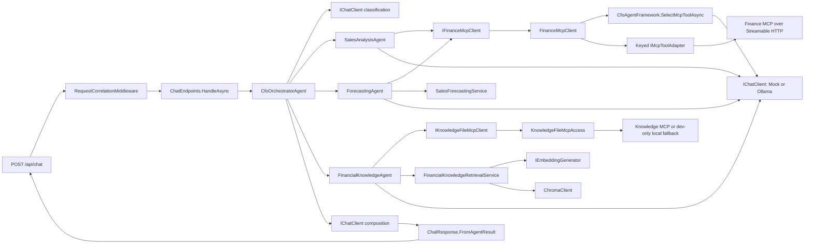

# CfoAgent.Api Current Architecture and Complexity Assessment

## Scope and method

This assessment is based on the current implementation of `src/CfoAgent.Api` and the tests that directly exercise it under `tests/CfoAgent.Api.Tests`. Finance MCP server internals, Knowledge MCP server internals, the frontend, PostgreSQL, ChromaDB deployment, MCP contracts, and the public chat contract are treated as external constraints rather than refactoring targets.

The review traced imports and constructor dependencies, dependency-injection registrations, options binding, HTTP and MCP calls, error propagation, health checks, deterministic calculation paths, and the production test seams. It did not rely on folder names or architecture documentation alone.

## Executive assessment

`CfoAgent.Api` is a pragmatic ASP.NET Core business monolith using an **Orchestrator-Worker multi-agent pattern**. It has one clear business orchestrator (`CfoOrchestratorAgent`) and three specialist workers (`SalesAnalysisAgent`, `ForecastingAgent`, and `FinancialKnowledgeAgent`). It is not a repository-pattern application because it intentionally owns no persistence. Finance data arrives through Finance MCP, knowledge retrieval uses ChromaDB, and the only authoritative forecast calculation is deterministic C#.

The code has useful Clean/Hexagonal characteristics, especially around `IChatClient`, `IFinanceMcpClient`, `IKnowledgeFileMcpClient`, and `IMcpToolAdapter`. It is **not strict Clean Architecture or strict Hexagonal Architecture**: agents depend on the concrete `CfoAgentFramework`, the knowledge agent depends on the concrete `FinancialKnowledgeRetrievalService`, and that service depends on the concrete `ChromaClient`. MCP SDK types also cross into `CfoAgentFramework`.

A broad redesign is not justified. A focused refactor is justified in the highest-risk areas: eliminate model calls that do not make a real decision, preserve typed dependency failures through specialist agents, and narrow MCP capability failures to the operation that actually needs the capability. The existing monolith, four-agent structure, deterministic finance service, public contracts, and external ownership boundaries should remain.

## Current architecture



### Pattern classification

| Concern | Assessment | Evidence |
|---|---|---|
| Application shape | Simple ASP.NET Core business monolith | One API project and one composition root in `src/CfoAgent.Api/Program.cs`; no internal service deployment or persistence project. |
| Multi-agent pattern | Orchestrator-Worker | `CfoOrchestratorAgent.HandleAsync` classifies and selects one or two of three specialists. |
| Repository pattern | Not used and not needed | The API has no EF Core, Npgsql, SQLite, repository, or database context dependency; `ApiFinancePersistenceBoundaryTests` enforces this. |
| Clean Architecture | Partial, pragmatic | Finance and LLM boundaries use ports, but concrete RAG infrastructure is injected into application-facing agent code. |
| Hexagonal Architecture | Partial | `IChatClient`, `IFinanceMcpClient`, and MCP adapter interfaces are ports; `ChromaClient` and MCP SDK types remain concrete dependencies in the inner request flow. |
| Dependency inversion | Strong for LLM and finance MCP; partial for RAG | Provider implementations implement `IChatClient`; specialists use `IFinanceMcpClient`; `FinancialKnowledgeAgent` directly uses `FinancialKnowledgeRetrievalService`. |
| Deterministic finance | Preserved | `SalesForecastingService.Forecast` performs ordinary least-squares and scenarios in C# after MCP returns historical totals. |

## End-to-end request flow

### 1. HTTP entry and validation

1. `RequestCorrelationMiddleware.InvokeAsync` validates or creates `X-Correlation-ID`, assigns `HttpContext.TraceIdentifier`, opens a logging scope, and records request duration.
2. `ChatEndpoints.MapChatEndpoints` exposes only `POST /api/chat`, applies the `chat` rate-limit policy, and declares 200, 400, and 503 responses.
3. `ChatEndpoints.HandleAsync` validates presence, nonblank content, and the 4,000-character limit. It generates or normalizes a conversation ID and creates `AgentRequest`.
4. The request-aborted token is passed to `CfoOrchestratorAgent.HandleAsync`.

### 2. Classification and business routing

1. `CfoOrchestratorAgent.ClassifyAsync` creates a `ChatClientAgent` through `CfoAgentFramework.CreateAgent` and asks the configured `IChatClient` for exactly one `CfoIntent` token.
2. `TryParseIntent` accepts only a bounded exact enum name. Malformed model output falls back to `ClassifyDeterministically`.
3. `CfoOrchestratorAgent.HandleAsync` uses a switch expression for **business-level routing**. This switch is appropriate and is not MCP tool selection.
4. Sales summary, comparison, top-products, forecast, and knowledge intents each invoke one specialist. `Mixed` invokes forecasting and knowledge concurrently. Unsupported requests return a fixed scoped response.

### 3. Sales and finance MCP flow

1. `SalesAnalysisAgent` selects one typed operation on `IFinanceMcpClient` from the already-classified business intent.
2. `FinanceMcpClient` constructs canonical date/range arguments using `TimeProvider` and fixed operation rules.
3. `McpToolAdapter.GetApprovedToolsAsync` lazily creates the official SDK `McpClient`; `McpClient.CreateAsync` performs MCP initialization. The adapter calls `ListToolsAsync`, filters by the configured allow-list, and caches approved `McpClientTool` instances.
4. `CfoAgentFramework.SelectMcpToolAsync` supplies a subset of approved SDK tools to `IChatClient`, requires one function call, validates the selected name, and requires the selected arguments to equal the canonical arguments exactly.
5. `FinanceMcpClient.SelectAndCallAsync` additionally requires the selected name to equal the typed method's hard-coded expected name.
6. `McpToolAdapter.CallApprovedToolAsync` invokes the SDK tool (`tools/call`), validates the standard response envelope, and returns cloned JSON data.
7. `FinanceMcpClient` maps private transport records to stable API finance result records.
8. `SalesAnalysisAgent` gives the verified typed result to an LLM only for executive-language presentation, then builds `AgentResult`.

### 4. Forecasting flow

1. `ForecastingAgent.GetForecastAsync` obtains historical yearly totals through `IFinanceMcpClient` using the same MCP discovery/selection/call path.
2. `SalesForecastingService.Forecast` validates the minimum history, calculates ordinary least-squares regression, and creates five deterministic conservative, expected, and optimistic scenarios.
3. The forecast result, assumptions, and warnings are authoritative. The LLM receives them only to produce prose.

### 5. Knowledge and ChromaDB flow

1. `FinancialKnowledgeAgent.RetrieveAsync` optionally calls `IKnowledgeFileMcpClient.ListFilesAsync` when Knowledge MCP or its local fallback is configured. This is an availability/access preflight; its result is not used in retrieval.
2. `KnowledgeFileMcpAccess` chooses the network client or the development-only secure in-process fallback through `KnowledgeFileMcpFallback`.
3. Regardless of file preflight, `FinancialKnowledgeRetrievalService.RetrieveAsync` creates a deterministic query embedding and calls `ChromaClient` to find the configured collection and query nearest chunks.
4. Retrieval applies distance and optional metadata filters, deterministic ordering, and source deduplication.
5. `FinancialKnowledgeAgent.BuildBoundedContext` truncates retrieved content to the configured context limit and sends only that context to the LLM.
6. Source metadata is mapped to `AgentSource`; insufficient retrieval returns a fixed answer without calling the LLM.

### 6. Result composition and HTTP response

1. Each specialist currently calls the LLM to create its own `AgentResult.Answer`.
2. `CfoOrchestratorAgent.ComposeAsync` then creates another orchestrator session and asks the LLM to compose an answer from reduced `OrchestratedSpecialistResult` objects. It does this for both single- and multi-specialist requests.
3. The orchestrator merges sources, assumptions, warnings, data period, and agent names. For a single result it preserves the specialist structured payload; for mixed results it returns the reduced specialist result array.
4. `ChatResponse.FromAgentResult` maps the internal enum to the public snake-case response type, serializes structured data to `JsonElement`, adds the orchestrator name, and includes configured model metadata.

### 7. Cancellation and failures

1. Request cancellation flows from `HttpContext.RequestAborted` through agents, SDK clients, HTTP clients, embedding generation, and Chroma queries.
2. `McpToolAdapter.ExecuteDependencyOperationAsync` distinguishes caller cancellation from its configured timeout and maps unavailable, timeout, capability, and invalid-response failures to `McpDependencyException`.
3. `OllamaChatClient` similarly distinguishes caller cancellation, provider timeout, provider unavailability, and invalid output.
4. `ApiExceptionHandler.TryHandleAsync` is the centralized sanitized mapping for Ollama, ChromaDB, MCP, timeout, invalid operation, and unknown failures.
5. `ChatEndpoints.HandleAsync` separately catches `InvalidOperationException` and returns a generic 503, creating a second exception-mapping path.
6. Specialist catch blocks preserve caller cancellation and Finance MCP failures, but generic catches can wrap other typed dependency failures before they reach `ApiExceptionHandler`.

## Responsibilities by component

| Component | Current responsibility | Assessment |
|---|---|---|
| `ChatEndpoints` | Transport validation, conversation ID, rate-limited endpoint, API mapping | Mostly focused; its local 503 mapping duplicates centralized handling. |
| `CfoOrchestratorAgent` | Classification, safe fallback classification, business routing, mixed concurrency, final composition | One clear orchestrator, but final composition duplicates specialist prose generation. |
| `SalesAnalysisAgent` | Calls typed finance operations, requests prose, maps finance outputs to `AgentResult` | Focused by sales use case; repeated validation/catch/result code is modest duplication. |
| `ForecastingAgent` | Retrieves MCP history, calls deterministic forecast service, requests prose, maps result | Focused; authoritative calculation remains separate. |
| `FinancialKnowledgeAgent` | File-MCP preflight, query construction, RAG retrieval, context bounding, LLM presentation, citation mapping | Broadest specialist responsibility and most infrastructure-aware agent. |
| `SalesForecastingService` | Pure deterministic regression and scenarios | Cohesive and necessary. |
| `CfoAgentFramework` | Creates Microsoft `ChatClientAgent` instances and validates MCP function selection | Useful SDK adapter with two distinct responsibilities and direct MCP SDK coupling. |
| `IChatClient` implementations | Deterministic offline provider or bounded Ollama transport | Meaningful provider port. |
| `IMcpToolAdapter` / `McpToolAdapter` | MCP lifecycle, initialization, discovery, allow-listing, cache, invocation, timeout, disposal | Meaningful reusable infrastructure boundary. |
| `IFinanceMcpClient` / `FinanceMcpClient` | Typed finance port, canonical arguments, LLM tool confirmation, transport mapping | Meaningful domain-facing port; tool confirmation currently overlaps typed operation selection. |
| Knowledge MCP classes | Remote read-only client, local secure fallback, fallback policy, unified access | Security concerns are real; the number of handoffs can be reduced without changing behavior. |
| `FinancialKnowledgeRetrievalService` | Embedding, Chroma query, filtering, ranking, source mapping | Cohesive retrieval application service, but concrete Chroma dependency limits inversion. |
| `ChromaClient` | Chroma HTTP protocol and response mapping | Focused infrastructure adapter. |
| Options classes | Typed ownership for AI, MCP, Chroma, RAG, frontend, and application settings | Small and appropriate. Validation is centralized in `Program.cs`. |
| Health checks | Readiness of Chroma, MCP capabilities, and selected Ollama model | Appropriate operational adapters. |
| `ApiExceptionHandler` | Sanitized exception-to-Problem Details mapping and failure logging | Meaningful centralized boundary, partially bypassed by endpoint and agent wrapping. |

## Dependency injection graph

`Program.cs` is the composition root. Its principal runtime graph is:

```text
ChatEndpoints
  -> CfoOrchestratorAgent (scoped)
     -> SalesAnalysisAgent (scoped)
        -> IFinanceMcpClient -> FinanceMcpClient (singleton)
     -> ForecastingAgent (scoped)
        -> SalesForecastingService (scoped)
        -> IFinanceMcpClient -> FinanceMcpClient
     -> FinancialKnowledgeAgent (scoped)
        -> FinancialKnowledgeRetrievalService (scoped)
           -> ChromaClient (typed HttpClient)
           -> IEmbeddingGenerator -> DeterministicTokenHashEmbeddingGenerator (singleton)
        -> IKnowledgeFileMcpClient -> KnowledgeFileMcpAccess (singleton)
     -> CfoAgentFramework (singleton)
        -> IChatClient -> MockChatClient or OllamaChatClient (singleton)

FinanceMcpClient
  -> keyed IMcpToolAdapter[Finance] -> McpToolAdapter (singleton)
  -> CfoAgentFramework
  -> TimeProvider.System

KnowledgeFileMcpAccess
  -> IKnowledgeFileMcpRemoteClient -> KnowledgeFileMcpHttpClient
     -> keyed IMcpToolAdapter[KnowledgeFiles] -> McpToolAdapter
  -> KnowledgeFileMcpClient (secure local implementation)
  -> KnowledgeFileMcpFallback
```

Lifetimes are coherent for current behavior: request coordinators are scoped; stateless provider and transport clients are singleton; typed HTTP clients are created by `IHttpClientFactory`. MCP clients are lazy and are not started merely by registration.

## Necessary abstractions to retain

| Abstraction | Why it is meaningful |
|---|---|
| `IChatClient` | Existing SDK port supports Mock, Ollama, agent SDK integration, and deterministic test doubles without provider branching in agents. |
| `IFinanceMcpClient` | Keeps specialist agents independent of MCP JSON, transport, tool schemas, dates, and SDK types; enables deterministic unit tests. |
| `IFinanceMcpRemoteClient` | Adds discovery only for readiness while keeping the narrower specialist port; this is useful interface segregation, not needless duplication. |
| `IMcpToolAdapter` | One implementation serves two keyed MCP dependencies and is replaced by focused test doubles; it owns connection/discovery/cache/security behavior. |
| `IKnowledgeFileMcpClient` | Gives the knowledge agent one read-only access surface regardless of network or development fallback. |
| `IEmbeddingGenerator` | Standard SDK abstraction isolates the current deterministic embedding implementation. |
| `CfoAgentFramework` | Centralizes Microsoft Agent SDK construction and shared provider use; retaining a small SDK adapter prevents repeated setup in every agent. |
| Transport mapping records in `FinanceMcpClient` | Prevent MCP JSON contracts and serialization details from becoming the specialist-agent contract. |

No repository interface, unit-of-work abstraction, mediator, agent interface hierarchy, factory registry, workflow engine, generic base agent, or custom schema framework is warranted.

## Findings

### F-01 - Typed finance routing and LLM tool selection both select the same operation

- **Severity:** High
- **Location:** `src/CfoAgent.Api/Mcp/FinanceMcpClient.cs`, class `FinanceMcpClient`, methods `GetCurrentWeekSummaryAsync`, `GetWeekOverWeekComparisonAsync`, `GetCurrentMonthTopProductsAsync`, `GetHistoricalYearlyTotalsAsync`, `GetBudgetTargetAsync`, and `SelectAndCallAsync`; `src/CfoAgent.Api/Agents/Configuration/CfoAgentFramework.cs`, method `SelectMcpToolAsync`.
- **Observed implementation:** A specialist invokes a typed finance method, which already determines the expected MCP operation and canonical arguments. The client then asks the LLM to choose from tools and rejects the result unless it equals the hard-coded `expectedToolName`.
- **Evidence:** `SelectAndCallAsync` accepts `expectedToolName`; after `SelectMcpToolAsync`, it compares `selected.Name` to that expected value. The model cannot legitimately choose another candidate.
- **Assessment:** The MCP discovery, allow-list, and argument checks are necessary. The extra LLM decision is not currently a real decision; it adds latency and another provider failure point to every finance request. This is accidental complexity in the present typed-client design.
- **Recommended action:** In a later task, choose one clear model: either directly call the discovered expected tool from the typed operation, or move true bounded tool selection above the typed operation. Do not keep two selectors that must agree. Preserve allow-listing and canonical arguments.
- **Risk of changing:** High. Tool-selection behavior and prior MCP regression expectations are security-sensitive and heavily tested.

### F-02 - Every successful specialist answer is generated and then discarded by a second LLM composition

- **Severity:** High
- **Location:** `src/CfoAgent.Api/Agents/CfoOrchestratorAgent.cs`, methods `HandleAsync` and `ComposeAsync`; `SalesAnalysisAgent.GetAnswerAsync`; `ForecastingAgent.GetForecastAsync`; `FinancialKnowledgeAgent.AnswerAsync`.
- **Observed implementation:** Specialists generate prose into `AgentResult.Answer`, but `ComposeAsync` ignores that answer and calls the orchestrator LLM with reduced structured outputs even when there is exactly one specialist.
- **Evidence:** `HandleAsync` calls `ComposeAsync` for all nonempty results. `OrchestratedSpecialistResult` contains only agent name, response type, and structured data. The specialist `Answer` is never included.
- **Assessment:** Multi-specialist composition is legitimate. Single-specialist recomposition duplicates work and creates avoidable latency, model-provider cost, and failure exposure. Finance requests can make four model calls: classify, confirm MCP tool, specialist prose, and orchestrator prose.
- **Recommended action:** Return a single specialist result directly while adding orchestrator attribution at the API mapping layer, or stop generating specialist prose when final orchestration is guaranteed. Retain one final composition step for mixed results.
- **Risk of changing:** Medium to high. Answer wording, agent-name expectations, Mock snapshots, and guardrail tests will change.

### F-03 - Specialist exception wrapping erases typed dependency semantics

- **Severity:** High
- **Location:** `src/CfoAgent.Api/Agents/SalesAnalysisAgent.cs`, all three public methods; `ForecastingAgent.GetForecastAsync`; `FinancialKnowledgeAgent.AnswerAsync`; `src/CfoAgent.Api/Observability/ApiExceptionHandler.cs`, `TryHandleAsync`.
- **Observed implementation:** Sales and forecasting explicitly preserve `McpDependencyException` but wrap other exceptions, including `OllamaProviderException`, in `InvalidOperationException`. The knowledge agent wraps MCP, Chroma, and Ollama dependency exceptions. Caller cancellation is preserved.
- **Evidence:** Generic `catch (Exception)` follows only cancellation and, for finance agents, MCP catches. The centralized handler has specific Ollama, Chroma, and MCP mappings that wrapped exceptions cannot reach.
- **Assessment:** Sanitization is necessary, but wrapping already-sanitized typed exceptions changes behavior. For example, a specialist Ollama timeout can become a generic 503 instead of the intended 504, and knowledge MCP failure loses its dependency category in logs.
- **Recommended action:** Preserve known `OllamaProviderException`, `ChromaDependencyException`, and `McpDependencyException` through specialist boundaries; wrap only unexpected application failures.
- **Risk of changing:** Medium. HTTP status/title and logging tests need explicit updates, but public success contracts remain unchanged.

### F-04 - One missing allowed MCP tool can disable unrelated operations

- **Severity:** High
- **Location:** `src/CfoAgent.Api/Mcp/McpToolAdapter.cs`, method `GetOrDiscoverToolsAsync`.
- **Observed implementation:** Discovery fails when any configured allow-list name is absent, before an operation-specific subset is evaluated.
- **Evidence:** `allowedToolNames.Any(name => !discoveredByName.ContainsKey(name))` throws `CapabilityMismatch`; `GetApprovedToolsAsync(operationToolNames, ...)` receives the operation subset only after the global cache is built.
- **Assessment:** Validating required capabilities is necessary, but global validation widens the failure domain. Removal of an unused budget tool can prevent a weekly sales summary even when its tool is healthy.
- **Recommended action:** Cache the intersection of discovered and approved tools, then validate only the requested operation set. Keep readiness free to enforce a separately declared required baseline if desired.
- **Risk of changing:** Medium to high. Readiness semantics and removed-tool tests intentionally encode the current all-tools-required policy.

### F-05 - Knowledge MCP is a request-time preflight whose result does not contribute to retrieval

- **Severity:** Medium
- **Location:** `src/CfoAgent.Api/Agents/FinancialKnowledgeAgent.cs`, methods `RetrieveAsync` and `AnswerAsync`.
- **Observed implementation:** When file access is enabled, `ListFilesAsync` runs before every Chroma retrieval, but the returned filenames are discarded. ChromaDB remains the sole semantic evidence source.
- **Evidence:** `await knowledgeFileMcpClient.ListFilesAsync(cancellationToken);` has no assigned result; the next statement always calls `retrievalService.RetrieveAsync`.
- **Assessment:** Keeping ChromaDB as the RAG store is correct. The preflight creates a second runtime dependency without affecting answer grounding, freshness, filtering, or citations. It can reject an otherwise answerable Chroma request.
- **Recommended action:** Clarify the business purpose. If Knowledge MCP is only an ingestion/admin source, remove it from the query path. If it is a required provenance check, validate that the retrieved source paths exist and document that policy explicitly.
- **Risk of changing:** Medium. Container readiness and prior MCP-wiring acceptance tests expect this call.

### F-06 - The knowledge specialist has mixed responsibilities and test-driven optional dependencies

- **Severity:** Medium
- **Location:** `src/CfoAgent.Api/Agents/FinancialKnowledgeAgent.cs`, constructor, `AnswerAsync`, `RetrieveAsync`, and `BuildBoundedContext`.
- **Observed implementation:** The agent decides whether file MCP should run, invokes the file dependency, builds retrieval queries, performs retrieval, bounds context, invokes the LLM, and maps citations. `IKnowledgeFileMcpClient` and `IOptions<McpOptions>` are nullable, and behavior changes when tests omit options.
- **Evidence:** `_knowledgeFileAccessEnabled` uses one branch when options are null and another in production. Program always registers both dependencies, while tests frequently construct the agent with omitted optional arguments.
- **Assessment:** Context bounding and answer composition belong near the knowledge use case, but optional DI creates a second implicit runtime mode primarily for manual construction. This weakens constructor invariants and makes tests less representative of production registration.
- **Recommended action:** Require production dependencies explicitly. Use configured disabled implementations/options in tests. If F-05 is removed, the agent naturally becomes smaller without adding a new framework or interface.
- **Risk of changing:** Medium. Many direct-construction tests need fixture updates.

### F-07 - `CfoAgentFramework` crosses agent creation and MCP selection concerns

- **Severity:** Medium
- **Location:** `src/CfoAgent.Api/Agents/Configuration/CfoAgentFramework.cs`, methods `CreateAgent` and `SelectMcpToolAsync`.
- **Observed implementation:** One concrete class both creates Microsoft Agent SDK agents and performs MCP function-call validation using `McpClientTool` and `FunctionCallContent`.
- **Evidence:** The class imports both `Microsoft.Agents.AI` and `ModelContextProtocol.Client`; finance infrastructure calls back into this agent configuration class.
- **Assessment:** The class itself is a useful SDK adapter and should remain. The MCP method reverses the otherwise clear direction by making infrastructure depend on an agent-configuration utility. This is infrastructure leakage, not evidence that another broad interface hierarchy is needed.
- **Recommended action:** Resolve F-01 first. If model tool selection remains, place that operation beside the MCP adapter or give the existing class a clearer application-service name; do not create factories or registries.
- **Risk of changing:** Medium. Finance tool selection and all agent creation tests depend on it.

### F-08 - Endpoint and centralized exception mapping overlap

- **Severity:** Medium
- **Location:** `src/CfoAgent.Api/Features/Chat/ChatEndpoints.cs`, method `HandleAsync`; `src/CfoAgent.Api/Observability/ApiExceptionHandler.cs`, method `TryHandleAsync`.
- **Observed implementation:** The endpoint catches every `InvalidOperationException` and creates a 503, while `ApiExceptionHandler` also maps `InvalidOperationException` and all other failures to Problem Details.
- **Evidence:** Both methods contain separate 503 titles and logging. The endpoint path omits the centralized `traceId` extension unless framework defaults add one.
- **Assessment:** Controlled errors are necessary; two mapping locations create inconsistent titles, trace details, and logging. Broadly treating all `InvalidOperationException` as temporary also risks hiding programming/configuration defects as dependency outages.
- **Recommended action:** Let the centralized handler own exception mapping. Introduce a narrow controlled application exception only if unexpected invalid operations must remain 500 while expected orchestration failures remain 503.
- **Risk of changing:** Medium. Existing API failure assertions encode current titles and statuses.

### F-09 - Knowledge fallback uses a wrapper chain with unused result metadata

- **Severity:** Low
- **Location:** `src/CfoAgent.Api/Mcp/KnowledgeFileMcpAccess.cs`, class `KnowledgeFileMcpAccess`; `KnowledgeFileMcpFallback.cs`, class `KnowledgeFileMcpFallback`; `McpFallbackResult.cs`, record `McpFallbackResult<T>`.
- **Observed implementation:** The access facade delegates to a fallback coordinator, which returns `UsedFallback` and `FallbackReason`; the facade immediately discards both and returns only `Value`.
- **Evidence:** Both `ListFilesAsync` and `ReadFileAsync` read only `result.Value`. Fallback observability is supplied by logs.
- **Assessment:** The remote/local separation and path-security implementation are necessary. The separate fallback result and coordinator are modest wrapper-on-wrapper complexity with no production metadata consumer.
- **Recommended action:** Consider merging fallback coordination into `KnowledgeFileMcpAccess` and return the value directly while retaining structured logs. Do this only with focused fallback/security tests.
- **Risk of changing:** Low to medium. Development fallback and cancellation behavior are security-sensitive despite the small code change.

### F-10 - Request validation is repeated at transport, orchestrator, and specialist levels

- **Severity:** Low
- **Location:** `ChatEndpoints.Validate`; `CfoOrchestratorAgent.HandleAsync`; all public specialist methods.
- **Observed implementation:** Null and blank-message checks recur at each layer.
- **Evidence:** The endpoint rejects invalid requests, then `AgentRequest` is checked again by the orchestrator and specialists.
- **Assessment:** Some defense at public method boundaries is reasonable because agents are tested and callable independently. The duplication is small and preferable to a validation pipeline or mediator.
- **Recommended action:** Retain lightweight guards. If agent methods become internal-only, centralize an `AgentRequest` invariant in its constructor rather than adding a validation framework.
- **Risk of changing:** Low.

### F-11 - Deterministic intent rules are duplicated in production fallback and Mock provider

- **Severity:** Low
- **Location:** `CfoOrchestratorAgent.ClassifyDeterministically`; `src/CfoAgent.Api/AI/Mock/MockChatClient.cs`, method `ClassifyIntent`.
- **Observed implementation:** Both methods contain nearly identical keyword routing rules.
- **Evidence:** Both independently test forecast, target/assumption/risk, comparison, top products, knowledge, and sales/week terms.
- **Assessment:** The Mock provider legitimately emulates model behavior, while the orchestrator fallback is application safety logic. Duplication risks drift but combining them could couple infrastructure to orchestrator internals.
- **Recommended action:** Prefer a parity test over a new classifier abstraction. Extract one internal function only if the rules begin changing frequently.
- **Risk of changing:** Low.

### F-12 - Small dead or ineffective elements remain

- **Severity:** Low
- **Location:** `src/CfoAgent.Api/Agents/Contracts/AgentRequest.cs`, properties `ConversationId` and `StructuredData`; `CfoOrchestratorAgent.GetMixedResultsAsync`, `MaximumSpecialistInvocations`; test classes `SpecialistAgentTests`, `PhaseTwoAgentGateTests`, and `AgentMcpWiringTests`, field `Clock`.
- **Observed implementation:** `ConversationId` is passed into `AgentRequest` but never read by agents; `StructuredData` is never supplied or read. The mixed-result length check follows a hard-coded two-task `Task.WhenAll` and cannot exceed two. Three static test clocks are declared but unused.
- **Evidence:** Repository-wide symbol search finds no agent reads of either request property, no nondefault structured request data, and no uses of the listed `Clock` fields.
- **Assessment:** These are not architectural failures, but they add misleading signals about session state, structured input, invocation limits, and time control.
- **Recommended action:** In a later cleanup, remove unused internal request fields and ineffective guards after verifying no reflection/serialization contract depends on them; remove unused test fields. Preserve `ChatRequest.ConversationId`, which is a public API echo/correlation field.
- **Risk of changing:** Low to medium because `AgentRequest` is public within the assembly surface and tests construct it positionally.

### F-13 - Test coverage is broad but duplicated around specialist happy paths and thin around composition/failure boundaries

- **Severity:** Low
- **Location:** `tests/CfoAgent.Api.Tests/SpecialistAgentTests.cs`; `Agents/PhaseTwoAgentGateTests.cs`; `Mcp/AgentMcpWiringTests.cs`; `Agents/CfoOrchestratorAgentTests.cs`; `Api/ChatApiTests.cs`.
- **Observed implementation:** Multiple suites repeat sales/forecast result assertions with similar finance fakes. Tests strongly cover MCP discovery, allow-listing, deterministic calculations, provider registration, Chroma mapping, public contracts, and sanitized Finance MCP failures. They do not assert per-request model-call counts, preservation of typed Ollama/Chroma failures through specialists, or whether single-specialist prose is generated twice.
- **Evidence:** The three specialist suites each construct `SalesAnalysisAgent`, `ForecastingAgent`, `MockChatClient`, and a finance fake. Orchestrator tests assert outputs but do not record invocation counts. API tests cover generic agent and Finance MCP failures but not Chroma/Ollama failures originating inside a specialist.
- **Assessment:** This is maintenance duplication plus a risk-based coverage gap, not a reason to delete tests blindly.
- **Recommended action:** Consolidate only exact duplicate happy-path assertions after adding focused tests for F-01 through F-04 and endpoint cancellation. Keep contract, security, deterministic calculation, and transport tests separate.
- **Risk of changing:** Medium because phase-gate tests also document historical acceptance criteria.

## Test seams and coverage

| Seam | How tests replace it | Representative tests |
|---|---|---|
| LLM | `IChatClient` implementations: `MockChatClient`, Ollama-style fake, function-call fake, cancelling fake | `MockChatClientGateTests`, `OllamaAgentGuardrailTests`, `McpToolAdapterTests` |
| Finance MCP | `IFinanceMcpClient` and `IFinanceMcpRemoteClient` fakes | `SpecialistAgentTests`, `AgentMcpWiringTests`, `ChatApiTests`, `McpReadinessTests` |
| MCP transport | In-memory MCP hosts plus `HttpMessageHandler`/`IHttpClientFactory` seams | `McpToolAdapterTests`, `ApiHttpMcpClientTests` |
| Knowledge file access | Remote client stub and real temporary-directory local client | `KnowledgeFileMcpAccessFallbackTests`, `KnowledgeFileMcpClientTests` |
| ChromaDB | Custom `HttpMessageHandler` or opt-in real Chroma tests | `FinancialKnowledgeRetrievalTests`, `ChromaClientTests`, `ChromaPhaseThreeIntegrationTests` |
| Clock | `TimeProvider` / `FixedTimeProvider` passed to `FinanceMcpClient` | `ApiHttpMcpClientTests` and finance client tests |
| HTTP host and DI | `WebApplicationFactory<Program>` with service/configuration overrides | `ChatApiTests`, `AiProviderRegistrationTests`, `OllamaOperationalTests` |
| Ownership boundaries | Assembly/project/source inspection | `ApiFinancePersistenceBoundaryTests`, `ContractFreezeTests` |

The test seams are generally meaningful and avoid adding interfaces to orchestrators or specialists merely for mocking. The concrete Chroma path remains testable through `HttpClient`, so an `IFinancialKnowledgeRetrievalService` interface is not currently justified solely for tests.

## Direct answers

1. **What architecture is currently implemented?** A simple ASP.NET Core business monolith with an Orchestrator-Worker multi-agent application layer, typed MCP adapters, provider-based LLM integration, concrete Chroma RAG infrastructure, and deterministic C# forecasting.
2. **Is there one clear orchestrator?** Yes. `CfoOrchestratorAgent` alone classifies and routes business intents. The switch is understandable business routing.
3. **Are specialist-agent responsibilities focused?** Sales and forecasting are reasonably focused. Financial knowledge is broader and mixes MCP preflight, retrieval orchestration, context construction, model presentation, and citation mapping.
4. **Are external dependencies isolated behind meaningful ports?** LLM and finance MCP are. Knowledge file access has a meaningful port but many internal handoffs. ChromaDB is isolated in a concrete client, not behind an application port.
5. **Is application logic coupled to MCP, ChromaDB, or Ollama details?** Agents are not coupled to Ollama implementation details. Finance agents use a clean finance port. `CfoAgentFramework` knows MCP SDK tool types, and the knowledge agent depends on a concrete Chroma-backed retrieval service.
6. **Are there duplicated orchestration or response-composition layers?** Yes. Specialists generate prose and the orchestrator regenerates it for every successful request. Transport mapping in `ChatResponse.FromAgentResult` is separate and appropriate.
7. **Which abstractions are necessary?** `IChatClient`, finance and knowledge client ports, `IMcpToolAdapter`, the embedding SDK port, the small Agent SDK adapter, typed options, and transport mappings.
8. **Which abstractions appear unnecessary?** No production interface is plainly valueless. The knowledge fallback result/coordinator split is the best simplification candidate; optional constructor seams and the dual typed/LLM tool selector create more complexity than an extra interface alone.
9. **Which classes should be retained?** The orchestrator, all three specialists, `SalesForecastingService`, `CfoAgentFramework`, provider clients, `McpToolAdapter`, typed MCP clients, `ChromaClient`, retrieval/ingestion services, options, health checks, middleware, and centralized exception handler.
10. **Which classes should potentially be merged or removed?** Potentially merge `KnowledgeFileMcpFallback` into `KnowledgeFileMcpAccess` and remove `McpFallbackResult<T>` if no metadata consumer is introduced. Remove only ineffective fields/guards identified in F-12. Do not remove specialist agents.
11. **Is a refactor genuinely required?** A narrow refactor is warranted for model-call duplication, tool-selection overlap, dependency error preservation, and capability blast radius. A structural rewrite is not warranted.
12. **What are the highest-risk areas?** Redundant model calls on every finance request, typed dependency failures being wrapped into generic 503s, global MCP capability coupling, and changing well-tested MCP security/contract behavior while simplifying it.

## Recommended sequence for a later task

1. Add tests that count model calls and assert typed Ollama, Chroma, and MCP failure propagation.
2. Preserve known dependency exceptions through every specialist.
3. Remove single-specialist recomposition or specialist prose duplication, preserving mixed composition.
4. Resolve the typed-operation versus LLM-tool-selection overlap without weakening allow-listing or canonical arguments.
5. Narrow capability validation to requested tools and keep readiness policy explicit.
6. Decide whether Knowledge MCP has a real query-time provenance role; remove the no-op preflight if it does not.
7. Only then consider the small knowledge fallback and dead-field cleanup.

This sequence does not require CQRS, MediatR, repositories, additional agents, a plugin system, a workflow engine, a policy engine, or a new project boundary.

## Validation result

The discovery-only change passed the required gate:

- `git status`: the repository was clean before the task; after the task, only this new document is untracked.
- `dotnet restore CfoAgent.sln --maxcpucount:1`: succeeded; all projects were up to date.
- `dotnet build CfoAgent.sln --no-restore --maxcpucount:1`: succeeded with 0 warnings and 0 errors.
- `dotnet test CfoAgent.sln --no-build --maxcpucount:1`: 184 total, 176 passed, 8 skipped, 0 failed. The skipped tests are explicitly opt-in ChromaDB, full-container, and live Ollama tests.
- `git diff --check`: passed.

The first sandboxed test attempt could not access Docker Desktop's Windows named pipe, so PostgreSQL Testcontainers fixtures failed before test execution. The exact command was rerun with Docker access and passed as reported above; this was an execution-environment permission issue, not a repository failure.

## Files inspected

The review inventoried all files under `src/CfoAgent.Api` and `tests/CfoAgent.Api.Tests`. Detailed source inspection covered:

- `src/CfoAgent.Api/Program.cs` and `CfoAgent.Api.csproj`
- `src/CfoAgent.Api/Features/Chat/*`
- `src/CfoAgent.Api/Agents/*` and `Agents/Configuration/*`
- `src/CfoAgent.Api/Agents/Contracts/*`
- `src/CfoAgent.Api/AI/Mock/*` and `AI/Ollama/*`
- `src/CfoAgent.Api/Mcp/*`
- `src/CfoAgent.Api/Rag/Chroma/*`, `Rag/Retrieval/*`, `Rag/Ingestion/*`, and `Rag/Embeddings/*`
- `src/CfoAgent.Api/Features/Forecasting/*` and finance result contracts under `Features/Sales/*`
- `src/CfoAgent.Api/Configuration/*`, `Health/*`, and `Observability/*`
- API, agent, provider, MCP adapter/fallback/readiness, RAG, deterministic forecast, contract-freeze, and persistence-boundary tests under `tests/CfoAgent.Api.Tests`
