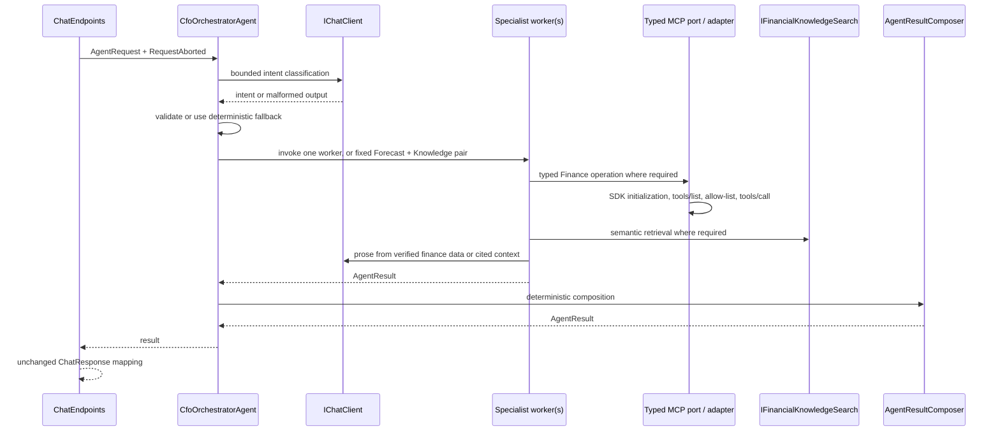

# CfoAgent.Api Refactor Results

## Status

The CfoAgent.Api refactor task pack is complete. The resulting application remains one ASP.NET Core business monolith with four in-process agents: the CFO orchestrator plus Sales Analysis, Forecasting, and Financial Knowledge workers. Finance MCP remains the only PostgreSQL owner, Knowledge File MCP remains filesystem-restricted, and ChromaDB remains the semantic RAG store.

## Before and after

Before the refactor, the orchestrator used a removed agent-framework wrapper, every successful specialist answer was recomposed by a second LLM call, finance operations used an LLM to confirm a tool that typed business code had already selected, and the knowledge agent depended on a concrete Chroma retrieval service. Knowledge local fallback was also split across an access facade, fallback coordinator, and unused result wrapper.

After the refactor, the standard `IChatClient` is used directly for bounded intent classification and verified-result prose. `AgentResultComposer` returns a single worker result unchanged or deterministically combines the fixed Forecasting and Financial Knowledge pair. `FinanceMcpClient` directly calls its one approved MCP tool with canonical deterministic arguments. `FinancialKnowledgeAgent` depends on `IFinancialKnowledgeSearch`, implemented by `ChromaFinancialKnowledgeSearch`. Development-only Knowledge fallback is explicit inside `KnowledgeFileMcpAccess`.

## Final request flow



`ChatEndpoints` validates the public payload, maintains the public conversation ID, passes `HttpContext.RequestAborted`, and maps the unchanged `ChatResponse`. `ApiExceptionHandler` is the one Problem Details translator.

## Responsibilities and dependency direction

| Component | Final responsibility |
|---|---|
| `CfoOrchestratorAgent` | Bounded classification, deterministic fallback classification, business-level worker routing, fixed mixed-worker concurrency, and composition delegation. It does not call MCP transport, ChromaDB, PostgreSQL, or Ollama APIs. |
| `SalesAnalysisAgent` | Typed Finance MCP summary/comparison/top-products results plus verified-result prose. |
| `ForecastingAgent` | Finance MCP history, deterministic `SalesForecastingService` regression/scenarios, then prose only. |
| `FinancialKnowledgeAgent` | `IFinancialKnowledgeSearch`, bounded cited context, and grounded prose. It does not perform raw Knowledge MCP file reads. |
| `AgentResultComposer` | No-interface deterministic composition. It preserves a single result and joins the fixed mixed pair in worker order without recalculating values or making LLM calls. |
| `IChatClient` | Meaningful LLM port. `MockChatClient` is deterministic by default; `OllamaChatClient` remains configuration-selected. |
| `IMcpToolAdapter` | Meaningful MCP protocol port. `McpToolAdapter` owns SDK initialization, `tools/list`, approved-tool caching, timeout, reconnect, and `tools/call`. |
| `IFinancialKnowledgeSearch` | Meaningful vector-search port. `ChromaFinancialKnowledgeSearch` owns deterministic embedding generation, Chroma query/filtering, ranking, and source mapping. |

Dependency direction is HTTP transport to orchestrator/workers to stable ports/contracts, with concrete provider, MCP, and Chroma adapters registered only in `Program.cs`. Agents have no direct Ollama, MCP SDK, Chroma HTTP, filesystem, or PostgreSQL dependency.

## MCP behavior

The official MCP SDK performs connection initialization. `McpToolAdapter` calls `tools/list`, caches only the intersection of discovered and configured-approved tools for the live connection, validates each requested operation, and calls the selected approved tool through `tools/call`. A timeout, transport failure, or tool error resets the client and cache so the next request reconnects and rediscovers.

Finance methods are typed application operations, not model-selected tools. `FinanceMcpClient` picks the fixed approved tool for its operation and creates dates, periods, limits, and forecast-history ranges in deterministic C#. The LLM cannot choose arbitrary tools, endpoints, or finance arguments. Knowledge File MCP remains restricted to read-only list/read operations; its secure local fallback is permitted only when explicitly enabled in Development and never replaces ChromaDB retrieval or citations.

## Error handling and cancellation

Caller cancellation propagates from the endpoint through the orchestrator, workers, `IChatClient`, MCP, and vector search. It is not converted to fallback or HTTP 503. `McpDependencyException` and `VectorSearchDependencyException` reach `ApiExceptionHandler` and become sanitized 503 Problem Details. Ollama timeout remains a sanitized 504, while other provider failures remain sanitized 503. Unexpected failures remain sanitized without exposing paths, endpoints, prompts, SQL, stack traces, or inner exception messages.

## Simplifications delivered

### Removed classes and code

- `Agents/Configuration/CfoAgentFramework.cs` and the `Microsoft.Agents.AI` package.
- The second LLM orchestration/composition pass and its Mock/prompt support.
- LLM tool-confirmation logic, tool-selection prompts, and Mock tool-call selection behavior.
- `KnowledgeFileMcpFallback` and `McpFallbackResult<T>`; their value-only fallback logic is now in `KnowledgeFileMcpAccess`.
- `FinancialKnowledgeRetrievalService`, renamed and moved as `ChromaFinancialKnowledgeSearch` behind `IFinancialKnowledgeSearch`.
- Unused `AgentRequest` fields, the impossible mixed-worker maximum check, unused test clocks, and the no-longer-used Finance MCP user-message overloads.

### Retained abstractions

| Abstraction | Why it remains |
|---|---|
| `IChatClient` | Provides the real Mock/Ollama provider boundary and deterministic test doubles. |
| `IFinanceMcpClient` / `IFinanceMcpRemoteClient` | Keep agents away from MCP schemas, transport, and readiness discovery while preserving typed deterministic finance results. |
| `IMcpToolAdapter` | One shared adapter isolates the official SDK and security-sensitive lifecycle for both MCP services. |
| Knowledge client interfaces | Preserve read-only remote access, Development fallback, and focused security/failure tests. |
| `IFinancialKnowledgeSearch` | Isolates the real Chroma integration and gives the knowledge worker a focused evidence port. |
| `IEmbeddingGenerator` | Standard SDK boundary around the committed deterministic embedding implementation. |

No factory, registry, mediator, handler pipeline, workflow engine, policy engine, generic base agent, repository, or unit-of-work layer was introduced. There is no duplicate result-composition layer, no custom schema parser, and no generic abstraction with only a theoretical purpose.

## Public behavior preserved

- `POST /api/chat`, `/health/live`, `/health/ready`, root endpoint, response DTOs, response types, model metadata, citations, correlation, and conversation-ID echo remain compatible.
- The five supported prompts and the fixed forecast-plus-knowledge mixed route remain supported.
- Finance values, ranking, dates, percentages, and forecast scenarios remain deterministic C#/Finance MCP results.
- Finance MCP owns PostgreSQL. CfoAgent.Api has no connection string, database provider, EF Core context, migrations, seed logic, or direct PostgreSQL query path.
- Mock remains deterministic; Ollama remains configuration-selected through `IChatClient`.
- MCP server contracts, Docker boundaries, ChromaDB deployment, and the frontend are unchanged.

## Tests and validation

Tasks 3 through 5 added or updated composer, orchestrator routing/composition, MCP adapter/client/readiness, vector-search, exception-mapping, local fallback/security, public chat-contract, provider, and deterministic-classification parity tests. The final focused regression suite covered composition, orchestration, API contracts, MCP wiring, local fallback, and provider guardrails.

Final validation completed with zero build warnings and zero build errors:

```text
Focused backend tests: 102 passed
Debug backend tests: 201 passed, 8 skipped, 209 total
Release backend tests: 201 passed, 8 skipped, 209 total
```

The eight skipped solution-test cases are explicit opt-in ChromaDB, container, and live Ollama tests when their external prerequisites are not enabled. `docker compose config` passed. An isolated rebuilt container stack passed all 3 Phase 8 container integration tests; its readiness smoke request and a sales-summary chat request returned HTTP 200. Stopping Finance MCP returned the expected HTTP 503 and recovered after restart. Knowledge MCP readiness returned HTTP 503 after an API restart forced a new MCP connection, then recovered after Knowledge MCP restarted.

## Known limitations

- The only mixed request is the explicit Forecast plus Knowledge pair; there is no dynamic planner, by design.
- Knowledge File MCP is an operational restricted-file capability, not the semantic RAG source; ChromaDB must be ingested and healthy for knowledge answers.
- MCP capabilities are cached for the current connection. A stopped Knowledge MCP process can remain ready until that cache is reset or the API reconnects; this is intentional cache behavior, not a fallback path.
- Live Ollama, ChromaDB, and full container tests require their local external prerequisites and are opt-in in ordinary backend test runs.

## Final assessment

The final design follows the **Orchestrator-Worker pattern with pragmatic Clean/Hexagonal boundaries**. It is not over-engineered: each remaining port protects a real provider, protocol, or vector-store boundary, while coordination and composition are explicit concrete classes. The application remains a simple monolith with focused workers, deterministic finance logic, and controlled external dependency behavior.
