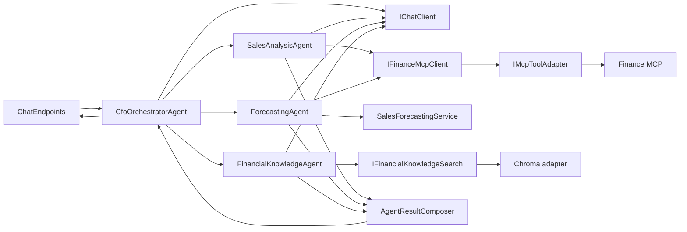
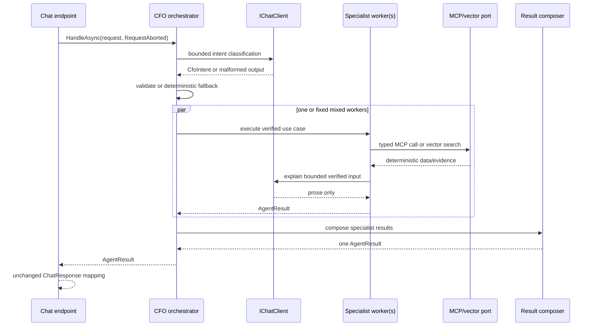

# CfoAgent.Api Target Architecture

## Architecture summary

`CfoAgent.Api` remains one ASP.NET Core business monolith with one CFO orchestrator and three in-process specialist workers. It uses pragmatic Clean/Hexagonal principles inside the existing project: application coordination depends on meaningful ports for external LLM, MCP, and vector-search capabilities, while concrete provider and protocol code remains at the edge.

The target is deliberately small:

- one `CfoOrchestratorAgent`;
- three specialists: sales analysis, forecasting, and financial knowledge;
- one concrete, deterministic `AgentResultComposer` with no interface;
- the existing standard `IChatClient` as the LLM port;
- the existing typed Finance and Knowledge MCP ports plus one shared MCP protocol adapter;
- one new `IFinancialKnowledgeSearch` port implemented by a Chroma adapter;
- no repository, mediator, workflow, registry, policy, factory, or custom agent framework.



The orchestrator switch remains because it expresses supported business intents. It does not choose raw MCP tools. Once a business operation is selected, the typed Finance client invokes its deterministic approved MCP tool directly through the shared adapter. An LLM is not asked to confirm a tool name that the typed operation has already fixed.

## Responsibilities

### 1. HTTP endpoint

`ChatEndpoints` owns only transport concerns:

- validate the public request body and message length;
- retain or generate the public conversation ID;
- pass `HttpContext.RequestAborted` to the orchestrator;
- map `AgentResult` to the unchanged `ChatResponse` contract;
- expose OpenAPI metadata and rate limiting.

It does not classify intent, catch application failures locally, invoke dependencies, or compose agent results. `ApiExceptionHandler` is the sole exception-to-Problem-Details translator.

### 2. CFO orchestrator

`CfoOrchestratorAgent` is the only orchestrator. It:

- uses `IChatClient` to classify the user request into the bounded `CfoIntent` set;
- applies the existing deterministic classification fallback to malformed model output;
- routes the business intent to one specialist or the fixed forecast-plus-knowledge pair;
- runs mixed workers concurrently with the caller token;
- gives their results to `AgentResultComposer`;
- returns one final `AgentResult`.

It does not query MCP, call ChromaDB, calculate finance values, select arbitrary tools, or contain transport error mapping.

### 3. Specialist agents

All three specialists remain because each has a distinct input source, deterministic policy, and response shape.

| Specialist | Target responsibility | Decision |
|---|---|---|
| `SalesAnalysisAgent` | Call a typed Finance MCP operation selected by the business intent, ask `IChatClient` to explain the verified result, and produce sales metadata | Retain. One agent appropriately owns the three closely related sales views. |
| `ForecastingAgent` | Obtain historical totals through Finance MCP, call `SalesForecastingService`, ask `IChatClient` to explain the completed deterministic forecast, and produce forecast metadata | Retain. It is small but represents a genuinely separate deterministic capability. |
| `FinancialKnowledgeAgent` | Query `IFinancialKnowledgeSearch`, bound retrieved context, ask `IChatClient` to answer from that context, and preserve citations | Retain but narrow. Remove the discarded Knowledge MCP file-list preflight and nullable test-only constructor behavior. |

No specialist is merged or removed. Sales and forecasting must not be merged because one reports authoritative MCP results while the other applies a deterministic forecasting algorithm. Knowledge uses a different evidence source and citation contract.

### 4. Result composer

Add one concrete `AgentResultComposer` under `Agents` with no interface and no LLM dependency.

It:

- returns the single specialist result without regenerating its answer;
- deterministically joins mixed specialist answers in stable worker order;
- sets `AgentResponseType.Mixed` only for multiple results;
- merges distinct agent names, sources, assumptions, and warnings;
- preserves the existing single-result payload and mixed `OrchestratedSpecialistResult[]` structured-data shape required by the public contract;
- preserves existing data-period behavior.

The composer never calculates finance values. Deterministic composition removes the discarded specialist prose and the second model pass. A single request therefore uses classification plus one specialist presentation call. A mixed request uses classification plus the two parallel specialist presentation calls; it does not need a fourth model call merely to concatenate verified results.

### 5. LLM port

Retain the standard `Microsoft.Extensions.AI.IChatClient` as the only LLM port. `MockChatClient` and `OllamaChatClient` remain its adapters, selected in `Program.cs` from `AiOptions`.

Agents call `IChatClient` directly with bounded prompts and `ChatOptions.Instructions`. Remove `CfoAgentFramework`: after MCP tool confirmation is removed, its remaining create-session-and-run wrapper adds no session state, workflow, or replacement seam. The standard port already provides the required replacement and test boundary.

The LLM may classify and phrase verified results. It may not calculate finance values, alter canonical MCP arguments, select arbitrary endpoints, or produce authoritative structured data.

### 6. MCP tool adapter port

Retain `IMcpToolAdapter`, but make its public surface protocol-neutral:

- discover and return approved tool **names**, not SDK `McpClientTool` objects;
- invoke an approved tool by name with canonical arguments;
- preserve lazy SDK initialization, `tools/list`, allow-list filtering, cache, timeout, cancellation, reconnect, and `tools/call` behavior.

`McpClientTool` stays private to `McpToolAdapter`. The adapter caches the intersection of discovered and configured-approved tools. A typed operation fails only if the tool it requires is absent. Explicit readiness discovery may still validate each service's complete required contract.

`FinanceMcpClient` remains the domain-facing typed adapter. Its methods determine the approved tool and canonical date/range arguments, then invoke that tool directly. Remove `CfoAgentFramework.SelectMcpToolAsync`, MCP selection prompts, and Mock-specific MCP tool-name selection. There is no current business ambiguity after intent routing, so retaining an LLM confirmation step would add failure risk without adding a decision.

### 7. Vector-search port

Add one meaningful application port:

```csharp
public interface IFinancialKnowledgeSearch
{
    Task<FinancialKnowledgeRetrievalResult> RetrieveAsync(
        FinancialKnowledgeQuery query,
        CancellationToken cancellationToken = default);
}
```

Rename/move `FinancialKnowledgeRetrievalService` to `ChromaFinancialKnowledgeSearch` under `Rag/Chroma`; it implements the port and retains embedding generation, Chroma querying, relevance filtering, ordering, deduplication, and source mapping. `FinancialKnowledgeAgent` depends only on the port.

This interface is justified by a real external boundary and enables focused agent tests without constructing Chroma protocol handlers. Do not add an interface around `ChromaClient` as well; that would create two ports for the same boundary.

### 8. Infrastructure adapters

The infrastructure edge consists of:

- `MockChatClient` and `OllamaChatClient` for `IChatClient`;
- `McpToolAdapter` for official MCP SDK lifecycle and protocol;
- `FinanceMcpClient` and Knowledge file clients for typed application contracts;
- `ChromaFinancialKnowledgeSearch`, `ChromaClient`, and the deterministic embedding generator for RAG;
- health checks, HTTP clients, and the secure development-only knowledge fallback.

Protocol DTOs stay private to adapters. Public API DTOs and MCP server contracts remain unchanged.

### 9. Exception translation

Dependency adapters continue throwing typed sanitized exceptions:

- `McpDependencyException` for MCP disabled/unavailable/timeout/capability/response failures;
- `ChromaDependencyException` for vector-store failures;
- `OllamaProviderException` for Ollama unavailable/timeout/response failures.

Specialists and the orchestrator rethrow caller cancellation and known dependency exceptions unchanged. Unexpected errors may retain the current controlled `InvalidOperationException` wrapper where public behavior requires it. `ApiExceptionHandler` alone maps exceptions to sanitized HTTP Problem Details. Remove the `InvalidOperationException` catch from `ChatEndpoints` so titles, trace IDs, logging, and status rules have one owner.

### 10. Configuration and dependency injection

`Program.cs` remains the single composition root. It:

- binds and validates existing options;
- selects exactly one `IChatClient` provider;
- registers the orchestrator, specialists, deterministic composer, forecast service, and vector-search port;
- registers keyed Finance and Knowledge MCP adapters;
- registers typed clients, health checks, middleware, CORS, rate limiting, and exception handling.

Registration must remain lazy: resolving services cannot contact Ollama or start MCP network work. No service locator or factory registry is introduced.

## Dependency direction

The intended direction is:

```text
HTTP transport
  -> orchestration and specialist use cases
     -> stable result contracts and external ports
        <- infrastructure adapters
```

Rules:

1. `Features/Chat` may depend on agent contracts and the orchestrator, never on MCP, Chroma, or provider implementations.
2. Agents may depend on `IChatClient`, typed MCP ports, `IFinancialKnowledgeSearch`, deterministic services, and result contracts.
3. Agents must not depend on MCP SDK, Chroma HTTP DTOs, OllamaSharp, filesystem paths, or `HttpClient`.
4. `McpToolAdapter` alone owns MCP SDK client/tool types.
5. Chroma protocol details stay in `Rag/Chroma`; retrieval contracts stay in `Rag/Retrieval`.
6. Infrastructure adapters depend inward on application-facing contracts; application use cases do not depend on concrete adapters.
7. `Program.cs` is the only place that knows all concrete implementations.

## Request sequence



## Worker flows

### Sales

```text
business intent -> typed IFinanceMcpClient method
-> approved MCP tools/list cache -> required tools/call
-> verified SalesSummary/Comparison/TopProducts
-> IChatClient prose -> AgentResult
```

### Forecast

```text
business intent -> historical totals through IFinanceMcpClient
-> SalesForecastingService deterministic regression/scenarios
-> IChatClient prose from completed forecast -> AgentResult
```

### Knowledge

```text
business intent -> IFinancialKnowledgeSearch
-> deterministic embedding + Chroma query/filter/citations
-> bounded context -> IChatClient grounded prose -> AgentResult
```

Knowledge MCP remains the secure read-only file integration and readiness boundary, with development-only local fallback. It is not inserted into semantic query execution unless its output has a defined provenance role. ChromaDB remains the only semantic retrieval and citation source.

## Mixed coordination and evidence combination

Only the existing `Mixed` intent invokes more than one worker: forecasting and financial knowledge. They run concurrently using the same caller token. Their evidence is not blended before either worker completes:

- Finance MCP historical totals feed deterministic forecast calculations.
- Chroma results feed knowledge prose and citations.
- `AgentResultComposer` combines completed answers and metadata without recalculating or asking an LLM to reconcile numbers.

Finance MCP and vector results therefore meet only at the typed `AgentResult` boundary. Raw MCP JSON, vector distances, and Chroma protocol DTOs never enter the orchestrator.

## Cancellation and failures

- The endpoint passes `RequestAborted` without replacing it.
- The orchestrator passes the same token to classification, all workers, and mixed `Task.WhenAll` operations.
- Specialists pass it to LLM, MCP, vector search, and deterministic services where applicable.
- Adapters may create linked timeout tokens, but check the original caller token first and rethrow caller cancellation.
- Caller cancellation is never converted to fallback, dependency failure, or HTTP 503.
- MCP and Chroma failures remain typed until `ApiExceptionHandler` maps them to sanitized 503 responses.
- Ollama timeout remains a sanitized 504; provider unavailability/invalid output remains a sanitized 503.
- Unexpected faults remain sanitized and do not expose prompts, paths, endpoints, SQL, stack traces, or inner messages.

## Folder and namespace structure

The project does not need separate Domain/Application/Infrastructure projects or a broad folder migration. Keep the current feature-oriented structure with one targeted port/adapter move:

```text
src/CfoAgent.Api/
  Features/
    Chat/                         # endpoint and public HTTP contracts
    Sales/                        # stable finance result contracts
    Forecasting/                  # deterministic forecast service/contracts
  Agents/
    CfoOrchestratorAgent.cs
    AgentResultComposer.cs        # new concrete deterministic composer
    SalesAnalysisAgent.cs
    ForecastingAgent.cs
    FinancialKnowledgeAgent.cs
    Configuration/                # names, instructions, prompt templates
    Contracts/                    # AgentRequest, AgentResult, intent/source metadata
  AI/
    Mock/
    Ollama/
  Mcp/                            # typed ports/facades and shared protocol adapter
  Rag/
    Retrieval/                    # IFinancialKnowledgeSearch and retrieval contracts
    Chroma/                       # Chroma client and search adapter
    Embeddings/
    Ingestion/
  Configuration/
  Health/
  Observability/
  Program.cs                      # composition root only
```

No top-level `Domain`, `Application`, `Infrastructure`, `Ports`, `Adapters`, `Handlers`, or `Pipelines` folder is added. No current top-level functional folder needs removal.

## Retain, merge, and delete

### Retain

- `CfoOrchestratorAgent` and all three specialists;
- `AgentRequest`, `AgentResult`, `OrchestratedSpecialistResult`, intent, source, and data-period contracts;
- `AgentDefinitions` and bounded prompt templates that remain in use;
- `IChatClient`, `MockChatClient`, `OllamaChatClient`, and provider exceptions;
- `IFinanceMcpClient`, `IFinanceMcpRemoteClient`, `IKnowledgeFileMcpClient`, `IKnowledgeFileMcpRemoteClient`, and `IMcpToolAdapter`;
- `McpToolAdapter`, typed Finance/Knowledge clients, and `McpDependencyException`;
- `SalesForecastingService` and finance result contracts;
- Chroma client, embedding, ingestion, retrieval contracts, health checks, middleware, options, and `ApiExceptionHandler`.

### Merge

- Merge `KnowledgeFileMcpFallback` behavior into `KnowledgeFileMcpAccess`; fallback logs and cancellation rules remain.

### Delete after replacement and tests

- `CfoAgentFramework`: standard `IChatClient` is the sufficient LLM port.
- `KnowledgeFileMcpFallback` and `McpFallbackResult<T>` after the access facade absorbs fallback coordination.
- MCP tool-selection prompt constants/methods and Mock tool-name selection code after typed direct invocation is established.
- Ineffective `MaximumSpecialistInvocations` check, unused internal `AgentRequest` fields, and unused test clocks after usage verification.

No specialist, MCP client contract, Chroma contract, or public HTTP contract is deleted.

## Intentionally retained abstractions

| Abstraction | Reason |
|---|---|
| `IChatClient` | Two production-selectable providers and many deterministic test doubles. |
| `IFinanceMcpClient` | Shields agents from MCP protocol and preserves typed deterministic results. |
| `IFinanceMcpRemoteClient` | Keeps readiness discovery out of the narrower agent port. |
| `IMcpToolAdapter` | Shared real implementation for two keyed MCP servers, plus protocol/security test seam. |
| Knowledge client interfaces | Separate remote behavior from secure local fallback and enable failure-path tests. |
| `IFinancialKnowledgeSearch` | Real Chroma boundary used by the knowledge agent and replaceable in focused tests. |
| `IEmbeddingGenerator` | Standard external abstraction with a committed deterministic implementation. |

`AgentResultComposer`, the orchestrator, specialists, forecast service, health checks, and options do not receive interfaces because there is no meaningful alternate implementation.

## Rejected patterns

| Rejected pattern | Why |
|---|---|
| MediatR/CQRS or request-handler pipeline | One endpoint and five fixed intents do not justify indirect dispatch. |
| Event bus or messaging | All workers run in one request and need an immediate response. |
| Workflow/planner engine | Mixed coordination is one explicit two-task branch. |
| Plugin/tool registry or policy engine | Static configuration allow-lists and typed facades are the correct security boundary. |
| Custom agent framework | `IChatClient` already provides the provider port; one-shot calls do not need sessions or framework lifecycle. |
| Repository/unit of work | The API owns no persistence. |
| Generic base agent | Three workers share too little behavior and have different evidence contracts. |
| Agent interfaces/factories | The orchestrator has one concrete implementation of each fixed worker. |
| Interface for `AgentResultComposer` | It is pure deterministic application logic with one implementation. |
| Both vector port and `IChromaClient` | One boundary is enough; wrapping the protocol client again would add no value. |
| Background tool refresh | MCP rediscovery on reconnect is sufficient for the request model. |
| New microservices or projects | The approved external MCP services already define the deployment boundary. |

## Decision answers

1. **One orchestrator?** Yes, exactly one `CfoOrchestratorAgent`.
2. **Necessary specialists?** Retain Sales Analysis, Forecasting, and Financial Knowledge.
3. **Too small or broad?** Forecasting is small but distinct and retained. Financial Knowledge is broad and narrowed by removing file preflight and adding the vector-search port.
4. **Classes retained?** All core agents, deterministic services, provider/MCP/Chroma adapters, contracts, options, health, and observability classes listed above.
5. **Classes merged?** Merge knowledge fallback coordination into `KnowledgeFileMcpAccess`.
6. **Classes deleted?** Delete only the superseded framework, reduced orchestration DTO, fallback result/coordinator, and verified dead elements.
7. **Meaningful interfaces?** LLM, typed MCP, generic MCP protocol, knowledge access, vector search, and embedding ports.
8. **Low-value interfaces?** None of the current production interfaces is deleted solely for having one implementation; no interface is added for composer or agents.
9. **Deterministic calculations?** Keep forecasting in `SalesForecastingService`; canonical Finance MCP dates/arguments remain in `FinanceMcpClient`; SQL calculations remain in Finance MCP outside this scope.
10. **Mixed requests?** Run the fixed Forecasting and Knowledge workers concurrently, then deterministically merge results.
11. **MCP and vector results?** Keep them in their specialist boundaries and combine only typed `AgentResult` values.
12. **Final response?** Specialist prose is preserved; deterministic composer merges metadata and mixed answers; HTTP maps the unchanged contract.
13. **Cancellation and failures?** Propagate caller cancellation end to end; preserve typed dependency exceptions; translate once in `ApiExceptionHandler`.
14. **Mock and Ollama?** Both continue implementing and being selected through `IChatClient` configuration.
15. **Dependency direction?** Transport to use cases to ports, with adapters pointing inward and concrete registration only in `Program.cs`.
