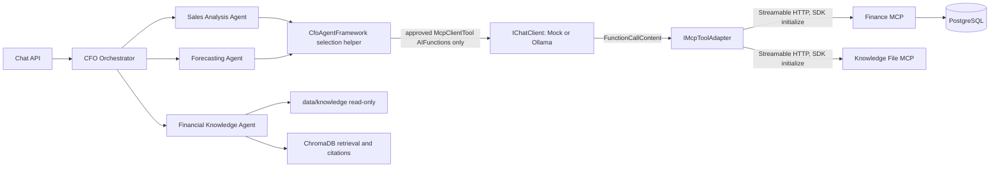
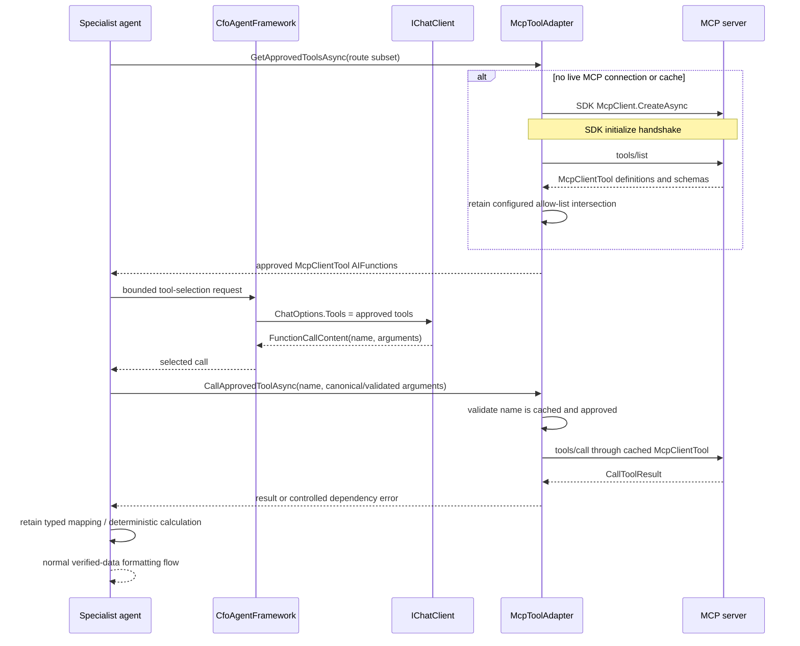

# Minimal Generic MCP Tool Adapter Design

## Purpose and decision

This design is the implementation plan for `TASK-MCP-REF-002`. It is grounded in the current Streamable HTTP implementation described in `docs/MCP-INTEGRATION-CURRENT-STATE.md` and rechecked against the current API source.

The current problem is not MCP connectivity. `FinanceMcpClient` and `KnowledgeFileMcpHttpClient` already use the official `ModelContextProtocol` 1.4.1 SDK correctly to connect lazily, perform SDK initialization, call `tools/list`, and invoke `tools/call`. The problems are duplicated lifecycle code, repeated discovery before every call, exact-set checks that reject harmless additions, and no model-facing use of the discovered `McpClientTool` definitions. Tool names and input construction are hard-coded in typed remote client methods.

The smallest practical refactor is:

1. Add one reusable `IMcpToolAdapter` / `McpToolAdapter` pair.
2. Retain the existing `McpOptions` hierarchy and add only an `AllowedToolNames` collection to each existing server options class. Do not add a registry or a new configuration section.
3. Register two named instances of the same adapter: one for Finance MCP and one for Knowledge File MCP.
4. Cache the full discovered `McpClientTool` definitions for a live connection, rather than only their names.
5. Give an explicit, bounded subset of approved SDK `McpClientTool` objects to the configured `IChatClient` only for a dedicated tool-selection request.
6. Let the model select a tool, but keep endpoint selection, tool approval, authoritative finance calculations, deterministic date/range construction, typed result mapping, agent routing, and failure policy in C#.

This is deliberately not a generic agent platform. The adapter solves MCP connection, discovery, approval, caching, and invocation; specialists remain responsible for their existing business result contracts.

## Current problem

| Current behavior | Evidence | Limitation addressed by this design |
|---|---|---|
| Each remote client owns almost identical lazy SDK creation, timeout, error conversion, and disposal code. | `FinanceMcpClient` and `KnowledgeFileMcpHttpClient` | One reusable transport/discovery/invocation implementation removes duplication. |
| Each business call invokes `DiscoverToolsAsync`, which calls `ListToolsAsync`. | Both clients' private `CallToolAsync` methods | The adapter keeps one immutable tool snapshot per successful MCP connection. |
| Discovery compares an exact required set, so adding an unrelated tool makes all approved operations unavailable. | Both clients' `RequiredTools` checks | An allow-list exposes approved tools only, while ignoring additional server tools. |
| Tool metadata and schemas are discarded after discovery. | `.Select(tool => tool.Name)` in both clients | Cache the actual `McpClientTool` objects, which are already `AIFunction`s. |
| The model never receives tools. | `CfoAgentFramework.CreateAgent`, `AgentDefinitions.SharedGuardrail`, `OllamaChatClient.CreateRequestOptions` | A separate bounded selection request can pass approved tools only. |
| Direct client methods determine tool names and construct all arguments. | `FinanceMcpClient.GetCurrentWeekSummaryAsync` through `GetBudgetTargetAsync`; Knowledge list/read methods | The remote transport selection moves to the adapter. Existing deterministic business argument shaping remains where needed. |

## Target architecture



`McpToolAdapter` is shared by Finance and Knowledge because connection creation, SDK handshake, discovery, caching, filtering, timeout, cancellation, invocation, and disposal are transport concerns. It is not shared as a business-result mapper:

- Finance retains deterministic conversion of Finance MCP response envelopes to `SalesSummary`, `WeeklySalesComparison`, `TopProductsResult`, `HistoricalYearlySalesResult`, and `BudgetTargetResult`.
- `SalesForecastingService` retains regression and scenario calculation after Finance returns historical totals.
- Financial Knowledge retains ChromaDB retrieval and citations. Knowledge File MCP remains a restricted list/read boundary and does not become the semantic retrieval source.

## Minimum additions

Exactly two new runtime abstractions are proposed. No new abstraction hierarchy is needed.

### `IMcpToolAdapter`

Location: `src/CfoAgent.Api/Mcp/IMcpToolAdapter.cs`.

It is a narrow interface for the application-facing mechanical MCP operations:

```csharp
public interface IMcpToolAdapter
{
    Task<IReadOnlyList<McpClientTool>> GetApprovedToolsAsync(
        IEnumerable<string>? operationToolNames,
        CancellationToken cancellationToken);

    Task<CallToolResult> CallApprovedToolAsync(
        string toolName,
        IReadOnlyDictionary<string, object?>? arguments,
        CancellationToken cancellationToken);
}
```

`operationToolNames` is optional route-level narrowing, not another policy system. The adapter intersects it with the configured server allow-list. Passing `null` means the server's configured allow-list only. No model-supplied endpoint, server name, or allow-list reaches this interface.

### `McpToolAdapter`

Location: `src/CfoAgent.Api/Mcp/McpToolAdapter.cs`.

One sealed, asynchronously disposable implementation owns:

- lazy `HttpClientTransport` creation for the configured `{BaseUrl}/mcp` endpoint;
- `McpClient.CreateAsync`, which performs the SDK initialization handshake;
- the `SemaphoreSlim` first-initialization guard already proven by the current clients;
- `ListToolsAsync` and an immutable cache keyed by server tool name;
- allow-list filtering before any definition is returned to the model;
- validation that a requested invocation name is in the cached approved map;
- `McpClientTool.CallAsync` or its equivalent SDK-backed call path for `tools/call`;
- the current linked timeout, caller-cancellation distinction, structured logging, `McpDependencyException` conversion, and async disposal behavior.

The cached value is the full `McpClientTool`, not a re-created description. `McpClientTool` already implements `Microsoft.Extensions.AI.AIFunction`, retains `ProtocolTool` metadata including the input schema, and invokes the owning MCP client through the official SDK. No custom tool-definition wrapper is needed.

### Configuration

Do not add an options class or configuration section. Extend the existing classes in `src/CfoAgent.Api/Configuration/McpOptions.cs`:

```text
Mcp:Finance:AllowedToolNames
Mcp:KnowledgeFiles:AllowedToolNames
```

At first implementation these values must be the current approved contract names:

```text
Finance: get_sales_summary, compare_sales_periods, get_top_products,
         get_historical_sales, get_budget_target
Knowledge: list_knowledge_files, read_knowledge_file
```

`Program.cs` validates that enabled adapters have a non-empty allow-list with unique nonblank names. It creates two named adapter registrations from the existing Finance and Knowledge settings. The names and URLs are supplied by DI configuration, never by the model. Existing named HTTP clients can be retained under stable names such as `FinanceMcp` and `KnowledgeFileMcp`.

## Sequence flow



The ordinary classification and verified-result formatting calls continue to use `ChatOptions.Tools = null`. Only the new selection request receives tools. This maintains the current guardrail that an LLM does not create authoritative finance values or invoke arbitrary functions during prose generation.

## Approval and security policy

### Per-server allow-list

The existing exact-set policy changes to a configured allow-list:

- A discovered tool is model-visible and callable only when its exact server name appears in that server's `AllowedToolNames`.
- Tools not on the list are ignored. They do not make the MCP dependency unhealthy solely by existing.
- A configured allowed tool that is absent makes that operation unavailable. It is surfaced as `McpDependencyFailureKind.CapabilityMismatch`, and Finance requests become the existing sanitized HTTP 503.
- A model-selected name must be found in the cache and in the applicable route subset before `tools/call`. Otherwise it is rejected before network invocation.

Newly discovered read-only tools must **not** become available automatically. Read-only is neither reliably inferable from a tool name nor sufficient authorization for a finance application. A new tool requires an explicit configuration allow-list change, a reviewed business use, tests, and, when it affects a current agent response, a result-contract mapping. This keeps the current seven-tool public integration boundary intact.

Dangerous or mutating tools are blocked by omission from the allow-list, even if a server advertises them. Knowledge keeps its server-side containment checks, read-only bind mount, read-only container root filesystem, and no write/delete/rename/execute tool contracts. The adapter must not infer safety from descriptions, annotations, or names.

### Arguments and deterministic finance constraints

The adapter does not build a custom JSON Schema engine. It must:

1. accept only the function-call argument object associated with a cached approved `McpClientTool`;
2. reject a missing/unknown selected tool before invocation;
3. use the cached SDK `McpClientTool` and its discovered `ProtocolTool` schema for model presentation;
4. invoke through the SDK (`McpClientTool.CallAsync` or verified equivalent), leaving server tool binding and input validation as the authority for required fields, types, ranges, and path rules;
5. convert an SDK/server argument error to a controlled `InvalidResponse` or `CapabilityMismatch`, never retry with model-invented arguments.

For the current five finance workflows, specialist code must retain the existing `TimeProvider`-based dates, five-year historical range, and top-five limit. The model may select from the approved route tool definitions, but its arguments are compared with and replaced by the canonical C# arguments before invocation. This is intentionally conservative: it preserves deterministic dates and prevents an LLM from changing the finance query scope while still exercising the target model tool-selection path.

If a later approved workflow genuinely requires user-selected parameters, it must add explicit business validation in that specialist before calling the adapter. That validation is domain code, not a generic schema framework.

### Provider behavior

`CfoAgentFramework` gains a small method, not a new service, that performs the bounded selection call through the configured `IChatClient` and extracts exactly one `FunctionCallContent`. It supplies the adapter-returned `McpClientTool` instances as `ChatOptions.Tools`.

- `MockChatClient` remains the default offline provider. It gains deterministic function-call responses only for a dedicated selection marker/prompt used by the framework and tests. Its normal classification and formatting behavior remains unchanged.
- `OllamaChatClient` must stop unconditionally setting `boundedOptions.Tools = null`; it must preserve the tools supplied by the bounded selection method. It does not discover tools, choose endpoints, or bypass the adapter allow-list.
- Existing regular `ChatClientAgent` calls still use `options: null` and the existing prompt rule to return prose only. Tests must prove normal formatting calls have no tools and the selection call has only the adapter-approved tool definitions.

## Cache, reconnect, schema, and outage behavior

The adapter retains one `McpClient` and one immutable approved-tool dictionary for each registered server instance. It does not poll in the background and does not call `tools/list` before every tool invocation.

| Event | Required behavior |
|---|---|
| First adapter use | Create the SDK client, let it initialize, call `tools/list`, filter the configured allow-list, and cache the full approved definitions. |
| Ordinary call | Use the cached approved definition; do not issue another `tools/list`. |
| Initialization/transport failure | Do not cache a client or tools. The next request can initialize again. Map the current request to sanitized dependency failure. |
| Timeout | Preserve caller cancellation; map only adapter-owned timeout cancellation to `McpDependencyFailureKind.Timeout`. |
| Caller cancellation | Rethrow `OperationCanceledException`; never use a Knowledge fallback or turn it into HTTP 503. |
| Server reconnect/new connection | Clear the old cache with the old client, run `tools/list` after the new SDK handshake, and replace the snapshot. |
| Selected cached tool is missing or rejects invocation as unknown | Clear the current cache/client, return controlled `CapabilityMismatch`, and let the next request reconnect and rediscover. Do not silently retry the model call. |
| Server adds an unapproved tool | Keep current approved operations available; do not expose the new tool to the model. |
| Server removes an approved tool | Discovery omits it, or invocation reports it missing; return controlled dependency failure. |
| Input schema changes | A reconnect replaces the model-facing definition with the new SDK schema. Current deterministic Finance argument construction and server validation remain authoritative; incompatible required changes produce controlled failure until code/tests are updated. |
| Output shape changes | Existing typed mapping/deserialization fails as controlled invalid dependency output; public chat contracts do not change silently. |

The adapter logs only server label, tool name, cache action, outcome, and failure category. It must not log endpoint URLs, arguments, raw model messages, raw tool results, database details, paths, prompts, or stack traces. `ApiExceptionHandler` remains the single HTTP boundary that maps `McpDependencyException` to sanitized 503 Problem Details.

## Existing classes retained, replaced, and removed mappings

### Retained

- `CfoOrchestratorAgent`, including its `CfoIntent` switch. The switch is business-level routing to the four existing agents, not MCP selection.
- `SalesAnalysisAgent`, `ForecastingAgent`, `FinancialKnowledgeAgent`, `SalesForecastingService`, all current `AgentResult` contracts, and the chat API.
- `CfoAgentFramework`, extended only with a bounded tool-selection helper.
- `McpDependencyException`, `ApiExceptionHandler`, `McpConfigurationHealthCheck`, `KnowledgeFileMcpAccess`, `KnowledgeFileMcpFallback`, `KnowledgeFileMcpClient`, and all Knowledge path protections.
- MCP server tool names/contracts, PostgreSQL ownership, ChromaDB ingestion/retrieval/citations, Docker deployment, Mock/Ollama provider registration, and `TimeProvider` registration.

### Replaced or deleted in Task 3

- Replace `FinanceMcpClient` and `KnowledgeFileMcpHttpClient` with two configured instances of `McpToolAdapter`; do not retain parallel remote transport implementations.
- Remove `IFinanceMcpRemoteClient` and `IKnowledgeFileMcpRemoteClient`; their only purpose is the current duplicated remote-client abstraction.
- Replace `IFinanceMcpClient`'s five remote transport methods with adapter-backed specialist calls while retaining the existing domain DTO output mapping in the specialists or a deliberately small existing domain helper. The remote client methods themselves are removed:
  - `GetCurrentWeekSummaryAsync`
  - `GetWeekOverWeekComparisonAsync`
  - `GetCurrentMonthTopProductsAsync`
  - `GetHistoricalYearlyTotalsAsync`
  - `GetBudgetTargetAsync`
- Keep `IKnowledgeFileMcpClient`, `KnowledgeFileMcpAccess`, and the local `KnowledgeFileMcpClient` as the restricted application/fallback boundary. Change `KnowledgeFileMcpAccess` to call the named Knowledge adapter for remote list/read instead of `IKnowledgeFileMcpRemoteClient`.

The hard-coded transport calls and the `RequiredTools` exact-set arrays disappear. The approved server tool-name lists remain as explicit configuration, and current specialist routes retain a small route-specific subset to preserve their output contracts and deterministic canonical arguments. That is authorization and business contract shaping, not dynamic endpoint selection.

## Exact implementation steps for Task 3

1. Add `IMcpToolAdapter` and `McpToolAdapter`, moving the shared connection, timeout, error, cache, and disposal logic from the two remote clients. Use `McpClientTool` objects returned by `ListToolsAsync` directly.
2. Add `AllowedToolNames` to the existing Finance and Knowledge option classes; populate the current seven contract names in `appsettings.json`, development/container settings, and test options. Validate non-empty unique values when enabled.
3. Register two named adapters in `Program.cs`; remove registrations for the old remote clients. Preserve lazy connection and named `HttpClient` setup.
4. Add the bounded selection helper to `CfoAgentFramework`. It passes only adapter-approved SDK tools to `IChatClient`, accepts exactly one function call, and returns a small internal selection value or throws a controlled MCP dependency exception. Do not expose it through the chat API.
5. Update `OllamaChatClient` to preserve explicitly supplied selection tools. Update `MockChatClient` to emit deterministic function-call content for the selection marker. Retain tool-free normal formatting/classification calls.
6. Update Sales and Forecasting to request their route-scoped approved Finance tool definitions, validate the model's selected name, supply canonical C# arguments, invoke the Finance adapter, and retain their existing DTO mapping and deterministic calculations. No tool response is accepted as an authoritative value without the existing mapping.
7. Update `KnowledgeFileMcpAccess` and readiness to use the Knowledge adapter. Keep the Knowledge agent's ChromaDB retrieval flow unchanged; raw file tools are not given to prose-formatting or RAG retrieval calls.
8. Update health checks to call `GetApprovedToolsAsync` for enabled remote MCP dependencies. Health verifies configured approved capabilities, not an exact server tool set.
9. Remove old remote-client files/interfaces and update registrations, tests, and contract-freeze expectations. Do not modify MCP server projects, Docker, PostgreSQL, ChromaDB, or public chat contracts.

## Exact tests required for Task 3

1. Adapter construction is lazy and does not create network traffic while services register.
2. First use performs SDK initialization and one `tools/list`; repeated calls use the cached full tool definitions without another `tools/list`.
3. Finance and Knowledge adapters use the same class with different endpoint and allow-list configuration.
4. The adapter returns only configured approved `McpClientTool` values and retains their names, descriptions, and schemas.
5. An extra server tool is ignored and does not disable approved tools.
6. A configured allowed tool missing from discovery yields `CapabilityMismatch` and sanitized API 503 for Finance.
7. An unapproved or route-disallowed model-selected name is rejected before `tools/call`.
8. A selected approved tool reaches `tools/call` through the cached SDK tool; an SDK/server input error becomes controlled failure.
9. Initialization failure, unavailable endpoint, timeout, and disposed/reconnect paths clear incomplete cache state and remain sanitized.
10. Caller cancellation passes through unchanged for discovery, selection, and invocation.
11. Reconnect rediscovers tools; a removed cached tool invalidates cache and is reported as a controlled failure.
12. A schema change is presented from a fresh discovery snapshot and an incompatible canonical Finance call fails safely rather than changing financial outputs.
13. The model receives tools only for the bounded selection request; Sales/Forecast/Knowledge formatting and orchestrator composition still receive no tools.
14. `MockChatClient` selects only the deterministic approved function in offline tests; it never calculates finance values.
15. `OllamaChatClient` forwards only the provided approved SDK tool definitions for selection and no tools for ordinary calls.
16. All five MVP agent workflows preserve their existing typed structured data, dates, forecast values, warnings, and sources; the forecast remains deterministic C# over Finance MCP historical totals.
17. Knowledge MCP remains read-only, blocked paths stay blocked, development-only fallback behavior remains unchanged, and ChromaDB remains the retrieval/citation path.
18. Existing contract, container, health, API Problem Details, and provider registration coverage remains or is replaced with equivalent/stronger assertions.

## Files expected to change in Task 3

New files:

- `src/CfoAgent.Api/Mcp/IMcpToolAdapter.cs`
- `src/CfoAgent.Api/Mcp/McpToolAdapter.cs`
- `tests/CfoAgent.Api.Tests/Mcp/McpToolAdapterTests.cs`

Modified API files:

- `src/CfoAgent.Api/Program.cs`
- `src/CfoAgent.Api/Configuration/McpOptions.cs`
- `src/CfoAgent.Api/appsettings.json`
- `src/CfoAgent.Api/appsettings.Development.json` if it overrides MCP options
- `src/CfoAgent.Api/Agents/Configuration/CfoAgentFramework.cs`
- `src/CfoAgent.Api/Agents/Configuration/AgentDefinitions.cs`
- `src/CfoAgent.Api/Agents/Configuration/AgentPromptTemplates.cs`
- `src/CfoAgent.Api/AI/Mock/MockChatClient.cs`
- `src/CfoAgent.Api/AI/Ollama/OllamaChatClient.cs`
- `src/CfoAgent.Api/Agents/SalesAnalysisAgent.cs`
- `src/CfoAgent.Api/Agents/ForecastingAgent.cs`
- `src/CfoAgent.Api/Agents/FinancialKnowledgeAgent.cs` only if it needs the named adapter for its existing access check
- `src/CfoAgent.Api/Mcp/KnowledgeFileMcpAccess.cs`
- `src/CfoAgent.Api/Health/McpConfigurationHealthCheck.cs`

Removed/replaced API files:

- `src/CfoAgent.Api/Mcp/FinanceMcpClient.cs`
- `src/CfoAgent.Api/Mcp/KnowledgeFileMcpHttpClient.cs`
- `src/CfoAgent.Api/Mcp/IFinanceMcpRemoteClient.cs`
- `src/CfoAgent.Api/Mcp/IKnowledgeFileMcpRemoteClient.cs`
- `src/CfoAgent.Api/Mcp/IFinanceMcpClient.cs` after its domain mapping responsibility has moved without changing public chat contracts

Expected test changes:

- `tests/CfoAgent.Api.Tests/Mcp/ApiHttpMcpClientTests.cs`
- `tests/CfoAgent.Api.Tests/Mcp/AgentMcpWiringTests.cs`
- `tests/CfoAgent.Api.Tests/Mcp/McpReadinessTests.cs`
- `tests/CfoAgent.Api.Tests/Mcp/KnowledgeFileMcpAccessFallbackTests.cs`
- `tests/CfoAgent.Api.Tests/Agents/OllamaAgentGuardrailTests.cs`
- `tests/CfoAgent.Api.Tests/AI/OllamaChatClientTests.cs`
- `tests/CfoAgent.Api.Tests/AI/MockChatClientTests.cs`
- `tests/CfoAgent.Api.Tests/PhaseEight/ContractFreezeTests.cs`
- `tests/CfoAgent.Api.Tests/PhaseEight/ContainerIntegrationTests.cs`
- applicable test fakes implementing removed interfaces

Task 3 must verify actual Microsoft.Extensions.AI function-call content APIs against the installed package version while compiling. It must not add package references unless an existing package proves insufficient.

## Explicit non-goals

- No changes to the public chat endpoint or response contract.
- No MCP server contract, tool name, database, migration, PostgreSQL, ChromaDB, Docker, frontend, or ownership-boundary change.
- No automatic approval of newly discovered tools.
- No model-selected endpoint, server, filesystem root, or raw SQL.
- No model calculation, alteration, or invention of finance values, dates, rankings, totals, percentages, or forecast values.
- No registry database, plugin framework, workflow engine, policy engine, background polling, dynamic code generation, reflection-based discovery, custom MCP protocol, or custom generic schema-validation framework.
- No new agents and no removal of the four existing specialist/orchestrator roles.
- No removal of Finance's controlled dependency failure or Knowledge's explicitly configured Development-only local fallback.

## Acceptance assessment

This design uses the existing official SDK and its `McpClientTool`/`AIFunction` support, defines one reusable adapter with one interface, retains business-level agent routing, preserves the current deterministic and security boundaries, and specifies the narrow Task 3 file/test plan. It intentionally refuses automatic use of newly discovered tools and treats schema incompatibility as a controlled failure rather than silently changing the finance contract.
