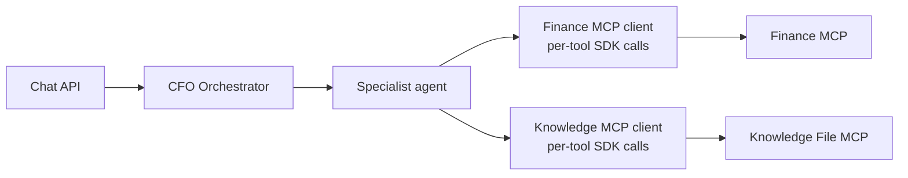
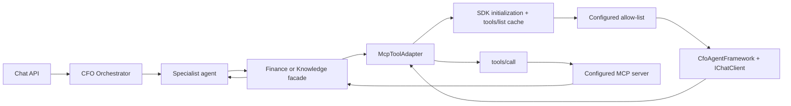

# MCP Integration Refactor Results

## Status

The generic MCP tool-adapter refactor is complete. `CfoAgent.Api` keeps its four-agent business architecture and public chat API while using one shared, bounded adapter for both network-hosted MCP services.

## Before and after

Before the refactor, the API had separate SDK-heavy Finance and Knowledge HTTP clients. Each client owned connection setup, capability discovery, direct tool invocation, timeout handling, and tool-specific MCP transport logic. Specialist agents and business routing were already appropriate and remain in place.

After the refactor, the shared `McpToolAdapter` owns the common MCP protocol work. The existing thin clients retain typed result mapping, deterministic finance arguments, restricted Knowledge path validation, health-check seams, and compatibility with the current agent contracts.

## Final MCP call flow

1. `FinanceMcpClient` or `KnowledgeFileMcpHttpClient` asks its keyed `IMcpToolAdapter` for the applicable approved tools.
2. `McpToolAdapter` lazily creates an official SDK `McpClient` over Streamable HTTP to the fixed configured endpoint. `McpClient.CreateAsync` performs the MCP initialization handshake.
3. The adapter calls `ListToolsAsync` (`tools/list`) once for the connection and indexes the discovered `McpClientTool` metadata.
4. It verifies that every configured `AllowedToolNames` entry exists, filters out all other discovered tools, and caches only the approved set.
5. For Finance operations, the relevant approved subset is passed to `CfoAgentFramework.SelectMcpToolAsync` as `AITool` definitions. The configured `IChatClient` receives those tools with `RequireAny` tool mode.
6. The model returns one function call. `CfoAgentFramework` verifies that its name is in the supplied approved set and that its arguments exactly match the canonical deterministic arguments constructed by Finance code.
7. The adapter verifies the selected name against the current approved cache and invokes the discovered SDK `McpClientTool` with `CallAsync` (`tools/call`).
8. The facade deserializes the server's established response envelope into the existing typed result contract; the specialist agent composes the existing response.

Knowledge file access uses the same adapter discovery, allow-list, cache, and `tools/call` path. It deliberately does not make raw-file reading an LLM-directed answer path: `FinancialKnowledgeAgent` continues to retrieve semantic context and citations from ChromaDB. The Knowledge facade retains relative-path validation before a read request.

## Classes and responsibilities

| Class or configuration | Responsibility |
|---|---|
| `McpToolAdapter` | One reusable Streamable HTTP SDK client per configured dependency; initialization, `tools/list`, approved-tool cache, `tools/call`, timeout, reconnect/reset, disposal, and sanitized dependency mapping. |
| `IMcpToolAdapter` | Minimal two-operation seam: get approved discovered tools and call an approved tool. |
| `McpOptions.Finance.AllowedToolNames` and `McpOptions.KnowledgeFiles.AllowedToolNames` | Explicit static approval boundary for discovered server tools. |
| `CfoAgentFramework.SelectMcpToolAsync` | Provides approved SDK tool definitions to `IChatClient`; validates the one returned function call and canonical arguments. |
| `FinanceMcpClient` | Retained typed facade. It narrows candidates by business operation, creates authoritative dates/ranges/limits, maps results, and protects deterministic finance behavior. |
| `KnowledgeFileMcpHttpClient` | Retained restricted-access facade. It preserves only list/read contracts and rejects invalid client-supplied relative paths. |
| `SalesAnalysisAgent` and `ForecastingAgent` | Retained specialist-agent business behavior; they pass the original request text to the Finance selection stage while preserving deterministic result composition and forecast calculation. |
| `FinancialKnowledgeAgent` | Retained ChromaDB retrieval and citation path. Knowledge MCP is an availability/restricted-file boundary, not a substitute for semantic RAG. |

The CFO Orchestrator intent-routing switch remains by design. It chooses a specialist agent, not an MCP endpoint or arbitrary MCP tool.

## Discovery, approval, cache, and reconnect behavior

- Tool discovery happens lazily on first use, not application startup.
- The SDK-created client performs initialization; the adapter then calls `tools/list` and caches the filtered `McpClientTool` metadata for that connection.
- A connection reset after a timeout, transport fault, or MCP error disposes the SDK client and clears the cache. The next request reconnects and discovers tools again.
- The API accepts only configured allowed names. A server-provided tool that is not on the allow-list is neither passed to an LLM nor callable through the adapter.
- A newly added read-only server tool becomes usable without a new direct SDK/client method after an explicit `AllowedToolNames` approval and reconnect/restart. Existing typed Finance response contracts still require a deliberate business mapping before a new finance operation can become part of a public agent response.
- If a configured/approved tool is removed, discovery fails with a controlled `McpDependencyException` capability mismatch rather than an unhandled tool-call error.
- The discovered SDK schema is supplied to `IChatClient` through `McpClientTool`. Calls with invalid arguments are rejected by the server/SDK path and become controlled invalid-response dependency failures; failures reset the cache so the next call rediscovers the current schema.

## Security and provider controls

- Endpoints are configuration-controlled, fixed Finance and Knowledge URLs. Neither the orchestrator nor a model can select an arbitrary MCP server.
- `AllowedToolNames` is the simple approval policy. There is no policy engine, registry, database, reflection discovery, code generation, or background polling.
- Finance candidate sets are narrowed to the applicable business operation. Canonical arguments are created by C# and must exactly match the model-returned call; an LLM cannot invent authoritative finance values, dates, ranges, or limits.
- Knowledge tools remain limited to read-only list/read operations. The Knowledge server enforces its `data/knowledge` root, and the API facade also rejects absolute or traversal paths.
- `MockChatClient` deterministically selects an offered known approved tool during the dedicated selection step. `OllamaChatClient` forwards tool definitions and accepts structured function-call responses. Neither provider becomes a finance-calculation authority.

## Failure and cancellation behavior

- Caller cancellation is rethrown and is not converted into fallback, timeout, or HTTP 503.
- Adapter timeouts, unavailable MCP services, missing capabilities, and invalid MCP responses become `McpDependencyException` with a failure kind. Existing API error handling maps dependency faults to sanitized Problem Details HTTP 503 responses without endpoints, arguments, prompts, SQL, paths, or stack traces.
- Finance MCP remains the sole PostgreSQL owner. `CfoAgent.Api` has no PostgreSQL connection string or direct finance persistence/fallback.
- Knowledge local fallback remains explicitly configured Development-only behavior. It is disabled in the container deployment and container tests.
- ChromaDB remains the semantic RAG store and source of citations.

## Tests and validation

Task 3 added focused adapter and provider coverage in `tests/CfoAgent.Api.Tests/Mcp/McpToolAdapterTests.cs`, `tests/CfoAgent.Api.Tests/Mcp/ApiHttpMcpClientTests.cs`, and `tests/CfoAgent.Api.Tests/AI/OllamaChatClientTests.cs`.

The covered behavior includes:

- SDK-backed `tools/list` discovery and cache reuse.
- Passing only approved discovered tool definitions to the configured `IChatClient`.
- Deterministic Mock selection and SDK-backed `tools/call` invocation.
- Calling another explicitly approved discovered tool without a new hard-coded SDK client method.
- Blocking an unapproved discovered tool.
- Safe failure when a configured tool is missing.
- Invalid-argument/schema failure followed by rediscovery on recovery.
- Caller cancellation propagation.
- Ollama tool-definition forwarding and structured function-call support.
- Finance and Knowledge MCP integration scenarios, sanitized outage behavior, recovery, restricted Knowledge paths, Chroma citations, and the existing finance scenarios through the container gate.

Final Task 4 validation completed successfully:

| Gate | Result |
|---|---|
| Focused `McpToolAdapterTests` | 7 passed, 0 failed, 0 skipped |
| Debug solution tests | 176 passed, 0 failed, 8 opt-in tests skipped, 184 total |
| Release solution tests | 176 passed, 0 failed, 8 opt-in tests skipped, 184 total |
| Isolated Docker container gate | 3 direct container tests passed; five MVP chat prompts, Finance/Knowledge outage and recovery checks, container-boundary checks, seed counts, and cleanup passed |
| Serialized Debug solution build | Succeeded with 0 warnings and 0 errors |

The skipped tests are the documented opt-in live Ollama, Chroma, and container test entry points. The isolated Docker gate deliberately enables the relevant real-container scenarios and cleans up only its own named test resources.

## Simplicity review

The implementation is not over-engineered:

- There is one adapter interface and one implementation because two MCP dependencies share the same SDK protocol workflow.
- Keyed DI registrations select the Finance or Knowledge configuration without a factory or registry.
- There is one cache per live adapter connection, not a second cache or background refresh service.
- The response-envelope parsing is the existing MCP server response boundary, not a custom schema-validation framework.
- The typed Finance and Knowledge facades are retained because they preserve deterministic domain arguments/result contracts and filesystem restrictions. Removing them would broaden this refactor and weaken those boundaries.
- Existing remote interfaces remain useful to health checks, controlled fallback/dependency paths, and focused tests; they are not a new Task 3 wrapper hierarchy.

## Known limitations and intentional boundaries

- Discovery is request-driven and refreshes on reconnect; it does not poll MCP servers in the background.
- New server tools require explicit configuration approval. The application does not automatically trust any tool merely because an MCP server advertises it.
- The current five Finance MCP tools and two Knowledge MCP tools remain the approved product surface. A new business-facing Finance capability needs a conscious typed contract and agent decision in addition to allow-list approval.
- The LLM's tool selection is bounded. It can select only from the approved tools supplied for the current operation and cannot choose endpoints or alter canonical financial arguments.
- Raw Knowledge MCP file reads are intentionally not used to replace ChromaDB semantic retrieval and citations.

## Public architecture confirmation

The public chat API contract is unchanged. MCP servers remain independently network-hosted Streamable HTTP services. Finance MCP owns PostgreSQL; `CfoAgent.Api` has no direct PostgreSQL dependency. Knowledge MCP remains filesystem-restricted, and ChromaDB remains the RAG store.
