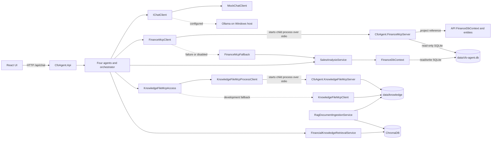

# Phase 8 Architecture Discovery and Migration Design

## Document status

- Task: `TASK-CFO-P8-001`
- Scope: discovery and migration design only
- Repository baseline: .NET SDK 10.0.302, four solution projects, serialized build successful
- Baseline tests: 159 total, 155 passed, 0 failed, 4 opt-in live Ollama tests skipped
- Runtime, project, package, configuration, Docker, and test changes: none in this task

This document uses the repository at the start of Phase 8 as its source of truth. Where an exact official MCP server API, route, or deployment value has not yet been verified against the package selected during implementation, the item is explicitly marked `TBA — verify during implementation.`

## Binding target decisions

Phase 8 must produce the following architecture:

1. `CfoAgent.Api` remains the ASP.NET Core AI agent and orchestration service.
2. `CfoAgent.FinanceMcpServer` and `CfoAgent.KnowledgeFileMcpServer` become independently hosted network services.
3. Both MCP connections use a Docker-suitable network transport, with Streamable HTTP through the official MCP C# SDK as the preferred transport.
4. PostgreSQL replaces SQLite and is owned exclusively by Finance MCP.
5. `CfoAgent.Api` does not reference a finance `DbContext`, database provider, connection string, migration, seeder, or direct finance query service in the target state.
6. Finance MCP owns finance persistence, migrations, deterministic seed data, queries, aggregation, and budget lookup.
7. Forecast regression and scenario calculations remain deterministic C# in `CfoAgent.Api`; their historical totals come from Finance MCP.
8. The local finance fallback is removed. Finance MCP failure produces a controlled, sanitized dependency failure, normally HTTP 503.
9. Knowledge File MCP may retain the secure in-process file reader only as an explicitly enabled development fallback.
10. ChromaDB remains the semantic RAG store and citation source. Raw file access does not replace retrieval.
11. Ollama remains on the Windows host and containerized services reach it through `host.docker.internal` when Ollama is selected.
12. MCP services are internal to the Docker network and unauthenticated in Phase 8.
13. Frontend containerization is deferred to its later Phase 8 task.

## Prerequisite and baseline assessment

The Phase 7 prerequisite is complete in the current repository:

- Mock and Ollama are selected through the existing `IChatClient` registration path.
- Mock remains the default offline provider.
- Ollama uses configured model `llama3.2:3b` and is not used for authoritative finance calculation.
- Four agents remain registered: `SalesAnalysisAgent`, `ForecastingAgent`, `FinancialKnowledgeAgent`, and `CfoOrchestratorAgent`.
- Finance MCP and Knowledge File MCP are independent process-backed integrations.
- ChromaDB remains the semantic retrieval store.
- The deterministic embedding implementation remains local.
- Serialized restore, build, and test validation is healthy.

No prerequisite blocker was found. A previously running API process briefly locked the Debug apphost during baseline validation; stopping that repository process resolved the environmental lock without a source change.

## Current-state architecture



### Current solution and package inventory

| Project | Current role | Relevant package facts |
| --- | --- | --- |
| `src/CfoAgent.Api/CfoAgent.Api.csproj` | ASP.NET Core API, agents, persistence, finance logic, RAG, MCP clients | `ModelContextProtocol` 1.4.1; EF Core SQLite and Design 10.0.10; `Microsoft.Agents.AI` 1.13.0; `Microsoft.Extensions.AI.Abstractions` 10.8.0; `OllamaSharp` 5.4.27 |
| `tools/CfoAgent.FinanceMcpServer/CfoAgent.FinanceMcpServer.csproj` | Stdio Finance MCP child process | `ModelContextProtocol` 1.4.1; EF Core SQLite 10.0.10; project reference to `CfoAgent.Api` |
| `tools/CfoAgent.KnowledgeFileMcpServer/CfoAgent.KnowledgeFileMcpServer.csproj` | Stdio restricted-file MCP child process | `ModelContextProtocol` 1.4.1 |
| `tests/CfoAgent.Api.Tests/CfoAgent.Api.Tests.csproj` | Unit, integration, MCP process, API, and opt-in live Ollama tests | xUnit 2.9.3; Microsoft.NET.Test.Sdk 17.14.1 |

`ModelContextProtocol.AspNetCore` is not currently referenced by either MCP server.

## Current implementation inventory

### Stdio MCP hosting and clients

Finance MCP currently uses child-process stdio end to end:

- `src/CfoAgent.Api/Mcp/FinanceMcpClient.cs`
  - Builds a repository-relative project path.
  - creates `StdioClientTransport`.
  - runs `dotnet run --project <path> --no-build --configuration <configuration>`.
  - lazily initializes an SDK `McpClient` under `SemaphoreSlim`.
  - discovers and validates five required tools.
  - applies linked caller cancellation and configured timeout.
  - disposes the SDK client and child process.
- `tools/CfoAgent.FinanceMcpServer/Program.cs`
  - uses `WithStdioServerTransport()`.
  - sends logs to stderr so stdout remains MCP protocol output.
  - supports a non-runtime `--list-tools` command.

Knowledge File MCP also uses child-process stdio:

- `src/CfoAgent.Api/Mcp/KnowledgeFileMcpProcessClient.cs`
  - starts the knowledge server with a configured `--root` argument.
  - accepts only `list_files` and `read_file` capabilities.
  - applies timeout, cancellation, lazy initialization, and safe disposal.
- `tools/CfoAgent.KnowledgeFileMcpServer/Program.cs`
  - uses `WithStdioServerTransport()`.
  - resolves the permitted root from `--root`.
  - exposes only read-only tools from `KnowledgeFileMcpTools`.

All `StdioClientTransport`, child-process command construction, repository project-path discovery, and `WithStdioServerTransport()` usage must be removed after HTTP migration compatibility is no longer required.

### Finance persistence and ownership

The API currently owns the finance database:

- `src/CfoAgent.Api/Data/FinanceDbContext.cs`
- `src/CfoAgent.Api/Data/Migrations/20260715141904_InitialFinanceSchema.cs`
- `src/CfoAgent.Api/Data/Migrations/FinanceDbContextModelSnapshot.cs`
- `src/CfoAgent.Api/Data/Seed/DevelopmentDatabaseInitializer.cs`
- `src/CfoAgent.Api/Data/Seed/DevelopmentFinanceSeeder.cs`
- `src/CfoAgent.Api/Configuration/DatabaseOptions.cs`
- `src/CfoAgent.Api/appsettings.json` section `Database`
- `src/CfoAgent.Api/Health/SqliteHealthCheck.cs`
- API `Program.cs` registration of `FinanceDbContext`, SQLite, initializer, seeder, and the `--seed` command path

The current model consists of:

- `Product`: code, name, category, active state, and sales navigation.
- `Sale`: order number, `DateOnly` sale date, product, quantity, unit price, discount, unit cost, and region.
- `BudgetTarget`: year, optional month, sales target, profit target, and assumption reference.

`FinanceDbContext` contains uniqueness, check constraints, decimal precision, filtered indexes, relationships, and SQLite-specific SQL fragments. The current migration and model snapshot are SQLite-specific and cannot simply be reused as PostgreSQL migrations.

`DevelopmentFinanceSeeder` is deterministic and idempotent for an empty database. It seeds eight products, historical monthly sales, partial current-year data, explicit comparison-week data, and annual/monthly budget targets using the configured demo date.

The Finance MCP server is not yet the persistence owner. It finds `data/cfo-agent.db`, opens it in SQLite read-only mode, and obtains `FinanceDbContext` and model types through a project reference to the API.

### Finance queries, calculations, and fallback

`src/CfoAgent.Api/Features/Sales/SalesAnalysisService.cs` currently owns direct EF queries and deterministic calculations for:

- current-period sales summary;
- comparison between periods;
- top products;
- historical yearly totals; and
- annual or monthly budget lookup.

`tools/CfoAgent.FinanceMcpServer/FinanceMcpTools.cs` implements equivalent deterministic queries for the five MCP tools. This is the target location for persistence-facing finance behavior.

`src/CfoAgent.Api/Features/Forecasting/SalesForecastingService.cs` has two responsibilities today:

1. obtaining historical totals through local `SalesAnalysisService`; and
2. deterministic ordinary least-squares regression plus base, optimistic, and conservative scenarios.

Only the first responsibility moves out. The regression and scenario calculation remain in the API and consume historical totals returned by Finance MCP. Ollama and Mock must never calculate those values.

`src/CfoAgent.Api/Mcp/FinanceMcpFallback.cs` converts disabled, unavailable, timed-out, or capability-deficient Finance MCP operations to local service calls when `Mcp:UseLocalFallback` is enabled. `SalesAnalysisAgent` and `ForecastingAgent` currently accept local finance services and optional MCP collaborators. This complete local finance path is deleted in the target state.

Caller cancellation already propagates through the MCP path and must continue to propagate without being translated into fallback or dependency failure.

### Finance tool and DTO contracts

The existing Finance MCP tool names are the compatibility boundary to freeze in Task P8-002:

1. `get_sales_summary`
2. `compare_sales_periods`
3. `get_top_products`
4. `get_historical_sales`
5. `get_budget_target`

The server wire records are in `tools/CfoAgent.FinanceMcpServer/FinanceMcpResults.cs`:

- `FinanceMcpResult<T>`
- `McpSalesPeriod`
- `McpTopProduct`
- `McpSalesSummary`
- `McpPeriodComparison`
- `McpTopProducts`
- `McpYearlySalesTotal`
- `McpHistoricalSales`
- `McpBudgetTarget`

The API duplicates the corresponding private wire records in `FinanceMcpClient` and maps them to transport-independent application contracts in `src/CfoAgent.Api/Features/Sales/SalesAnalysisResults.cs`:

- `SalesPeriod`
- `TopProduct`
- `SalesSummary`
- `WeeklySalesComparison`
- `TopProductsResult`
- `YearlySalesTotal`
- `HistoricalYearlySalesResult`
- `BudgetTargetResult`

Forecast output remains defined by `SalesForecastRow` and `SalesForecastResult` in `SalesForecastingResults.cs`. The HTTP transport migration must not change these agent-facing result contracts.

No persistence entity should become a network contract. The safest Phase 8 approach is to freeze the existing five tool names, arguments, and JSON result shapes with contract tests, while keeping the small client/server DTO duplication. A new shared project is not justified merely to remove those transport DTO copies.

### Knowledge files and semantic RAG

The knowledge paths serve different responsibilities:

- `KnowledgeFileMcpProcessClient` and `KnowledgeFileMcpClient` provide restricted file listing and reading.
- `RagDocumentIngestionService` reads top-level Markdown from configured `Rag:KnowledgeFilesRoot`, parses front matter, creates deterministic chunks and embeddings, and upserts metadata and vectors into ChromaDB.
- `FinancialKnowledgeRetrievalService` queries ChromaDB and preserves source metadata and citations.
- `FinancialKnowledgeAgent` may use Knowledge File MCP for allowed file access, but semantic answers continue through ChromaDB.

`KnowledgeFileMcpClient` is the secure in-process implementation that may remain only as a development fallback. Its traversal, absolute-path, root-containment, and reparse-point protections must not be weakened.

### Configuration, health, and deployment

Current relevant configuration is:

- `Database:ConnectionString`: SQLite path used by the API.
- `Mcp:UseLocalFallback`: shared fallback switch.
- `Mcp:Finance:Enabled`, `ServerProjectPath`, and `TimeoutSeconds`.
- `Mcp:KnowledgeFiles:Enabled`, `RootPath`, and `TimeoutSeconds`.
- `Chroma:BaseUrl`, collection, tenant, database, and timeout.
- `Rag:KnowledgeFilesRoot` and chunk/retrieval limits.
- `AI:Provider`, `BaseUrl`, `Model`, and timeout.
- frontend `VITE_API_BASE_URL`, defaulting to `http://localhost:5260`.

`McpConfigurationHealthCheck` currently validates local project paths and the knowledge root without starting MCP processes. `SqliteHealthCheck` probes the API-owned database. `OllamaHealthCheck` calls the configured Ollama base URL only when Ollama is selected.

The current `docker-compose.yml` hosts only ChromaDB on port 8000 with a persistent volume. No API, MCP server, PostgreSQL, Ollama, or frontend container is defined yet.

## Target-state architecture

```mermaid
flowchart LR
    Browser[React UI] -->|published API HTTP| Api[CfoAgent.Api container]
    Api --> Agents[Four agents and orchestrator]
    Agents --> Chat[IChatClient]
    Chat --> Mock[MockChatClient]
    Chat -. when configured via host.docker.internal .-> Ollama[Ollama on Windows host]

    Agents --> FinanceHttp[Finance MCP HTTP client]
    FinanceHttp -->|Streamable HTTP on internal Docker network| FinanceMcp[CfoAgent.FinanceMcpServer container]
    FinanceMcp -->|EF Core and Npgsql only| Postgres[(PostgreSQL)]

    Agents --> KnowledgeHttp[Knowledge File MCP HTTP client]
    KnowledgeHttp -->|Streamable HTTP on internal Docker network| KnowledgeMcp[CfoAgent.KnowledgeFileMcpServer container]
    KnowledgeMcp -->|read-only mount| KnowledgeFiles[(data/knowledge)]
    KnowledgeHttp -. explicit Development-only fallback .-> LocalFiles[Secure KnowledgeFileMcpClient]
    LocalFiles --> KnowledgeFiles

    Agents --> Retrieval[FinancialKnowledgeRetrievalService]
    Retrieval --> Chroma[(ChromaDB container)]
    Ingestion[RagDocumentIngestionService] -->|read-only source mount| KnowledgeFiles
    Ingestion --> Chroma
```

### Target ownership matrix

| Concern | Target owner | Boundary rule |
| --- | --- | --- |
| Agent orchestration and four agents | `CfoAgent.Api` | Agent count and orchestration behavior remain stable. |
| Mock/Ollama provider selection | `CfoAgent.Api` | Existing `IChatClient` registration is retained. |
| Finance entities and EF model | Finance MCP | No API reference to the entities or `DbContext`. |
| PostgreSQL connection and provider | Finance MCP | Connection settings are never supplied to the API. |
| Finance migrations and schema upgrade | Finance MCP | PostgreSQL migrations live with the owning service. |
| Deterministic finance seed | Finance MCP | Seed command/process is owned and executed by Finance MCP. |
| Finance queries, aggregation, and budget lookup | Finance MCP | Exposed only through the frozen MCP tools. |
| Forecast regression and scenario arithmetic | `CfoAgent.Api` | Uses MCP historical totals; no database or LLM calculation. |
| Finance dependency fallback | None | Dependency failure is sanitized and normally returned as HTTP 503. |
| Knowledge restricted file access | Knowledge MCP | Root is configured server-side and mounted read-only. |
| Knowledge development fallback | `CfoAgent.Api` | Secure in-process reader; explicit Development-only switch. |
| Semantic retrieval, metadata, and citations | ChromaDB plus API RAG services | Raw file reads never replace Chroma retrieval. |
| Embedding generation | `CfoAgent.Api` | Existing deterministic implementation remains unchanged. |
| Ollama runtime | Windows host | Containers use configured `host.docker.internal` URL. |

## File and class disposition

| Current item | Action | Target disposition |
| --- | --- | --- |
| API `Models/Finance/Product.cs`, `Sale.cs`, `BudgetTarget.cs` | Move, temporarily duplicate | Move model ownership into Finance MCP. Keep temporary API copies only until API persistence and local finance code are removed. |
| API `Data/FinanceDbContext.cs` | Move and replace provider mappings | Finance MCP owns a PostgreSQL `FinanceDbContext`; remove API copy. |
| API SQLite migrations and snapshot | Replace, then delete | Create a fresh PostgreSQL migration set under Finance MCP; delete SQLite migrations from API. |
| `DevelopmentFinanceSeeder` and initializer | Move and adapt | Finance MCP owns deterministic seeding and migration startup/command behavior. |
| `DatabaseOptions` and API `Database` configuration | Delete from API | PostgreSQL connection configuration exists only in Finance MCP. |
| `SalesAnalysisService` | Move behavior, then delete | Persistence queries and deterministic aggregation become Finance MCP-owned services/tools. |
| `SalesForecastingService` | Split and remain | Remove local history retrieval; retain deterministic forecast calculation in API. |
| `FinanceMcpTools` and `FinanceMcpToolCatalog` | Remain and refactor | Use Finance MCP-owned PostgreSQL services and network hosting. |
| Finance MCP project reference to API | Delete | Finance MCP must compile without referencing the API project. |
| `FinanceMcpClient` | Replace transport | Retain typed operation surface and mapping; replace stdio/process code with SDK HTTP transport. |
| `FinanceMcpFallback` and finance portions of `McpFallbackResult<T>` | Delete | No local finance fallback or fallback metadata in the required finance path. |
| Local finance dependencies in `SalesAnalysisAgent` and `ForecastingAgent` | Delete | Require Finance MCP operations; propagate cancellation and controlled dependency failures. |
| `KnowledgeFileMcpProcessClient` | Replace transport | Retain capability restriction; replace stdio/process code with SDK HTTP transport. |
| `KnowledgeFileMcpClient` | Remain conditionally | Explicitly enabled secure Development-only local fallback. |
| `KnowledgeFileMcpFallback` and `KnowledgeFileMcpAccess` | Refine | Permit fallback only under the development policy; preserve cancellation. |
| `RagDocumentIngestionService` | Remain | Preserve chunking, metadata, deterministic embeddings, and Chroma upsert. |
| `FinancialKnowledgeRetrievalService` | Remain | Preserve semantic retrieval and citations from ChromaDB. |
| `SqliteHealthCheck` | Delete | API readiness reflects Finance MCP dependency instead of direct database access. |
| `McpConfigurationHealthCheck` | Replace local-path checks | Validate remote endpoint configuration and dependency readiness without project-path assumptions. |
| `ApiExceptionHandler` and chat error handling | Refine | Map explicit Finance MCP dependency failures to sanitized 503; never expose endpoint, database, path, prompt, SQL, or stack trace. |
| Stdio process tests | Replace | Use network contract and container integration tests; retain focused client timeout/cancellation/capability tests. |

## MCP transport recommendation

### Verified SDK facts

The repository uses official `ModelContextProtocol` 1.4.1. The matching installed `ModelContextProtocol.Core` API documentation includes:

- `ModelContextProtocol.Client.HttpClientTransport`;
- `HttpClientTransportOptions.Endpoint`;
- `HttpClientTransportOptions.TransportMode`; and
- `HttpTransportMode.StreamableHttp` plus `AutoDetect`.

This supports replacing child-process client creation with an SDK HTTP client that connects to an already hosted service. The official [MCP C# SDK repository](https://github.com/modelcontextprotocol/csharp-sdk) identifies `ModelContextProtocol.AspNetCore` as the package for HTTP-based MCP servers.

### Recommended client shape

- Keep the existing typed `IFinanceMcpClient` and `IKnowledgeFileMcpProcessClient` operation boundaries initially so agents and tests migrate incrementally.
- Replace `StdioClientTransport` with `HttpClientTransport` using a configured absolute endpoint.
- Set Streamable HTTP explicitly after compatibility is proven; do not depend permanently on auto-detection.
- Preserve existing capability discovery, request timeout, caller cancellation, structured logging, and async client disposal.
- Remove process command, arguments, build configuration, and repository project-path resolution.
- Register clients without connecting at service-registration time. Readiness probes may actively verify the remote dependency; ordinary registration must not start a process.

### Recommended server shape

- Convert each console MCP host to an ASP.NET Core-hosted service using the official HTTP server package.
- Add `ModelContextProtocol.AspNetCore` at a version compatible with the selected official SDK.
- Map only the current tool catalog for each server.
- Keep the Finance and Knowledge services independently deployable and independently healthy.
- Do not add MCP authentication in Phase 8; expose both services only on the internal Docker network.

The exact 1.4.1-compatible ASP.NET Core registration API is `TBA — verify during implementation.`

The exact Streamable HTTP route mapping and endpoint path are `TBA — verify during implementation.` No route is prescribed in this design because it has not been verified against the package API that will be installed.

Whether the selected server configuration should use stateless or session-backed Streamable HTTP is `TBA — verify during implementation.` The current tools are request/response operations and hold no application session state, so the simplest verified mode should be selected.

## PostgreSQL ownership and schema migration

Finance MCP becomes the only component that knows PostgreSQL exists.

1. Add the Npgsql EF Core provider to the Finance MCP project only.
2. Move the entities, `FinanceDbContext`, and deterministic seeder into Finance MCP ownership.
3. Create a fresh PostgreSQL initial migration. Do not reinterpret the SQLite migration as provider-neutral.
4. Translate SQLite-specific check and filtered-index SQL to verified PostgreSQL syntax.
5. Preserve money precision as an explicit PostgreSQL numeric mapping and preserve `DateOnly` as a date mapping.
6. Preserve uniqueness, foreign keys, positive quantity/price/cost constraints, nonnegative discount/targets, and annual-versus-monthly budget semantics.
7. Preserve deterministic, idempotent demo data and configured demo-date behavior.
8. Make migration and seeding failures fail the Finance MCP operation/deployment clearly; never fall back to an API-local data store.
9. Store the connection string only in Finance MCP configuration/environment. Do not commit credentials.
10. Use a persistent PostgreSQL volume and an internal-only database connection in Docker Compose.

The PostgreSQL image version is `TBA — verify during implementation.` It should be pinned rather than use an unbounded `latest` tag.

The production-style migration execution mechanism, such as a Finance MCP startup gate or explicit one-shot command, is `TBA — verify during implementation.` It must remain deterministic and testable.

## Failure, readiness, and security behavior

### Required Finance MCP behavior

- Disabled/local finance mode is removed from the target application.
- Missing configuration, connection failure, unavailable service, capability mismatch, timeout, invalid response, and server-side dependency failure become an explicit Finance MCP dependency failure.
- Chat/API handling returns a sanitized Problem Details response, normally HTTP 503.
- Caller cancellation remains cancellation and is not converted to a 503.
- The API may start while Finance MCP is unavailable, but readiness is unhealthy and finance requests fail in a controlled way. This avoids a process crash while still making dependency loss observable.
- Logs include operation, duration, outcome, and a bounded failure category. They must not include database credentials, connection strings, full endpoints with secrets, raw prompts, SQL, stack traces in responses, or sensitive paths.

The final timeout status policy is `TBA — verify during implementation.` The binding default is a controlled dependency failure, normally 503; any retained 504 behavior must be explicitly justified and covered by the Phase 8 contract tests.

### Knowledge MCP behavior

- The containerized/default path uses the independently hosted Knowledge MCP service.
- The service receives only its configured knowledge root, mounted read-only in Docker.
- Only `list_files` and `read_file` are discoverable and callable.
- Absolute paths, traversal, escapes, links/reparse points that leave the root, writes, rename, move, delete, execute, and directory creation remain prohibited.
- A local fallback may run only when an explicit development configuration switch is enabled and the hosting environment is Development.
- Caller cancellation never triggers fallback.
- ChromaDB remains the answer retrieval source; file access is not a semantic-search replacement.

### Health model

- API liveness: process is alive; it does not require PostgreSQL access.
- API readiness: ChromaDB readiness plus selected Ollama readiness and Finance MCP readiness; Knowledge MCP readiness according to whether the configured development fallback can safely serve its limited role.
- Finance MCP liveness: service process is alive.
- Finance MCP readiness: PostgreSQL reachable, migrations valid, and tool catalog available.
- Knowledge MCP liveness: service process is alive.
- Knowledge MCP readiness: configured root exists, is readable, and only the expected tool catalog is exposed.
- PostgreSQL and ChromaDB use their own container health checks.

Exact HTTP health routes and container probe commands are `TBA — verify during implementation.`

## Docker and network design constraints

The later Docker tasks should introduce one internal application network with these components:

- `cfo-agent-api`;
- `finance-mcp`;
- `knowledge-file-mcp`;
- `postgres`;
- `chromadb`; and
- the frontend only in the later frontend-containerization task.

Rules:

- Finance MCP and Knowledge MCP are addressed by Docker service DNS names through configured absolute MCP endpoints.
- Their ports are internal and are not published to the host by default.
- PostgreSQL is reachable only by Finance MCP on the internal network.
- `data/knowledge` is mounted read-only into Knowledge MCP and, while the current ingestion command remains API-owned, read-only into the API for ingestion.
- ChromaDB retains persistent storage and becomes an internal API dependency rather than `localhost` from inside the API container.
- Ollama is not containerized. When selected, set `AI:BaseUrl` to the configured `host.docker.internal` address through container environment configuration.
- The browser cannot use Docker-internal service names. Frontend API routing is finalized in the later frontend container task.
- Secrets and PostgreSQL credentials are environment-supplied and not committed.

Internal service ports, published API port, and exact endpoint paths are `TBA — verify during implementation.`

Whether non-Docker Linux hosts require an explicit `host-gateway` mapping for `host.docker.internal` is `TBA — verify during implementation.` Docker Desktop for Windows is the required initial environment.

## Safest buildable migration sequence

The sequence follows `tasks/phase-8/PHASE-8-EXECUTION-ORDER.md` and keeps a compiling compatibility path until its replacement is validated.

1. **P8-001: discovery and design**  
   Record actual ownership, contracts, migration order, and unresolved SDK details. Make no runtime change.

2. **P8-002: contract freeze and baseline**  
   Freeze the five Finance MCP tools, two Knowledge MCP tools, arguments, JSON result shapes, cancellation behavior, and sanitized API error contract. Add contract fixtures/tests before moving ownership.

3. **P8-003: move finance ownership into Finance MCP**  
   Temporarily duplicate the entities, context-independent query behavior, and seed definitions inside Finance MCP while the API-local path still compiles. Remove Finance MCP's project reference to the API. Keep API copies only as a short-lived compatibility implementation.

4. **P8-004: PostgreSQL migrations and deterministic seeding**  
   Replace Finance MCP SQLite with Npgsql/PostgreSQL, create provider-correct migrations, and prove deterministic idempotent seeding and tool-equivalent query results. The API remains on its temporary local compatibility path until the network service is available.

5. **P8-005: network-host Finance MCP**  
   Add the verified official ASP.NET Core MCP package and Streamable HTTP host. Retain a temporary stdio compatibility mode only if required to keep the not-yet-migrated API executable; mark it for deletion and test both contract and PostgreSQL behavior.

6. **P8-006: network-host Knowledge File MCP**  
   Add the independently hosted Streamable HTTP endpoint with exactly two tools and a read-only configured root. Retain temporary stdio compatibility only until API client migration.

7. **P8-007: replace API MCP clients and failure policy**  
   Switch both API clients to configured HTTP endpoints. Delete Finance MCP process startup and local finance fallback behavior. Introduce explicit sanitized Finance dependency failures and keep only the guarded Knowledge development fallback. Preserve cancellation.

8. **P8-008: remove API finance persistence**  
   Delete API finance entities, `FinanceDbContext`, SQLite migrations/provider/options, initializer/seeder, `SqliteHealthCheck`, local `SalesAnalysisService`, and database configuration. Move the seed command fully to Finance MCP. Retain only deterministic forecast calculation and transport-independent result contracts in the API.

9. **P8-009: backend containers and Compose**  
   Containerize the API and both MCP services, add PostgreSQL, retain ChromaDB, configure internal networking/health/volumes, and configure host Ollama reachability. Do not containerize the frontend yet.

10. **P8-010: integration and resilience gate**  
    Validate real HTTP MCP capability discovery, PostgreSQL persistence/seeding, service unavailability, timeout, cancellation, sanitized 503 behavior, Knowledge fallback policy, Chroma citations, and deterministic forecasts under serialized tests.

11. **P8-011: frontend containerization**  
    Containerize the existing React UI and route browser API traffic without exposing MCP or PostgreSQL services.

12. **P8-012: documentation and phase gate**  
    Remove all temporary stdio compatibility code, obsolete SQLite files/configuration, and temporary duplicate finance ownership. Run full Debug/Release and container gates, then update operating documentation.

At the end of each step, build the full four-project solution with `--maxcpucount:1` and run the affected focused tests before proceeding. Temporary duplication is acceptable only where explicitly identified above; no temporary path may survive the final Phase 8 gate.

## Test migration map

| Current test area | Phase 8 treatment |
| --- | --- |
| `FinanceDbContextMigrationTests`, `DevelopmentFinanceSeederTests` | Move ownership to Finance MCP PostgreSQL tests; delete API/SQLite assumptions after equivalent coverage passes. |
| Tests using `TemporaryFinanceDatabase` | Replace persistence-facing cases with PostgreSQL integration fixtures; use frozen DTO fixtures or fake `IFinanceMcpClient` only for isolated agent tests. |
| `FinanceMcpProcessTests` | Replace stdio/process and SQLite hash tests with Streamable HTTP, capability, PostgreSQL, cancellation, and service-loss integration tests. |
| Finance cases in `McpFallbackTests` | Delete local-success expectations; assert sanitized dependency failure and no local database access. |
| Knowledge cases in `McpFallbackTests` | Retain and tighten for explicit Development-only fallback. |
| `AgentMcpWiringTests` | Require Finance MCP for sales/history; retain deterministic forecasting and no-LLM-calculation assertions; preserve Knowledge/Chroma behavior. |
| API health/readiness tests | Replace SQLite readiness assertions with Finance MCP dependency readiness and sanitized 503 cases. |
| RAG ingestion/retrieval/citation tests | Preserve unchanged except container endpoint/mount configuration. |
| Offline Mock/Ollama tests | Preserve deterministic offline default and opt-in live Ollama behavior. |

Unit tests must remain offline and deterministic. PostgreSQL and real network MCP tests should be clearly separated container/integration tests, with deterministic setup and serialized execution where required.

## Unresolved implementation items

These are intentionally not guessed in the discovery task:

1. Compatible `ModelContextProtocol.AspNetCore` version and exact server registration API: `TBA — verify during implementation.`
2. Exact Streamable HTTP route mapping and endpoint paths: `TBA — verify during implementation.`
3. Stateless versus session-backed Streamable HTTP server mode: `TBA — verify during implementation.`
4. Pinned PostgreSQL image version: `TBA — verify during implementation.`
5. Finance MCP migration execution mechanism: `TBA — verify during implementation.`
6. Internal container ports and published API port: `TBA — verify during implementation.`
7. HTTP health routes and Docker probe commands: `TBA — verify during implementation.`
8. Final timeout mapping if it differs from the normal sanitized 503 dependency response: `TBA — verify during implementation.`
9. Non-Docker-Desktop `host.docker.internal` compatibility mapping: `TBA — verify during implementation.`

These are implementation verification items, not blockers to the migration design.

## Acceptance-criteria assessment

- [x] The current architecture is grounded in actual projects, classes, configuration, tests, and package versions.
- [x] All current stdio process hosts and clients are identified.
- [x] Finance entities, `DbContext`, SQLite migrations, deterministic seeding, query services, calculations, and fallback paths are identified.
- [x] Shared and duplicated finance tool/DTO contracts are identified.
- [x] Move, remain, temporarily duplicate, replace, and delete decisions are explicit.
- [x] The target gives PostgreSQL and all finance persistence ownership exclusively to Finance MCP.
- [x] The API local finance fallback is removed and controlled sanitized dependency failure is defined.
- [x] Deterministic forecast calculation remains in the API while historical totals move behind Finance MCP.
- [x] Knowledge File MCP remains independent and the secure local fallback is limited to explicit development use.
- [x] ChromaDB, citations, deterministic embeddings, Mock, Ollama provider selection, and the four-agent architecture are preserved.
- [x] Streamable HTTP through the official MCP C# SDK is recommended without inventing server APIs or endpoint paths.
- [x] Current-state and target-state Mermaid diagrams are included.
- [x] A safe, buildable migration sequence aligned with the Phase 8 execution order is defined.
- [x] All unresolved transport/deployment details are marked `TBA — verify during implementation.`
- [x] This task creates documentation only and does not implement later Phase 8 work.
