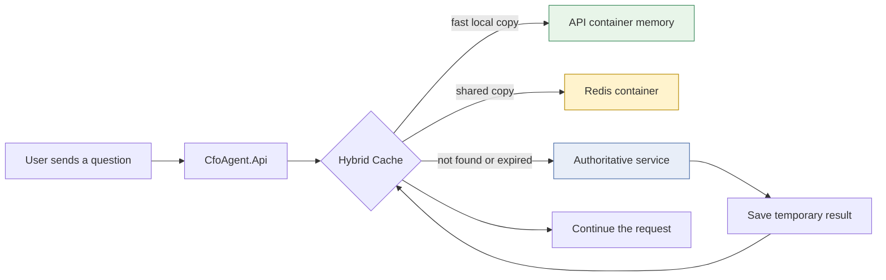
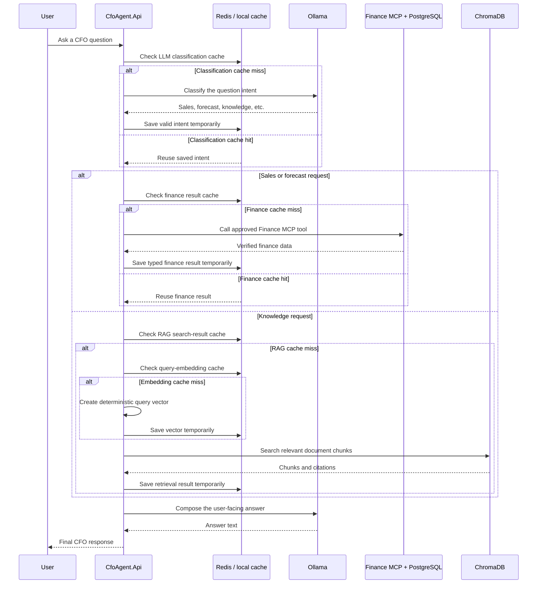
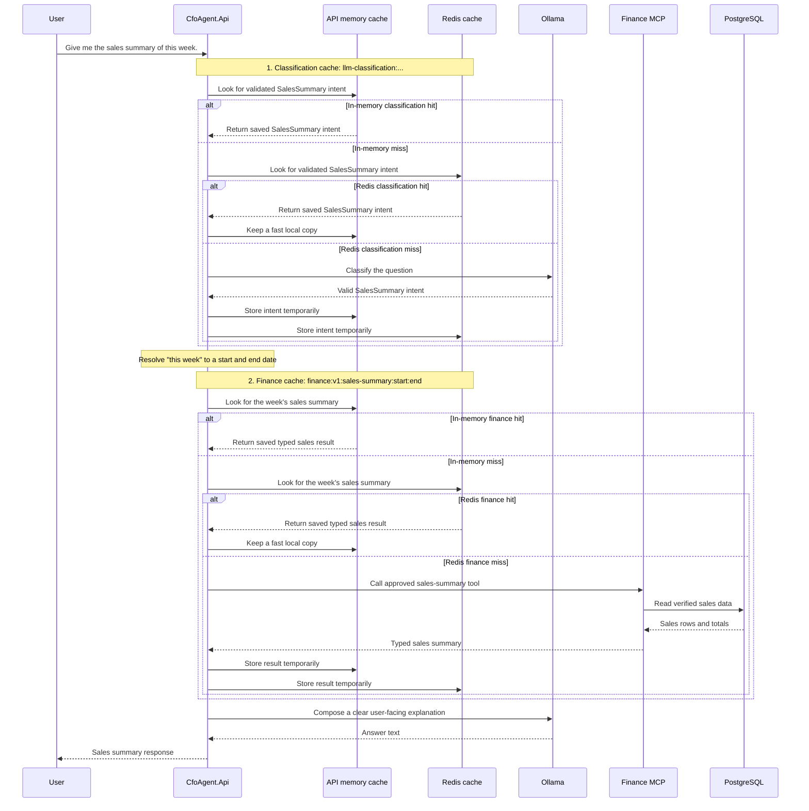

# How Caching Works

## The Short Version

Caching is a temporary shortcut. When the application has recently completed the
same safe piece of work, it can reuse the saved result instead of repeating that
piece of work immediately.

The CFO AI Agent has five cache layers. They are used for small, repeatable
operations such as identifying the type of question, reading sales data, looking
up knowledge search results, creating a vector, and checking which MCP tools are
available.

The application **does not cache the final chat answer**. It still builds the
response normally. Caching never replaces the real systems:

- PostgreSQL remains the source of truth for finance data.
- ChromaDB remains the source of truth for knowledge search.
- Finance MCP and Knowledge MCP remain the services that provide their data.
- Ollama remains the LLM used to classify a request and write helpful text.

## Where The Cached Data Lives

The API uses .NET Hybrid Cache. It has two places where it can keep a temporary
copy:

1. **Inside the API container's memory.** This is the fastest copy, but it is
   lost when the API container restarts.
2. **Redis.** Redis is a separate container that lets the API reuse cache entries
   after an API restart. It is the main place to inspect cache entries manually.

Redis is configured as a disposable cache in `docker-compose.yml`. It has no
volume and persistence is disabled. Restarting or deleting the Redis container
loses cache data only; it does not remove finance data from PostgreSQL, vectors
from ChromaDB, or files in `data/knowledge`.



## What "Hit" And "Miss" Mean

- **Cache miss:** no usable saved value exists. The application calls the real
  system, receives a successful result, and saves a temporary copy.
- **Cache hit:** a usable saved value exists. The application reuses it and skips
  that one real-system call.
- **Expired:** the saved value has reached its time limit (TTL), so the next
  request is treated as a miss.
- **Bypassed:** caching is disabled with `CACHE_ENABLED=false`. The application
  always calls the real system.
- **Fails open:** Redis is temporarily unavailable. The application logs the
  cache issue and continues with the real system instead of failing the user's
  request because of the cache.

The API logs these events as `Application cache Hit`, `Miss`, `Bypassed`,
`Invalidated`, or `failed open`. The logs use safe cache keys made from operation
names, dates, and hashes; they do not log full prompts, secrets, or result data.

## Full Request Flow

The following is a typical request. Not every request uses every cache layer.



The last Ollama call that helps present the answer is not cached. This prevents a
stored final answer from being reused when a fresh response should be composed.

## Example: "Give Me The Sales Summary Of This Week"

This example uses two cache layers:

1. the **LLM classification cache**, which remembers that the question is a
   `SalesSummary` request; and
2. the **Finance result cache**, which remembers the verified sales summary for
   the resolved start and end dates of the current week.

For each cache lookup, .NET Hybrid Cache checks in this order:

1. **API memory** in the running `api` container;
2. **Redis** in the `redis` container, when `CACHE_USE_DISTRIBUTED_CACHE=true`;
3. the real service only when neither temporary copy has a usable value.

The first request normally has cache misses. A second identical request made
before the TTL expires can use the saved values.



### What Is Stored For This Example?

| Step | Temporary value | Cache locations | Default lifetime | Not stored here |
| --- | --- | --- | --- | --- |
| Intent classification | The validated `SalesSummary` intent | API memory, then Redis | 5 minutes | Raw prompt and final answer |
| Finance data | The typed weekly sales-summary result for the resolved dates | API memory, then Redis | 60 seconds | PostgreSQL source records |

If `CACHE_ENABLED=false`, both lookups are bypassed and the API calls Ollama and
Finance MCP normally. If Redis is unavailable, the application fails open: it
uses the real dependency rather than failing the user's request just because the
cache cannot be used.

## The Five Cache Layers

| Cache layer | When it is checked | What is temporarily saved | Where the real result comes from | Default lifetime |
| --- | --- | --- | --- | --- |
| LLM classification | Before the CFO orchestrator chooses a specialist agent | A validated intent, such as `SalesSummary` or `Knowledge` | Ollama classification response | 5 minutes |
| Finance result | When a Sales Analysis or Forecasting worker needs finance data | Typed sales summaries, comparisons, top products, yearly totals, or budget targets | Finance MCP, which reads PostgreSQL | 1 minute to 1 hour, depending on operation |
| MCP tool discovery | When the API connects to Finance MCP or Knowledge MCP and needs its approved tool list | Approved tool names only | MCP `tools/list` call | 5 minutes |
| Query embedding | Before a knowledge search needs a vector for a query | One deterministic 256-number vector | The API's deterministic embedding generator | 1 hour |
| RAG retrieval | When the Financial Knowledge worker searches indexed documents | Relevant chunks, source information, and warnings | ChromaDB vector search | 5 minutes |

### 1. LLM Classification Cache

When a user submits a question, the CFO orchestrator asks Ollama which supported
intent it represents. For example, `Give me the sales summary of this week.` is
classified as a sales-summary request.

For the same message, same model, same safety settings, and same conversation
context, the validated intent can be reused for five minutes. The cache key uses
a hash of the message, not the readable message itself.

If Ollama returns an invalid or `Unsupported` intent, the result is not cached.

### 2. Finance MCP Result Cache

After the intent chooses a finance worker, that worker needs verified numbers.
For example, a weekly sales-summary request needs a start date and end date.

The API checks a key similar to:

```text
finance:v1:sales-summary:20260720:20260726
```

On a miss, the API calls the approved Finance MCP tool. Finance MCP reads its
PostgreSQL database and returns the typed result. The API then temporarily saves
that typed result in the cache. On a hit, the API reuses that result and does not
make another finance read for the same operation and dates.

Financial calculations remain deterministic C# code and verified finance values
are never calculated by Ollama.

### 3. MCP Tool-Discovery Cache

Before the API can call an MCP tool, the MCP SDK connects to the server and
performs the normal MCP handshake. The API checks the server's `tools/list`
response and keeps only tool names that are on its configured allow-list.

Only the approved tool-name list is cached. Tool arguments and tool results are
not stored by this cache layer. The cache lets a newly restarted API reuse a
recent approved tool list, while still performing the required connection and
handshake. If a call reports a missing or bad tool, the application invalidates
this cache and discovers tools again.

### 4. Query-Embedding Cache

For a knowledge question, text must first become a list of numbers called an
embedding (or vector). ChromaDB uses that vector to find similar document chunks.

The current embedding generator is deterministic: the same normalized query
always produces the same 256-number vector. Keeping that vector for one hour
avoids repeating that calculation when the RAG result itself has expired or a
different search filter is used.

The cache key contains a hash of the normalized query, the embedding version,
the provider identity, and the expected vector size. It does not contain readable
knowledge-question text.

### 5. RAG Retrieval Cache

RAG means *retrieval-augmented generation*: retrieve relevant knowledge first,
then use it to help answer the question. The Financial Knowledge worker searches
ChromaDB for document chunks and receives source details/citations.

For the same normalized question, index version, filters, requested result count,
and distance setting, the API can reuse the ChromaDB retrieval result for five
minutes. The answer still uses the retrieved source information, so citations are
preserved on both a cache hit and a miss.

## Which Requests Use Which Layers?

| User request type | Classification | Finance data | MCP discovery | Embedding | RAG retrieval |
| --- | --- | --- | --- | --- | --- |
| Sales summary, comparison, or top products | Yes | Yes | Finance MCP | No | No |
| Forecast | Yes | Yes, for historical totals | Finance MCP | No | No |
| Financial knowledge question | Yes | No | No for ChromaDB search | Yes | Yes |
| Mixed forecast and knowledge question | Yes | Yes | Finance MCP | Yes | Yes |

Knowledge MCP is a separate read-only filesystem service. It is not used as a
replacement for ChromaDB semantic search, so ordinary Financial Knowledge
questions use the embedding and RAG retrieval layers shown above.

## When A Cache Is Not Used

The cache deliberately does not save:

- final chat responses;
- failed calls, timeouts, cancellations, or error messages;
- raw prompts or retrieved document text as cache keys;
- secrets or connection strings;
- unvalidated/unsupported intent classifications.

This keeps cache behavior safe: a problem is retried with the real dependency,
and one user's final wording is not served as another user's response.

## Settings You Can Change

The `.env` file supplies Docker settings. The most useful cache settings are:

```text
CACHE_ENABLED=true
CACHE_USE_DISTRIBUTED_CACHE=true
CACHE_REDIS_CONNECTION_STRING=redis:6379
CACHE_LLM_CLASSIFICATION_TTL_SECONDS=300
CACHE_RAG_RETRIEVAL_TTL_SECONDS=300
CACHE_EMBEDDINGS_TTL_SECONDS=3600
CACHE_MCP_DISCOVERY_TTL_SECONDS=300
```

Finance operations have their own TTL settings too, for example
`CACHE_FINANCE_SALES_SUMMARY_TTL_SECONDS=60`.

After changing `.env`, recreate the API container so it reads the new values:

```powershell
docker compose up -d --force-recreate api
```

For detailed repeatable checks, including Redis commands, TTL testing, and a
safe `FLUSHDB` cache reset, see
[MANUAL_TEST_CASES_AND_CHECKS.md](MANUAL_TEST_CASES_AND_CHECKS.md).
